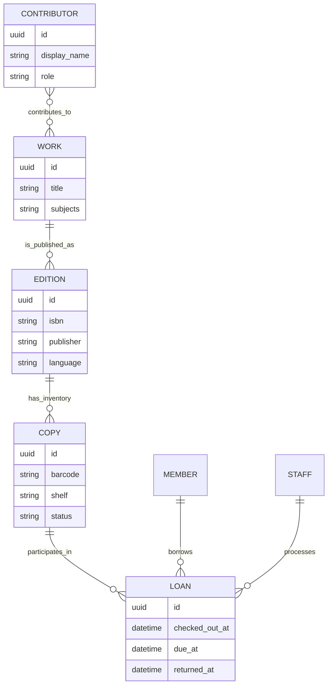
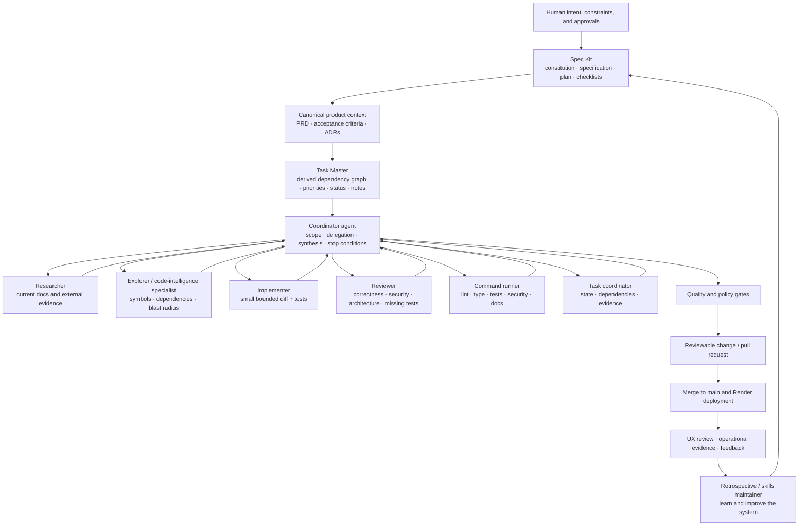
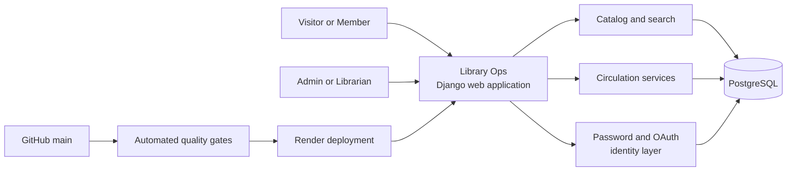
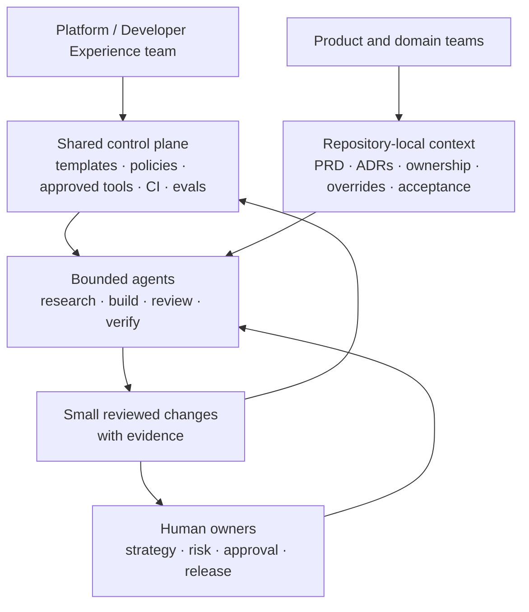

# 📚 Library Ops

> **A live library-management demo and a case study in governed autonomous software delivery.**
>
> Browse a seeded catalog, inspect editions and physical copies, review availability states, and see how a bounded multi-agent engineering system turns product intent into tested, reviewable, deployable work.

<p align="center">
  <a href="https://library-ops.onrender.com/"></a>
  
  
  
  
</p>

<p align="center">
  <strong><a href="https://library-ops.onrender.com/">🏠 Open the demo</a></strong>
  ·
  <strong><a href="https://library-ops.onrender.com/catalog/">🔎 Browse the catalog</a></strong>
  ·
  <strong><a href="https://library-ops.onrender.com/accounts/login/">🔐 Sign in</a></strong>
</p>

> [!IMPORTANT]
> This README is written for a reviewer of the deployed product. It is intentionally self-contained: the demo path, product scope, architecture, autonomous agent system, SDLC, development history, trade-offs, UX findings, limitations, and team-scale application are all explained here. It is not a workstation installation guide.
> [!NOTE]
> The first request can be slower after an idle interval while the Render service wakes. Refresh once if the deployment initially shows a loading or transient error page.

**Live review date:** 22 June 2026
**Observed demo state:** 9 works · 10 editions · 16 physical copies

---

## 🧭 At a glance

Library Ops demonstrates two related systems:

| System | What it proves |
|---|---|
| **The product** | A correct small-library model: contributors, works, editions, physical copies, availability, identity, role boundaries, search, and circulation state. |
| **The delivery system** | A spec-driven, task-aware, multi-agent SDLC in which autonomous agents operate inside explicit scope, permission, review, quality, and human-approval boundaries. |

### Project thesis

> **Ship a small, coherent, inspectable product—and make the reasoning and delivery system behind it as reviewable as the code.**

The goal was not maximum feature count. The goal was to demonstrate product judgment, domain correctness, traceability, quality discipline, and a practical model for using coding agents safely at team scale.

---

## 🎬 Review the demo in five minutes

1. **Start at the [Library Dashboard](https://library-ops.onrender.com/).** Confirm the current seeded state: **9 catalog works** and **16 physical copies**.
2. **Open the [catalog](https://library-ops.onrender.com/catalog/).** Browse the nine public-domain works and the search surface for identifiers, titles, contributors, and subjects.
3. **Open [A Tale of Two Cities](https://library-ops.onrender.com/catalog/6/).** It is the clearest public example of one edition with several physical copies in mixed states: one on loan and four available.
4. **Open [Pride and Prejudice](https://library-ops.onrender.com/catalog/1/).** It demonstrates one work represented by two editions, each with its own ISBN, publisher, and copy inventory.
5. **Review [sign-in](https://library-ops.onrender.com/accounts/login/).** Password access, recovery, local sign-up, GitHub OAuth, and Google OAuth entry points are exposed.
6. **Continue with supplied staff credentials when available.** `Admin` and `Librarian` roles exercise catalog and circulation operations; `Member` demonstrates restricted access. Privileged credentials should be shared with the evaluator privately, not committed to a public repository.

### What to look for

- **Domain correctness:** a title is not treated as one borrowable row.
- **Inventory integrity:** every physical copy has its own barcode, shelf, and circulation state.
- **Clear semantics:** the user-facing actions are **Borrow** and **Return**, resolving the brief’s ambiguous check-in/check-out wording.
- **Role boundaries:** catalog mutation and circulation are staff workflows, not anonymous actions.
- **Scope discipline:** the core assignment is completed before speculative AI or enterprise-library features.
- **Delivery judgment:** requirements, architectural decisions, task state, agent behavior, tests, evidence, and deployment are governed rather than improvised.

---

## ✨ What is implemented

### Status legend

| Symbol | Meaning |
|---:|---|
| ✅ | Publicly observed in the deployed application |
| 🔐 | Implemented as an authenticated or staff-role workflow |
| ⚙️ | Implemented in the engineering/delivery control plane rather than the end-user UI |
| ⏸️ | Deliberately deferred from the demo scope |
| ⚠️ | Known limitation or follow-up |

| Capability | Evidence available to a reviewer | Status |
|---|---|:---:|
| Live deployment | Public Render URL with home, catalog, detail, and account routes | ✅ |
| Seeded catalog | 9 works, 10 editions, and 16 physical copies in the current demo state | ✅ |
| Bibliographic modeling | Contributor → Work → Edition → Copy relationships, including a multi-edition work | ✅ |
| Copy-level availability | Barcodes, shelves, `Available`, and `On loan` states on work-detail pages | ✅ |
| Catalog discovery | Search surface for identifier, title, contributor, and subject; exact identifiers are intended to rank first | ✅ |
| Password identity | Email/password form, remember-me option, sign-up, and password recovery | ✅ |
| Social identity | GitHub and Google OAuth entry points; GitHub reaches a Library Ops authorization flow | ✅ |
| Role model | `Admin`, `Librarian`, and `Member` responsibilities | 🔐 |
| Catalog create/edit/archive | Staff-only catalog operations | 🔐 |
| Borrow and return | Staff circulation flow with active, overdue, and returned loan states | 🔐 |
| Circulation dashboard | Active, overdue, and recently returned loan views | 🔐 |
| Spec-driven governance | Constitution, PRD, plans, decision records, and explicit acceptance criteria | ⚙️ |
| Task-aware execution | Dependency-aware task decomposition, task selection, status, notes, and completion evidence | ⚙️ |
| Autonomous agent control plane | Coordinator, specialists, reusable skills, permissions, rules, hooks, research tools, and retrospectives | ⚙️ |
| CI and release gates | Automated verification before merge/deployment, with evidence-calibrated completion claims | ⚙️ |
| Semantic/vector search | Designed as an additive discovery layer, not shipped in the public demo | ⏸️ |
| AI metadata assistant | Designed with human approval, not shipped in the public demo | ⏸️ |
| Holds, fines, notifications, acquisitions | Explicitly outside the focused assignment scope | ⏸️ |
| Public video walkthrough | No public Loom link is included | ⚠️ |

> [!TIP]
> **A Tale of Two Cities** is the best record for mixed copy states. **Pride and Prejudice** is the best record for understanding the Work → Edition → Copy hierarchy.

---

## 🧠 The decisions that shaped the product

The earliest concept explored **LibraryOps AI** as a broader TypeScript/Next.js/Supabase product with semantic search, AI metadata suggestions, recommendation explanations, Figma artifacts, and enterprise-style identity options.

The implemented project deliberately converged on a smaller and more coherent system:

- **Django + PostgreSQL + Render** for a compact, server-rendered, deployment-friendly application.
- **Contributor / Work / Edition / Copy / Loan** instead of a single `Book` table with one mutable status.
- **Borrow** and **Return** as the primary UI language.
- **Exact identifiers and lexical search first.** Semantic retrieval remains an optional later layer.
- **Public-domain, provenance-aware seed data** suited to a reproducible demo.
- **Spec Kit for specification discipline** and **Task Master for the derived execution graph**.
- **AI-assisted engineering governance rather than decorative product AI.** The shipped product does not claim an AI capability that was not completed, evaluated, and grounded in real catalog records.

That reduction was intentional. A smaller system with correct boundaries, traceable decisions, working deployment, and honest limitations is stronger than a wider feature list with weak evidence.

---

## 🧩 Domain model



### Circulation language

| UI action | Domain meaning | State transition |
|---|---|---|
| **Borrow** | A member receives an available physical copy | `AVAILABLE → ON_LOAN` |
| **Return** | Staff closes the active loan for that copy | `ON_LOAN → AVAILABLE` |

The core invariant is foundational and important:

> **One physical copy can have at most one active loan.**

<details>
<summary><strong>Why not use a single <code>Book.status</code> field?</strong></summary>

A work may have several editions, and each edition may have several physical copies. Those copies can be available, on loan, lost, under maintenance, or archived independently. A title-level status would lose inventory accuracy, make multiple-copy circulation impossible, and corrupt historical loan reasoning.

Separating the concepts also makes later features—holds, copy maintenance, inventory audits, and edition-specific metadata—possible without replacing the original model.

</details>

---

## 🤖 The autonomous engineering system

> [!NOTE]
> This is an **engineering-time agent system**, not a chatbot embedded in the Library Ops product. Its purpose is to plan, research, implement, review, verify, and improve software delivery while remaining subordinate to human intent and repository policy.

### How the system works



### The autonomous execution loop

Within an approved task boundary, the system can perform the following loop without requiring the human to micromanage each command:

1. **Select work.** Task Master identifies the next unblocked task and its dependencies.
2. **Reconstruct intent.** The coordinator reads the constitution, PRD, acceptance criteria, accepted decisions, current task, and relevant code.
3. **Check for conflict.** If task state disagrees with canonical intent, the system stops and reconciles the source—not the other way around.
4. **Assess risk.** Routine work continues; material scope, security, credential, architecture, cost, privacy, or destructive decisions require a human gate.
5. **Delegate bounded work.** Direct specialist agents research, explore, implement, review, or run checks in parallel where useful.
6. **Implement the smallest complete change.** The implementer stays inside the current task and updates tests with behavior.
7. **Verify independently.** A reviewer looks for correctness, authorization gaps, data-integrity risks, architecture drift, and missing tests.
8. **Run deterministic gates.** The command runner runs the applicable lint, type, test, security, documentation, migration, and build checks.
9. **Record evidence.** The task coordinator updates notes, status, files changed, checks run, blockers, and remaining work.
10. **Learn after delivery.** A retrospective agent proposes improvements to policies, skills, tests, or tasks so repeated friction becomes reusable automation.

This is **bounded autonomy**: the system can move a well-defined task from “ready” to “verified,” but it cannot redefine the product, bypass permissions, hide failed checks, or silently turn a plan into a completion claim.

### Agent roles

| Agent | Primary responsibility | Typical permissions | Stop condition |
|---|---|---|---|
| **Coordinator** | Reconcile intent, choose the task, assess risk, delegate specialists, synthesize results | Limited workspace and task-system access | Scope conflict, material decision, failed gate, or missing evidence |
| **Researcher** | Verify current framework, standards, vendor, or ecosystem facts | Read-only repo + approved research tools | Primary sources disagree or implementation assumption remains unresolved |
| **Code explorer** | Map symbols, dependencies, architecture boundaries, and change blast radius | Read-only code intelligence | Change crosses unexpected bounded contexts or ownership boundaries |
| **Implementer** | Produce one small, reviewable change tied to acceptance criteria | Workspace write, no unrestricted machine access | Task boundary exceeded, migration/security risk, or tests cannot be made reliable |
| **Reviewer** | Challenge correctness, authorization, integrity, maintainability, and test sufficiency | Read-only | Blocking issue remains |
| **Command runner** | Execute explicit quality commands and summarize exact results | Restricted shell; destructive commands forbidden | Non-zero gate or unavailable required dependency |
| **Task Master coordinator** | Maintain dependency order, notes, status, and completion evidence | Task-state access; no manual state-file corruption | Evidence does not support the requested status |
| **Retrospective / skills maintainer** | Convert recurring mistakes into improved skills, policy, or automation | Read-only analysis; proposed patches reviewed before adoption | Suggested change would bloat global context or weaken a gate |

### No uncontrolled agent hierarchy

The system uses a **two-tier topology**:

```text
Tier 0 — Coordinator
  └── Tier 1 — Direct specialists

No recursive specialist-to-specialist spawning by default.
```

This limits context drift, cost, latency, and accountability problems. Parallelism is used where tasks are genuinely separable; final judgment returns to one coordinator.

---

## 🧰 The control plane and supporting systems

The agent system is not “one large prompt.” It is a set of complementary controls with distinct responsibilities.

| System or artifact | High-level role | Why it matters |
|---|---|---|
| **PRD and acceptance criteria** | Define user outcomes, scope, non-goals, and evidence of completion | Prevent implementation from optimizing for code volume instead of product value |
| **Engineering constitution** | Holds non-negotiable principles such as security, evidence, testing, and source-of-truth rules | Gives every session the same baseline constraints |
| **Spec Kit** | Structures the path from constitution → specification → clarification → plan → tasks/checklists → analysis/implementation | Keeps the “what,” “why,” and “how” explicit before code changes begin |
| **Task Master** | Converts canonical intent into a dependency-aware operational graph with priorities, complexity, subtasks, status, and notes | Gives autonomous agents a precise next action and preserves execution continuity across sessions |
| **ADRs** | Capture architecturally significant choices, alternatives, consequences, and rollback considerations | Prevents major decisions from disappearing into chat history |
| **arc42-style architecture views** | Organize context, constraints, building blocks, runtime behavior, risks, and decisions | Makes architecture reviewable without generating documentation for its own sake |
| **C4 diagrams** | Add context/container/component views when a diagram reduces ambiguity | Creates shared technical language for humans and agents |
| **Strategic DDD** | Defines bounded contexts, ubiquitous language, and invariants | Protects business meaning without introducing unnecessary tactical ceremony |
| **`AGENTS.md`** | Always-on repository policy for agents | Makes operating rules durable and versioned with the code |
| **Nested agent overrides** | Add stricter local rules for sensitive areas such as circulation, search, migrations, or seed imports | Applies context-specific controls without bloating global instructions |
| **Skills** | Package reusable workflows, checklists, references, and optional deterministic scripts | Turns repeated good practice into a callable organizational capability |
| **Subagents** | Provide bounded specialist roles with distinct instructions and permissions | Enables parallel work without losing ownership of the final decision |
| **MCP integrations** | Connect approved documentation, research, design, task, and code-intelligence systems | Gives agents current context while maintaining an explicit capability boundary |
| **Rules and permission profiles** | Allow safe commands, prompt for risky actions, and block destructive or secret-related access | Makes least privilege enforceable rather than aspirational |
| **Hooks** | Trigger safe lifecycle reminders, evidence capture, or retrospective scaffolding | Automates stable process steps without silently changing product code |
| **Promptfoo evaluation lane** | Tests agent prompts and future AI-assisted behavior against repeatable cases | Treats agent instructions as testable software artifacts |
| **CI and branch policy** | Require automated checks and review evidence before merge | Converts local confidence into a reproducible team gate |

### Canonical, derived, and local state

A critical design choice is that not every generated artifact has equal authority.

| Class | Examples | Policy |
|---|---|---|
| **Canonical** | Constitution, accepted PRD, acceptance criteria, significant ADRs | Human-reviewed source of product and engineering truth |
| **Derived** | Task Master task graph, generated task breakdowns, diagrams, evaluation output | Regenerate or reconcile when canonical intent changes; never silently overrule it |
| **Operator-local / ephemeral** | Tokens, OAuth state, caches, local databases, agent logs, generated context packs | Never treated as portable project truth and never committed when sensitive or machine-specific |

This separation is what lets the system act autonomously without allowing generated state to become accidental governance.

<details>
<summary><strong>Supporting tool ladder</strong></summary>

The repository’s control-plane design distinguishes core context sources from optional helpers:

| Tool category | Examples | Use |
|---|---|---|
| **Current library documentation** | Context7 | Version-specific framework and API facts during implementation |
| **Current external research** | Exa or live web research | Recent standards, vendor behavior, security changes, and niche evidence |
| **Task orchestration** | Task Master MCP/CLI | Task selection, dependency validation, decomposition, notes, and status |
| **Symbol and structure intelligence** | Serena, code-review-graph | Symbol navigation, dependency analysis, review context, and blast radius |
| **Deterministic structural search** | ast-grep | Repeatable pattern search and codemod candidate discovery |
| **Bounded context packaging** | Repomix | Secret-excluding snapshots when targeted retrieval is insufficient; generated packs remain local |
| **Shell-output reduction** | RTK | Optional lossy summary for noisy output; raw commands remain the final source for proof |
| **Design context** | Figma MCP | Task-scoped design work; not a mandatory startup dependency for backend or maintenance tasks |
| **Agent/LLM evaluation** | Promptfoo | Regression cases for prompts, RAG behavior, routing, and future product AI |

Not every tool is required for every task. The coordinator activates the smallest set that improves evidence or execution quality.

</details>

---

## 🧑‍⚖️ Autonomy boundaries and human-in-the-loop control

“Autonomous” does not mean “unsupervised.” Responsibility is divided deliberately.

| The agent system may do autonomously | A human remains accountable for |
|---|---|
| Select the next unblocked approved task | Product strategy and prioritization |
| Read repository context and reconstruct acceptance criteria | Approving or changing canonical requirements |
| Delegate bounded research, implementation, review, and checks | Material scope, architecture, security, privacy, cost, and credential decisions |
| Produce small diffs and tests | Accepting business and operational risk |
| Run approved commands and collect evidence | Granting production access or destructive permissions |
| Update derived task notes/status when evidence supports it | Final merge/release policy and exception approval |
| Propose improvements from retrospectives | Deciding whether a new policy becomes organizational standard |

The preferred decision block for a material change is:

```text
Decision status:
User / business tie-back:
Problem:
Alternatives considered:
Counterfactual evidence:
Recommendation:
Validation or smoke test:
Security / cost / privacy impact:
Rollback:
Open question:
```

This makes agent escalation concise, reviewable, and suitable for an engineering team rather than a one-off chat.

---

## 🔁 End-to-end SDLC

```mermaid
flowchart LR
    A[Discover<br/>brief · users · ambiguity] -->
    B[Specify<br/>constitution · PRD · acceptance]
    B --> C[Plan<br/>architecture · data · risk · UX]
    C --> D[Decompose<br/>dependencies · tasks · priorities]
    D --> E[Build<br/>bounded diff · tests]
    E --> F[Verify<br/>lint · type · tests · security · docs]
    F --> G[Review<br/>human + independent agent]
    G --> H[Release<br/>merge · deploy · smoke test]
    H --> I[Observe<br/>UX · defects · evidence]
    I --> J[Learn<br/>retro · skill · policy · backlog]
    J --> B
```



| Phase | Primary artifacts | Autonomous contribution | Human checkpoint |
|---|---|---|---|
| **Discover** | Assignment interpretation, personas, ambiguity log, evaluation mapping | Research comparable patterns and expose assumptions | Confirm the problem, evaluator needs, and scope |
| **Specify** | Constitution, PRD, functional/non-functional requirements, acceptance criteria | Expand gaps, normalize terminology, test requirement consistency | Accept outcomes and non-goals |
| **Plan** | Architecture, domain model, security posture, UX flow, risk register, ADRs | Compare options, inspect current documentation, identify consequences | Approve material decisions |
| **Decompose** | Dependency graph, priorities, subtasks, definition of done | Generate and validate an executable task graph | Confirm sequencing and release boundaries |
| **Build** | Small code change, migration when needed, tests, task notes | Implement one bounded unit and keep behavior traceable | Intervene only for ambiguity or escalated risk |
| **Verify** | Test/lint/type/security/docs/build evidence | Run deterministic gates and summarize exact failures | Decide on justified exceptions; do not weaken gates silently |
| **Review** | Diff review, architecture/security findings, missing-test report | Perform independent challenge review | Approve, request changes, or reject |
| **Release** | Protected merge, deployment, smoke results, release notes | Prepare evidence and execute approved automation | Authorize release policy and production access |
| **Observe** | Live UX review, runtime findings, defect reports, usage signals | Collect evidence and compare behavior with requirements | Reprioritize based on real outcomes |
| **Learn** | Retrospective, improved skill, policy patch, backlog update | Identify repeated friction and propose reusable fixes | Decide what becomes durable team practice |

### Definition of done

A task is not complete merely because code exists. Completion requires the applicable combination of:

- acceptance criteria met;
- authorization enforced server-side for privileged operations;
- domain and database invariants preserved;
- success and failure paths tested;
- migrations intentional and checked;
- required quality gates passing;
- user-facing loading, empty, error, and validation states considered;
- documentation or evidence updated when behavior or architecture changed;
- task status supported by actual verification, not agent confidence.

---

## 🏗️ Application architecture



| Layer | Responsibility |
|---|---|
| **Web experience** | Server-rendered navigation, catalog browsing, detail pages, account flows, and staff workflows |
| **Catalog domain** | Contributors, works, editions, copies, provenance, identifiers, and availability projection |
| **Circulation domain** | Borrow, return, due dates, overdue state, active-loan integrity, and history |
| **Identity and authorization** | Password access, OAuth entry points, role-aware UI, and server-side permission checks |
| **Persistence** | PostgreSQL relationships, constraints, transactions, and historical records |
| **Delivery** | Version control, automated checks, protected review path, and Render deployment |
| **Agent control plane** | Specifications, tasks, instructions, skills, specialists, tools, permissions, evidence, and retrospectives |

### Search strategy

Search is intentionally layered:

1. **Exact identifiers** such as ISBN or barcode should win.
2. **Lexical catalog matches** cover title, contributor, subject, and metadata terms.
3. **Business signals** can adjust ranking without replacing deterministic matches.
4. **Semantic/vector retrieval** is optional and should be added only with a relevance benchmark, latency/cost budget, and grounded result evaluation.

Availability is always retrieved from current database state. An AI layer must never invent it.

---

## 🗺️ Development timeline

This is a **decision and delivery sequence**, not an invented commit log. It describes what the project explored, what changed, what reached the live demo, and what was intentionally left behind.

| Stage | What happened | What changed or remained undone |
|---|---|---|
| **1. Assignment interpretation** | The brief was mapped to book/catalog management, borrow/return, search, README evidence, and optional deployment/auth/AI bonuses. The check-in/check-out language conflict was identified. | The product standardized on **Borrow** and **Return**. A title-level status model was rejected. |
| **2. Ambitious product concept** | The first PRD explored LibraryOps AI with Next.js, Supabase, OAuth/RBAC, semantic search, metadata assistance, recommendation explanations, Figma, and a Loom walkthrough. | This became an exploration baseline, not the final production contract. Core product evidence was prioritized over breadth. |
| **3. Architecture correction** | The implementation direction moved to Django, PostgreSQL, deterministic seed data, and Render. The model matured to Contributor / Work / Edition / Copy / Loan. | The earlier Next.js/Supabase/Vercel recommendation was superseded. Semantic product AI was postponed. |
| **4. Governed starter** | The repository gained a constitution, canonical PRD, ADRs, architecture/runbook scaffolding, agent instructions, skills, subagents, rules, hooks, and verification scripts. | At this stage the repository was still a controlled scaffold; it did not claim a completed web product. |
| **5. Delivery-system consolidation** | Spec Kit became the specification backbone; Task Master became the derived execution graph. Canonical, derived, and operator-local artifacts were separated. Promptfoo became the agent-evaluation lane. | Figma became task-scoped. RTK and Repomix were demoted from hard blockers to optional helpers. Documentation ceremony was reduced to artifacts with decision value. |
| **6. Agent preflight hardening** | Local Codex startup issues were traced to relative agent paths, malformed custom-agent configuration, unbounded WSL glob scanning, stale npm lock state, and fatal required-MCP startup behavior. Validators and bootstrap posture were corrected. | Unavailable integrations were not allowed to masquerade as healthy. Temporary bootstrap exceptions were distinguished from final implementation readiness. |
| **7. Product implementation** | The Django application, seeded catalog, work/edition/copy detail, search surface, account routes, role model, circulation states, and staff flows were implemented. | The product remained intentionally compact; holds, fines, notifications, interoperability, and product-facing AI stayed out of scope. |
| **8. Deployment and seeded walkthrough** | The current implementation was merged to `main` and deployed on Render with a seeded public-domain catalog and visible mixed availability states. | The dataset was optimized for evaluator comprehension, not scale benchmarking. |
| **9. Live UX review and synthesis** | Public routes were reviewed and this README was rewritten around the evaluator journey, actual live evidence, agentic SDLC, trade-offs, and limitations. | Authenticated staff flows still require supplied credentials; account-template visual consistency and full accessibility verification remain follow-ups. |

---

## ✅ Assignment and PRD traceability

| Objective | Evidence in the project/demo | Disposition |
|---|---|:---:|
| Add books and metadata | Staff catalog workflow; contributors, works, editions, ISBN, publisher, language, subjects, and copies | 🔐 |
| Edit books | Staff-only mutation path | 🔐 |
| Delete/remove safely | Archive-oriented design preserves loan history rather than casually hard-deleting referenced records | 🔐 |
| Check out / borrow | Copy and loan model; visible on-loan state | 🔐 |
| Check in / return | Loan closure and availability restoration | 🔐 |
| Search collection | Public search surface with exact-identifier-first intent and lexical catalog matches | ✅ |
| Useful metadata | Contributor role, ISBN, publisher, language, edition count, barcode, shelf, and availability | ✅ |
| Working product | Public Render deployment | ✅ |
| Source and README | Repository plus this self-contained evaluator guide | ✅ |
| Deployment bonus | Live Render URL | ✅ |
| Authentication and roles bonus | Password, GitHub/Google OAuth entry points, and Admin/Librarian/Member model | ✅ / 🔐 |
| AI bonus | Not claimed as shipped; semantic search and metadata assistance remain deferred | ⏸️ |
| Loom bonus | No public video link included | ⚠️ |
| Creativity and product quality | Correct inventory model, provenance-aware seed data, role boundaries, autonomous delivery control plane, traceability, and evidence-calibrated claims | ✅ / ⚙️ |

### Task Master alignment by capability

Task identifiers may be regenerated as the canonical specification evolves. The durable alignment is the dependency-ordered outcome sequence:

| Capability phase | Durable outcome | Demo or repository evidence |
|---|---|---|
| Foundation | Django project, environment boundaries, PostgreSQL, deployment path | Live server-rendered app on Render |
| Catalog domain | Contributor / Work / Edition / Copy relationships and constraints | Nine works, ten editions, physical-copy details |
| Seed and provenance | Reproducible, reviewable demo data | Project Gutenberg and Open Library provenance in visible edition data |
| Search | Exact identifiers, then lexical catalog retrieval | Public search language and catalog surface |
| Identity | Password and optional social login | Account, recovery, sign-up, GitHub, and Google entry points |
| Authorization | Admin, Librarian, Member permissions | Staff actions gated behind identity/role workflows |
| Circulation | Transactional borrow/return and active-loan integrity | Available/on-loan copy states and authenticated circulation views |
| Quality and release | Verification, review policy, branch gates, and deployment | Control-plane artifacts and live service |
| Demo polish | Seed narrative, evaluator route, limitations, UX review | Dashboard, this README, and findings below |

---

## ✂️ What was deliberately left undone

The project does not present planned features as shipped features.

| Deferred item | Why it was deferred | What would justify adding it |
|---|---|---|
| Semantic/vector search | A nine-work catalog does not justify embeddings, vector infrastructure, relevance tuning, and evaluation cost | Larger catalog, benchmark queries, relevance judgments, latency and cost budgets |
| AI metadata suggestions | Generated metadata needs schema-constrained output, review UX, provenance, overwrite rules, and regression cases | Human-approval workflow and grounded evaluation set |
| Recommendation explanations | Weak signal with a tiny catalog and easy to make decorative | Meaningful inventory/borrowing data and explanation-quality tests |
| Generic chatbot | High hallucination risk and little connection to the core assignment | No current plan; a grounded task-specific assistant would be preferable |
| Holds and reservations | Introduces a queue, expiry, concurrency, and notification policy | Validated patron workflow and explicit policy |
| Fines and payments | Outside the mini-system brief and adds financial/security complexity | Clear business requirement and payment architecture |
| CSV import/export | Useful, but lower value than a correct core model and circulation lifecycle for this demo | Stable schema, validation report, and idempotent import semantics |
| Email reminders | Requires scheduling, delivery, retry, privacy, and consent decisions | Provider, retry strategy, monitoring, and consent model |
| Enterprise SAML SSO | OAuth is sufficient for a portfolio deployment | Enterprise tenant and identity-provider requirements |
| MARC / Z39.50 integration | Disproportionate scope for the assignment | Real interoperability requirement |
| Native mobile client | The responsive web product is the review target | Validated mobile-only workflows |
| Production-scale observability and load testing | The environment and dataset are demonstration-oriented | Defined SLOs, traffic assumptions, retention, alerting, and paid infrastructure |

---

## 🔎 Live UX review — 22 June 2026

The public review covered the home page, catalog, representative work-detail pages, sign-in, sign-up, password reset, and OAuth redirects. Authenticated staff workflows were not exercised without demo credentials.

### What works well

| Strength | Why it matters |
|---|---|
| **Browse before sign-in** | A reviewer can inspect real records without first creating an account. |
| **Visible live state** | The dashboard exposes catalog and copy counts instead of presenting an empty marketing shell. |
| **Understandable domain model** | Work detail separates contributors, editions, and copies; availability is tied to inventory. |
| **Purposeful seed records** | One record shows mixed copy states; another shows multiple editions. |
| **Reliable password fallback** | The demo is not dependent on one external identity provider. |
| **Tangible OAuth configuration** | GitHub reaches a real Library Ops authorization flow; Google exposes a configured OAuth redirect. |
| **No decorative AI claim** | Search and availability remain grounded in catalog and database state. |

### Highest-value improvements

| Priority | Finding | Recommended change |
|:---:|---|---|
| **P1** | Sign-in is branded, but sign-up and password-reset use a visibly different/default account layout. | Apply the Library Ops shell, typography, navigation, spacing, alert, and form components to every account page. |
| **P1** | Sign-in mentions a “seeded demo account” without explaining how the evaluator receives credentials. | Add a safe demo-access panel or state clearly that credentials accompany the submission. Never publish privileged production credentials. |
| **P1** | “Catalog Foundation” and “foundation records” are implementation vocabulary rather than librarian language. | Rename them to **Library Catalog**, **Add book**, or **Add catalog record**. |
| **P1** | The assignment’s staff workflows are central, but anonymous reviewers cannot preview them. | Add screenshots, a short capture, or a non-mutating guided-tour mode for CRUD and circulation. |
| **P2** | Catalog rows show title, contributor, and edition count, but not copy availability. | Add badges such as `4 available · 1 on loan`. |
| **P2** | The search surface describes match modes but provides no visible example queries. | Add example chips for ISBN, contributor, title, and subject; preserve the query in the result heading. |
| **P2** | Copy identifiers are useful but visually dense. | Group copies by state, emphasize status, and keep barcode/shelf as secondary text. |
| **P2** | Dashboard count cards read as summaries rather than navigation. | Make cards link to the relevant views and expose visible keyboard focus. |
| **P2** | The public UI does not explain the engineering system behind the demo. | Add a concise “About this demo” link or panel pointing reviewers to this README. |
| **P2** | Responsive behavior, keyboard order, contrast, form errors, and live announcements still need direct verification. | Run authenticated mobile/keyboard testing plus automated accessibility checks against WCAG 2.2 AA expectations. |

<details>
<summary><strong>Route-by-route notes</strong></summary>

### Home

- The two primary actions—**Sign in to the demo** and **Browse catalog first**—fit an evaluator journey.
- Counts make the deployment feel active and set expectations for scope.
- The summary cards should be clickable and keyboard-focusable.

### Catalog

- All nine seeded works are visible.
- The public-domain titles are understandable without proprietary context.
- The page communicates identifier-first ranking intent.
- “Catalog Foundation” leaks implementation-phase terminology.
- Availability should appear in the list rather than only on detail pages.

### Work detail

- The edition/copy hierarchy is the strongest public proof of domain quality.
- ISBN, publisher, language, barcode, shelf, and state are useful evidence.
- A one-sentence explanation of works, editions, and copies would help non-library reviewers.

### Sign in

- The custom account-access framing is clearer than the secondary account pages.
- Password recovery, local account access, GitHub, and Google are discoverable.
- The page needs explicit demo-credential instructions and a statement about the role assigned to newly created accounts.

### Sign up and password reset

- They appear functional but visually inconsistent with the main product shell.
- Reuse the application header, container, button hierarchy, validation components, and help text.

</details>

---

## ⚠️ Known limitations

- The dataset is intentionally small and designed to expose domain states, not benchmark large-catalog performance.
- Catalog mutations and circulation are role-gated; anonymous visitors cannot complete the full staff journey.
- Public demo credentials are not embedded in this README.
- Semantic search, metadata generation, and recommendations are not shipped.
- Account sign-up and reset pages need the same visual system as the main application.
- No public Loom walkthrough is linked.
- The live review did not include authenticated staff actions, visual regression capture, mobile-device testing, or assistive-technology testing.
- A content/route review is not a substitute for a complete WCAG 2.2 AA audit.
- A demonstration deployment is not presented as a production SLO, scale, backup, or disaster-recovery guarantee.
- Render-hosted demo services can have a slower first response after inactivity.

---

## 🏢 How this becomes a scalable team capability

The most reusable part of this project is not the library domain. It is the **delivery control plane**: a versioned operating model for turning intent into bounded, evidenced changes across many engineers, repositories, and coding agents.

### Team-scale operating model



### Scalable patterns

| Pattern | Practical team application |
|---|---|
| **Golden repository template** | Platform engineering publishes approved `AGENTS.md`, permission profiles, CI workflows, security rules, evaluation scaffolds, and reusable skills. |
| **Local policy overrides** | Domain teams add stricter rules around payments, PII, migrations, search, safety, or regulated workflows without forking the entire control plane. |
| **Specification as the handoff** | Product, design, security, and engineering agree on outcomes and acceptance before an agent creates code. This reduces “prompt interpretation” as an invisible requirements phase. |
| **Task graph as execution memory** | Dependency-aware tasks bridge sessions, engineers, and agents; work can pause and resume without relying on one chat transcript. |
| **Role-specific agents** | Research, implementation, review, and command execution use different instructions and permissions, mirroring separation of duties in healthy teams. |
| **Risk-tiered autonomy** | Documentation and low-risk tests may be highly autonomous; authentication, data migration, production infrastructure, and privacy changes require stronger human gates. |
| **Reusable skills as playbooks** | Incident response, migrations, release preparation, API changes, threat modeling, accessibility review, and retrospectives become versioned workflows. |
| **Approved MCP catalog** | Teams expose only sanctioned tools and data sources, with least-privilege access and clear ownership. |
| **Evidence by default** | Every completion claim includes files changed, checks run, results, risks, and follow-ups—useful for review, audit, and incident reconstruction. |
| **Continuous agent evaluation** | Prompt and routing changes are tested like code before being rolled across teams. |
| **Central policy, decentralized execution** | The platform team owns paved roads; product teams retain domain decisions and can move quickly inside guardrails. |

### Risk-tiered autonomy example

| Risk tier | Example work | Default autonomy |
|---|---|---|
| **Tier 1 — Low** | Docs, tests, formatting, non-behavioral refactors | Agent may implement and verify; normal review |
| **Tier 2 — Moderate** | Bounded feature work behind existing patterns | Agent implements; independent agent review + human approval |
| **Tier 3 — High** | Authorization, migrations, payment/PII, public APIs, infrastructure | Human-approved plan, specialist review, restricted permissions, staged rollout |
| **Tier 4 — Critical** | Destructive production action, credential rotation, legal/compliance exception | Human execution or tightly supervised automation only |

### Integrating with real team systems

The same pattern can connect to:

- GitHub Issues, Jira, Linear, or another planning system for intake and ownership;
- a service catalog for repository, domain, and on-call metadata;
- an internal developer portal for approved templates and skills;
- identity-aware MCP gateways for documentation, observability, design, ticketing, and source control;
- protected branches, required status checks, deployment environments, and merge queues;
- security scanning, SBOM generation, dependency policy, and audit evidence;
- product analytics and incident data that feed the next specification or retrospective.

### Metrics that matter

Measure the system as an engineering capability, not by lines of generated code:

| Outcome | Example measures |
|---|---|
| **Flow** | Lead time, cycle time, queue time, task completion rate |
| **Quality** | Escaped defects, rollback rate, test failures, review rework |
| **Reliability** | Change failure rate, recovery time, deployment success |
| **Governance** | Percentage of changes tied to acceptance criteria, evidence completeness, policy exceptions |
| **Agent effectiveness** | First-pass acceptance, human correction rate, tool cost, context size, repeated failure categories |
| **Developer experience** | Time to first productive change, cognitive load, onboarding time, satisfaction |

### Practical adoption path

1. **Pilot one bounded workflow.** Start with tests, documentation, or a small internal service—not unrestricted production automation.
2. **Codify the successful path.** Turn repeated instructions into a skill, deterministic script, or CI check.
3. **Separate policy from local context.** Centralize organization-wide security and quality; keep domain intent with the owning team.
4. **Add specialist agents only when responsibilities are distinct.** More agents are not automatically better.
5. **Introduce risk tiers and human gates.** Make autonomy proportional to impact and reversibility.
6. **Measure corrections and failures.** Use retrospectives to remove recurring ambiguity and improve the control plane.
7. **Scale through templates and approved integrations.** Replicate the operating model, not one giant shared prompt.

---

## 🛡️ Quality, security, and governance posture

The project’s engineering rules are designed so that “agentic” does not become a synonym for “uncontrolled.”

| Concern | Control |
|---|---|
| **Authorization** | Privileged behavior requires server-side permission checks, not only hidden UI controls |
| **Data integrity** | Circulation invariants belong in transactional services and database constraints |
| **Historical truth** | Archival preserves referenced loan history |
| **Secrets** | Tokens, OAuth state, `.env` files, private context packs, caches, and local databases stay out of version control |
| **Research accuracy** | Current or niche claims use primary sources where possible and distinguish verified facts from recommendations |
| **Tool access** | Permissions, domain allowlists, MCP configuration, and command rules constrain capabilities |
| **Destructive actions** | Force pushes, hard resets, broad deletion, and similar operations are blocked or require explicit human action |
| **Dependency and supply chain** | Lockfiles, audit tools, dependency checks, and SBOM-oriented release practices reduce accidental drift |
| **Accessibility** | WCAG 2.2 AA is the target; remaining manual verification is disclosed rather than assumed |
| **Completion claims** | A task cannot be marked done based on code generation alone; evidence must show relevant checks and acceptance |
| **Continuous improvement** | Retrospectives propose changes to skills, tests, policies, or tasks; global instructions grow only when the rule is truly universal |

---

## 🗂️ Repository landmarks

The README contains the complete evaluator narrative. These repository locations show how the narrative is enforced in code and process:

| Path | Responsibility |
|---|---|
| `AGENTS.md` | Durable operating policy and source-of-truth order |
| `.agents/skills/` | Reusable task, implementation, review, release, and retrospective workflows |
| `.codex/agents/` | Specialist agent roles and boundaries |
| `.codex/config.toml` | Agent topology, tools, permissions, and project behavior |
| `.codex/rules/` | Safe, prompted, and forbidden command policy |
| `.specify/` | Spec Kit constitution and specification artifacts |
| `docs/PRD.md` | Canonical product requirements and the source used to derive execution work |
| `.taskmaster/tasks/` | Derived dependency-aware task state |
| `docs/adr/` | Significant architectural decisions and consequences |
| `docs/README.md` | Documentation governance and the kept document set |
| `SETUP.md` | Validation, operations, deployment, and demo refresh commands |
| `scripts/` | Deterministic validation and policy checks |
| `.github/workflows/` | Automated repository quality and release gates |
| `src/` | Django application and domain code |
| `tests/` | Unit, integration, property, and end-to-end verification where applicable |

> [!NOTE]
> Generated task state, diagrams, evaluation output, and context packs are useful execution aids, but they do not outrank the accepted product requirements, constitution, or significant decisions.

---

<details>
<summary><strong>📚 Engineering method references</strong></summary>

The project’s operating model was informed by the official documentation for the systems it uses or adapts:

- [GitHub Spec Kit](https://github.com/github/spec-kit) — constitution/specification/plan/tasks/implementation workflow.
- [Task Master](https://github.com/eyaltoledano/claude-task-master) — AI-assisted task decomposition, dependencies, status, and research-oriented execution support.
- [OpenAI Codex customization](https://developers.openai.com/codex/concepts/customization) — complementary roles for `AGENTS.md`, skills, memory/context, and MCP.
- [OpenAI Codex subagents](https://developers.openai.com/codex/subagents) — bounded specialist agents and parallel workflows.
- [OpenAI Codex skills](https://developers.openai.com/codex/skills) — reusable workflow packaging.
- [OpenAI Codex MCP](https://developers.openai.com/codex/mcp) — explicit access to external tools and context.
- [GitHub Actions](https://docs.github.com/actions) — automated build, test, and delivery workflows.
- [GitHub protected branches and status checks](https://docs.github.com/repositories/configuring-branches-and-merges-in-your-repository/managing-protected-branches/about-protected-branches) — enforceable merge policy.
- [Render Django deployment guide](https://render.com/docs/deploy-django) — Django deployment on Render.
- [WCAG 2.2 overview](https://www.w3.org/WAI/standards-guidelines/wcag/) — accessibility target and supporting guidance.

</details>

---

<p align="center">
  <strong>📚 Browse deliberately. Borrow safely. Preserve the history.</strong><br>
  <sub>And let autonomous tools move quickly only inside boundaries the team can explain, test, and audit.</sub>
</p>
