# 🏗️ Library Ops Architecture

> **Status:** current as-built architecture with explicit deferred extensions<br>
> **Last reviewed:** 22 June 2026<br>
> **Audience:** engineers, technical leaders, security reviewers, evaluators, and agent-system maintainers

[← Documentation index](README.md) · [Product requirements](PRD.md) · [Experience design](DESIGN.md) · [Setup and operations](../SETUP.md) · [Live demo](https://library-ops.onrender.com/)

---

## 📌 Executive summary

Library Ops is a server-rendered Django application backed by PostgreSQL and deployed on Render. Its core product architecture models bibliographic identity and physical inventory separately:

```text
Contributor → Work → Edition → Copy → Loan
```

That hierarchy is the central architectural decision. It permits one conceptual work to have multiple published editions, one edition to have multiple physical copies, and each copy to carry an independent circulation state and history.

The repository also contains a separate **engineering control plane**. Spec Kit, Task Master, Codex policies, specialist agents, reusable skills, MCP integrations, deterministic checks, and retrospectives support bounded autonomous delivery. This system operates at engineering time and is not an end-user AI feature.

### Architectural posture

- **Modular monolith before distributed systems.** The domain does not need service boundaries to demonstrate correctness.
- **PostgreSQL is authoritative.** Catalog relationships, permissions, and circulation state are not delegated to a search index or AI model.
- **Server-side authorization and transactions.** Hidden UI controls are not security boundaries.
- **Exact and lexical retrieval first.** Semantic retrieval is deferred and must remain additive.
- **Evidence-calibrated delivery.** Planned, configured, authenticated, public, and verified are distinct states.
- **Shallow agent orchestration.** One coordinator delegates direct specialists; recursive fan-out is limited to one level by default.

---

## 🧭 Architecture documentation method

The document uses a deliberately hybrid method:

| Method | How it is used | What is intentionally avoided |
| --- | --- | --- |
| **arc42-style structure** | Context, constraints, building blocks, runtime behavior, deployment, cross-cutting concerns, risks, and decisions | Completing every template section when it adds no decision value |
| **C4 views** | System context, container, and selected component views | Diagramming every module or class |
| **Strategic DDD** | Bounded contexts, ubiquitous language, aggregate/invariant ownership, and context relationships | Tactical patterns added only for ceremony |
| **MADR-light decisions** | Significant choices, alternatives, consequences, status, and reconsideration triggers | One ADR for every dependency or code edit |
| **Threat/risk review** | Trust boundaries, protected operations, failure modes, mitigations, and evidence gaps | Claiming formal certification |
| **Evidence register** | Live routes, code/tests/configuration, primary-source references, and explicit verification status | Treating old handoffs or generated summaries as current truth |

The architecture exists to support decisions, implementation, review, onboarding, and incident reasoning—not to maximize diagram count.

---

## 1. Goals and quality priorities

### Product goals

1. Provide a working mini library-management system with catalog lifecycle, search, and circulation.
2. Model physical inventory and borrowing correctly enough to avoid the common “one book row, one status” failure.
3. Make public evaluation possible before sign-in.
4. Enforce role boundaries and circulation integrity on the server.
5. Keep the system small enough to understand, test, and deploy as one application.

### Engineering-system goals

1. Preserve product intent across sessions and agents.
2. Turn approved requirements into dependency-aware executable work.
3. Allow bounded autonomous progress without unrestricted machine or production access.
4. Separate research, implementation, review, command execution, and final judgment.
5. Require evidence before completion claims.
6. Improve the delivery system through retrospectives and reusable skills.

### Quality attribute priority

| Priority | Attribute | Architectural response |
| ---: | --- | --- |
| 1 | **Correctness and data integrity** | Normalized domain, foreign keys, transactional circulation, unique identifiers, explicit invariants |
| 2 | **Security and authorization** | Server-side permission checks, least privilege, secret isolation, protected staff workflows |
| 3 | **Reviewability** | Modular monolith, explicit boundaries, traceable requirements, small changes, human-readable docs |
| 4 | **Usability and accessibility** | Public browse path, task language, predictable forms/states, WCAG 2.2 AA target |
| 5 | **Deployability and operability** | Django/PostgreSQL/Render, locked dependencies, migrations, smoke tests, rollback awareness |
| 6 | **Maintainability** | Bounded contexts, service/query separation where useful, deterministic checks, decision register |
| 7 | **Performance** | Indexed identifiers and lexical search, bounded seeded dataset, query review before new infrastructure |
| 8 | **Extensibility** | Clean points for holds, semantic retrieval, multi-branch inventory, or metadata assistance without prebuilding them |

---

## 2. Constraints and assumptions

### Product constraints

- The assignment is intentionally small; enterprise library standards and operations are not required.
- Public reviewers must be able to inspect useful behavior without a privileged account.
- Staff mutation and circulation require authentication and role checks.
- The deployed demo uses a seeded, intentionally modest catalog.
- Public-domain and external metadata need provenance and licensing awareness.
- Product AI is not shipped merely because AI was used during engineering.

### Technology constraints

- Django 5.2 LTS is the selected application framework family.
- PostgreSQL is the production data store.
- Render serves the public web application and managed database path.
- GitHub is the source and CI/CD integration point.
- Node/npm support documentation, agent-control-plane, and browser/evaluation tooling; they are not the application runtime.

### Governance constraints

- Canonical requirements and accepted decisions outrank generated Task Master state.
- `AGENTS.md`, skills, rules, permissions, hooks, and MCPs are versioned controls, not informal suggestions.
- Credentials and operator-local state must not enter the repository.
- A task cannot be marked done solely because an agent generated code.
- Material scope, architecture, privacy, security, credential, migration, cost, or production changes require a human decision gate.

---

## 3. System context

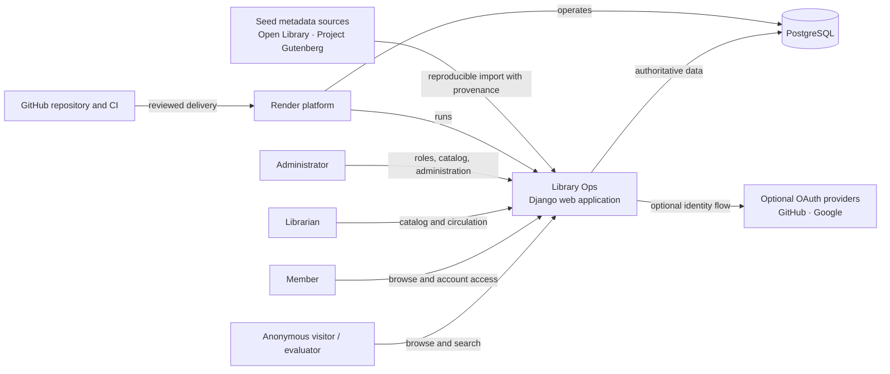

### Roles and participants

| Role | Primary intent | Trust level |
| --- | --- | --- |
| **Anonymous visitor / evaluator** | Inspect catalog, domain model, seeded state, and account entry points | Untrusted public request |
| **Member** | Browse/search and access permitted account information | Authenticated, least privilege |
| **Librarian** | Maintain catalog inventory and operate circulation | Privileged staff role |
| **Administrator** | Manage users/roles and all supported staff workflows | Highest application privilege |
| **Contributor / operator** | Develop, test, seed, deploy, and troubleshoot the application | Repository and environment privileges |
| **Autonomous engineering agents** | Execute approved engineering tasks inside scoped capabilities | Tool-scoped, policy-constrained, non-owner |

### External systems

| System | Use | Architectural rule |
| --- | --- | --- |
| **PostgreSQL** | Catalog, identity-linked application data, copies, loans, search structures | Source of truth for availability and history |
| **GitHub / Google OAuth** | Optional social authentication | Provider success is environment-dependent; password fallback remains available |
| **Render** | Web and database deployment | Deployment must be reproducible from repository configuration and secrets |
| **GitHub** | Source, review, CI, deploy trigger | Protected delivery and checks should precede production |
| **Open Library / Project Gutenberg** | Seed metadata and public-domain demonstration content | Record provenance; respect API, dump, license, and trademark guidance |
| **Codex / MCP services** | Engineering-time research and execution | No end-user runtime dependency; least privilege and explicit verification |

---

## 4. Container view

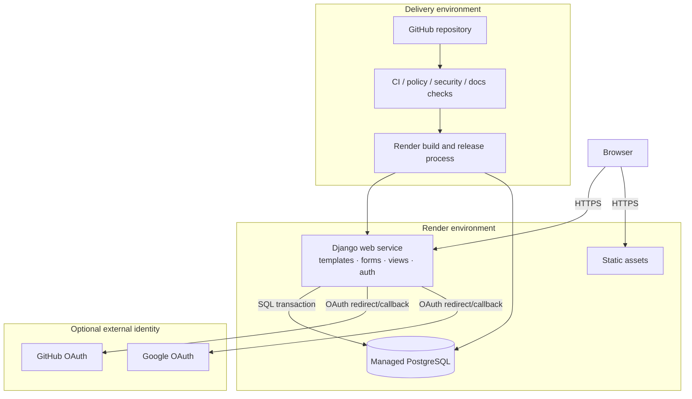

### Container responsibilities

| Container | Responsibility | Does not own |
| --- | --- | --- |
| **Django web service** | HTTP routing, server-rendered UI, validation, authentication integration, permission checks, domain orchestration | Long-lived duplicated search/availability truth |
| **PostgreSQL** | Referential integrity, authoritative catalog/circulation data, transactional state, indexes | UI policy or generated AI content |
| **Static assets** | Styles, images, progressive enhancement | Business logic |
| **GitHub/CI** | Reviewable source and automated gates | Production secrets |
| **Render build/release** | Dependency install, static collection, application process, deployment orchestration | Product requirements or task authority |
| **OAuth providers** | External user identity assertion | Application role assignment and authorization |

---

## 5. Logical building blocks and bounded contexts

The application remains a modular monolith. Context boundaries are conceptual and code-organizational, not network services.

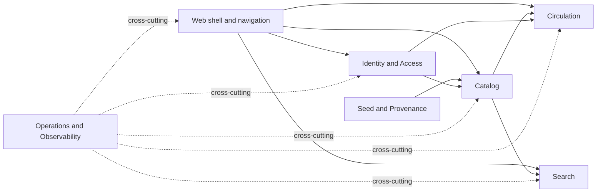

### 5.1 Identity and Access

#### Owns

- authentication integration;
- application role resolution;
- permission checks;
- account entry, recovery, and provider flows;
- staff/member distinction.

#### Key rules

- OAuth identity does not imply application privilege.
- Every protected mutation checks authorization server-side.
- `Member` is not a staff role.
- Privileged credentials are never public documentation.

### 5.2 Catalog

#### Owns

- contributors and contribution roles;
- works;
- editions and identifiers;
- physical copies, barcodes, shelves, and inventory state;
- archive semantics and historical references.

#### Key rules

- a work is not a physical copy;
- an edition belongs to one work;
- a copy belongs to one edition;
- copy barcodes are unique;
- referenced records are archived rather than destructively removed when history would be lost.

### 5.3 Search

#### Owns

- query normalization;
- exact identifier detection;
- lexical search and ranking;
- search result projection and explanations when exposed;
- future additive semantic retrieval.

#### Key rules

1. exact ISBN/barcode/source identifiers outrank fuzzy or semantic matches;
2. lexical retrieval is the baseline;
3. live availability comes from authoritative catalog/circulation data;
4. semantic retrieval cannot invent works, copies, or availability;
5. a hosted search service requires measured need and an accepted decision.

### 5.4 Circulation

#### Owns

- borrowing and returning;
- active, overdue, returned, and historical loan views;
- due dates and processing participants;
- copy-state transition consistency.

#### Key rules

- one copy has at most one active loan;
- borrow requires an available copy and authorized staff member;
- return requires an active loan and authorized staff member;
- loan and copy changes occur transactionally;
- historical loans remain queryable after catalog archival.

### 5.5 Seed and Provenance

#### Owns

- deterministic demonstration data;
- source identifiers and provenance;
- idempotent or safely repeatable import behavior;
- import validation and controlled refresh.

#### Key rules

- seed data does not require private secrets;
- bulk datasets use provider-recommended channels rather than abusive API loops;
- provenance survives import;
- externally sourced claims are not silently converted into application-owned truth.

### 5.6 Operations and Observability

#### Owns

- deployment configuration;
- health/smoke checks;
- log and error handling policy;
- migration/release process;
- backup/rollback awareness;
- evidence capture.

#### Key rules

- production secrets are externalized;
- a successful build is not a successful release until smoke checks pass;
- migration failures block release;
- logs must not leak credentials or sensitive user data.

---

## 6. Domain model

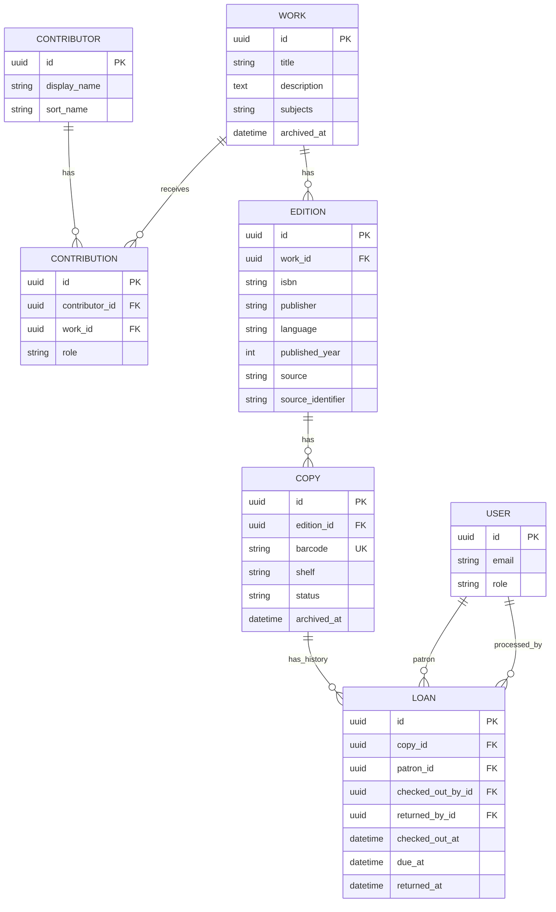

This is a conceptual schema. Exact field names and user/profile relationships remain defined by current migrations and models.

### Ubiquitous language

| Term | Meaning |
| --- | --- |
| **Contributor** | A person or organization associated with a work in a role such as author. |
| **Work** | The conceptual intellectual creation, independent of a particular publication. |
| **Edition** | A publication or manifestation of a work, with edition-specific identifiers and metadata. |
| **Copy** | A physical inventory item that can be available or borrowed independently. |
| **Loan** | A borrowing lifecycle connecting a copy, member, staff processor, due date, and return state. |
| **Borrow** | Create an active loan and make the copy unavailable. |
| **Return** | Close the active loan and make the copy available. |
| **Archive** | Remove from ordinary active use while preserving references and history. |
| **Availability** | A derived statement about whether a specific copy may be borrowed now. |

### Required invariants

| ID | Invariant | Preferred enforcement |
| --- | --- | --- |
| INV-001 | A copy has at most one active loan. | Database uniqueness/constraint plus transaction check |
| INV-002 | Only an available, non-archived copy can be borrowed. | Transactional domain service |
| INV-003 | Returning requires an active loan. | Transactional domain service |
| INV-004 | Borrow/return update loan and copy state atomically. | Database transaction |
| INV-005 | Barcode values are unique. | Database unique constraint |
| INV-006 | Exact edition identifiers resolve deterministically. | Normalization + database constraint/index where applicable |
| INV-007 | Members cannot perform staff mutations. | Server-side authorization and tests |
| INV-008 | Historical loans survive record archival. | Protected references and soft/archive semantics |
| INV-009 | Availability never comes from an AI response or stale secondary index alone. | Query composition and architecture rule |
| INV-010 | Seed provenance remains associated with imported records. | Stored source metadata and import tests |

---

## 7. Runtime scenarios

### 7.1 Public catalog search

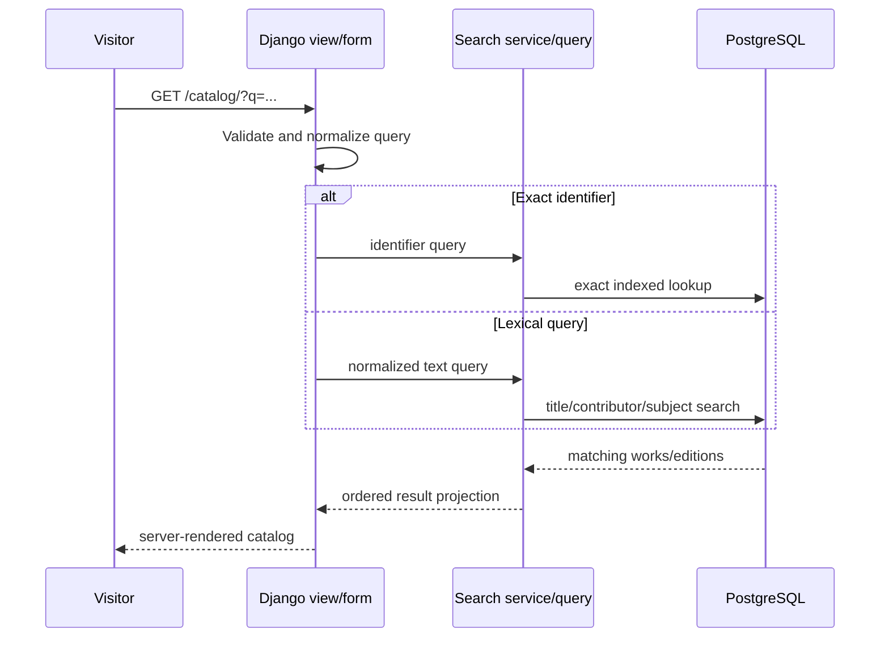

#### Failure behavior

- malformed or empty input produces a usable browse state;
- no results provide recovery guidance rather than an error page;
- identifiers are normalized carefully without turning arbitrary text into an identifier;
- archived records are excluded from ordinary results unless an authorized workflow needs them.

### 7.2 Borrow a copy

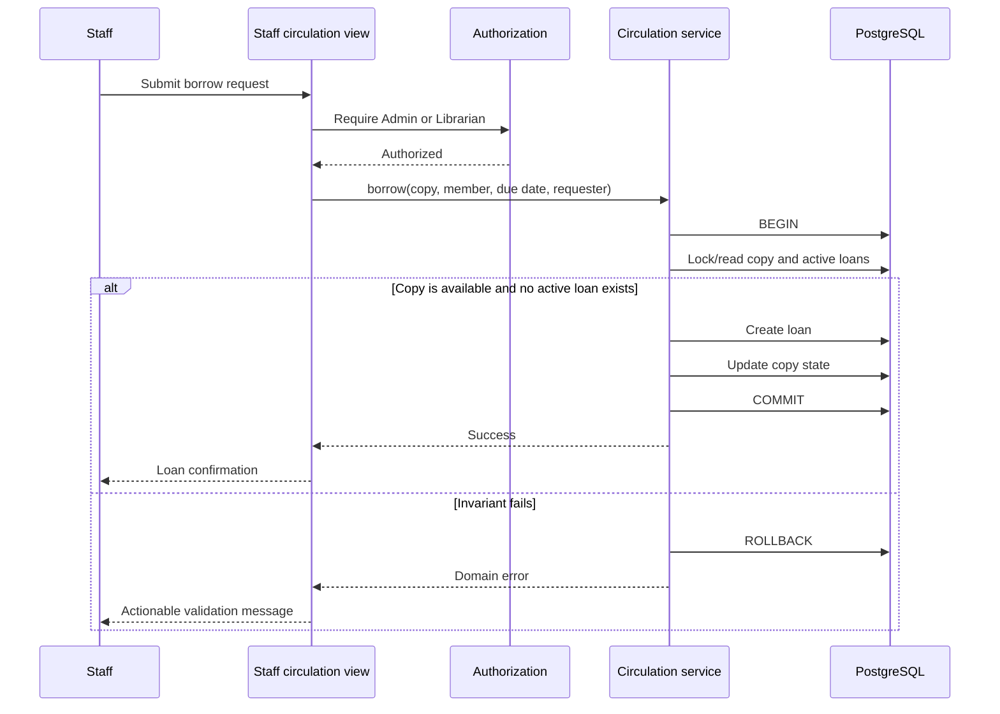

Concurrency control should rely on database-enforced uniqueness and transaction semantics, not only a pre-check in the form.

### 7.3 Return a copy

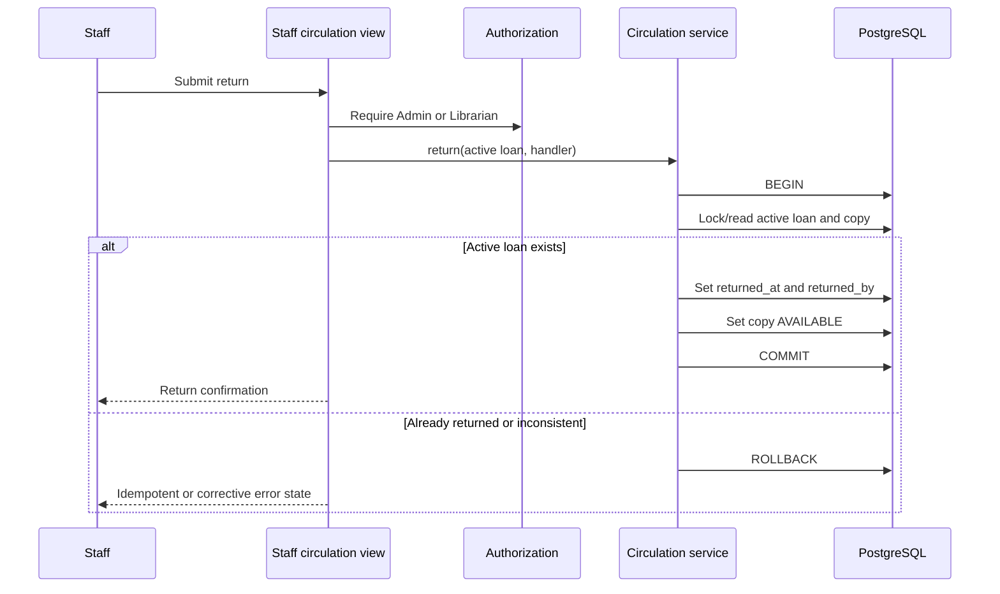

### 7.4 OAuth sign-in

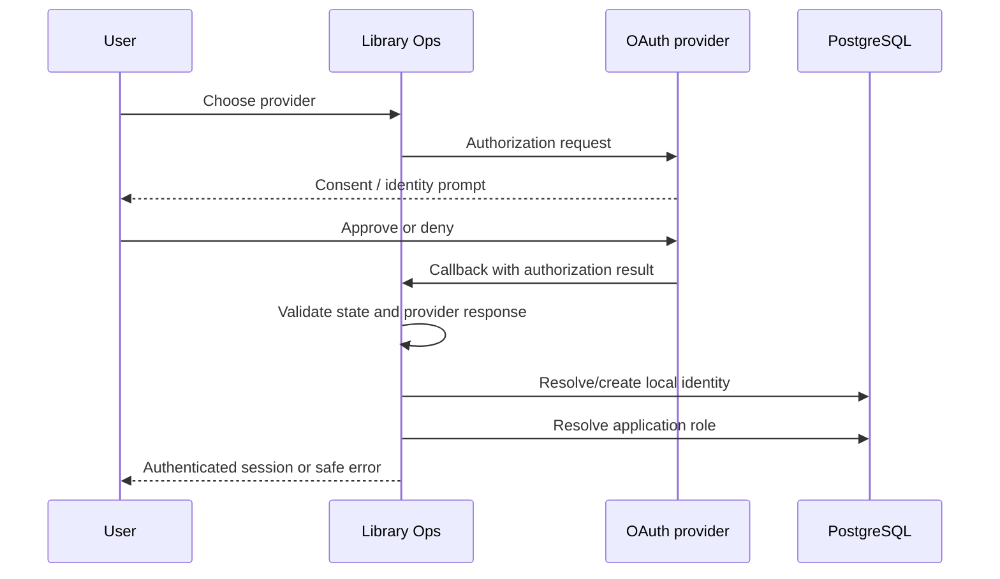

Provider identity and local authorization remain separate concerns.

### 7.5 Seed/import flow

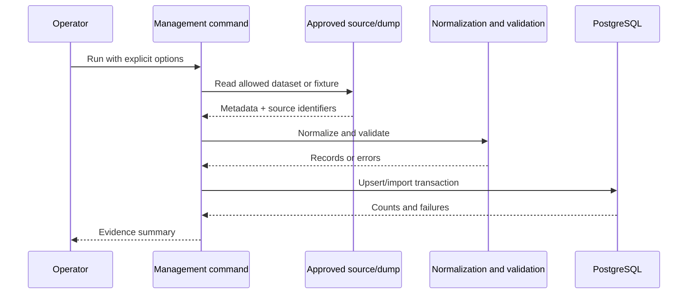

### 7.6 Git-to-Render delivery

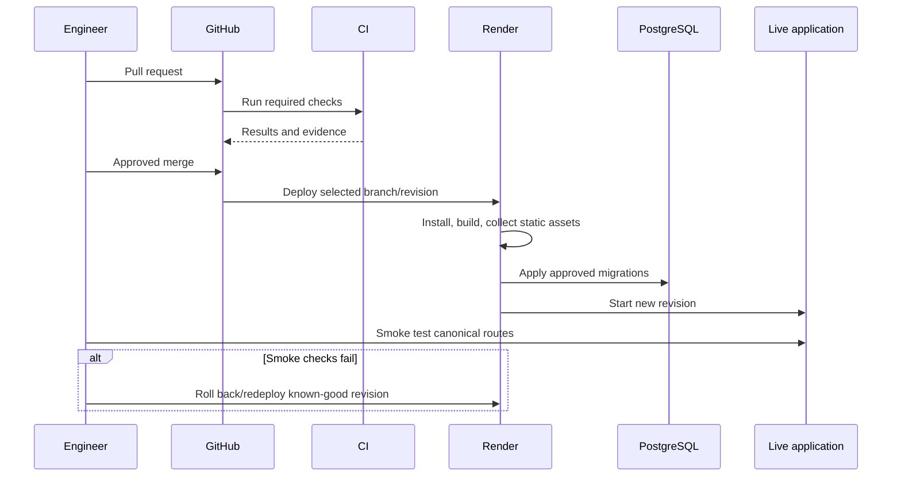

---

## 8. Search architecture

### Current strategy

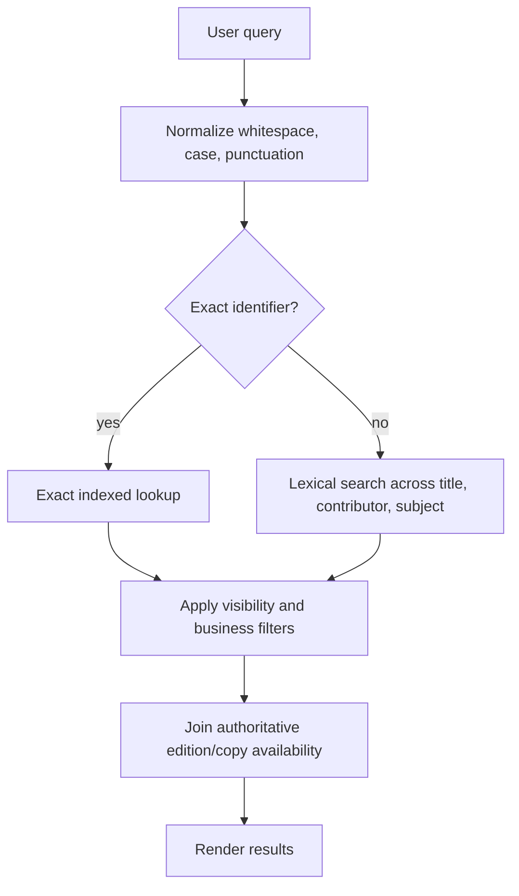

### Ordering principles

1. exact barcode/ISBN/source identifiers;
2. strong exact title or contributor matches;
3. lexical relevance across supported metadata;
4. stable tie-breaking;
5. authoritative visibility and availability filtering.

### Deferred semantic layer

A future vector or hybrid layer may augment discovery when the catalog and query evidence justify it. It must:

- retrieve only real catalog records;
- use current record identifiers to rehydrate authoritative data;
- never state availability from embeddings;
- preserve exact identifier precedence;
- include an evaluation set and measurable relevance improvement;
- have cost, privacy, latency, and fallback behavior documented;
- be removable without breaking baseline search.

Hosted BM25/search infrastructure is likewise deferred until PostgreSQL search is measured as insufficient.

---

## 9. Identity, authorization, and trust boundaries

### RBAC intent

| Capability | Admin | Librarian | Member | Anonymous |
| --- | :---: | :---: | :---: | :---: |
| Browse/search public catalog | ✅ | ✅ | ✅ | ✅ |
| View public availability | ✅ | ✅ | ✅ | ✅ |
| Create/edit/archive catalog records | ✅ | ✅ | ❌ | ❌ |
| Add/archive copies | ✅ | ✅ | ❌ | ❌ |
| Borrow/return copies | ✅ | ✅ | ❌ | ❌ |
| View circulation dashboard | ✅ | ✅ | Limited/own if implemented | ❌ |
| Manage application roles | ✅ | ❌ | ❌ | ❌ |
| Access Django administration | As configured | As configured | ❌ | ❌ |

The current migrations, permission decorators/mixins, services, and tests remain authoritative for exact behavior.

### Trust boundaries

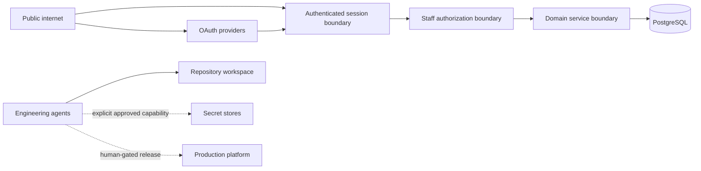

### Security controls

| Concern | Control intent |
| --- | --- |
| Authentication | Django session/account integration, password hashing, optional OAuth, CSRF protection |
| Authorization | Server-side role/permission checks for every privileged mutation |
| Input validation | Django forms/model/domain validation at trust boundaries |
| Injection | ORM parameterization, constrained raw SQL, template auto-escaping |
| Session security | Secure cookie and HTTPS settings in production; appropriate logout/session expiry behavior |
| Secrets | Environment or platform secret store; denied from agent/repo read where possible |
| Data integrity | Foreign keys, uniqueness, transactions, protected/archive semantics |
| Auditability | Loan processor identity/timestamps and operational logs; expand mutation audit trail when required |
| Supply chain | Lockfiles, dependency audit, CI checks, least-privilege Actions permissions, SBOM-oriented release tooling |
| Deployment | HTTPS, trusted endpoints/origins, controlled migrations, smoke tests, rollback path |
| Agent security | Sandboxed permissions, rules, MCP allowlisting, human gates, evidence requirements |

The project uses OWASP ASVS as a verification baseline and OWASP Top 10 as risk framing, not as a claim of formal compliance certification.

---

## 10. Deployment architecture

### Production topology

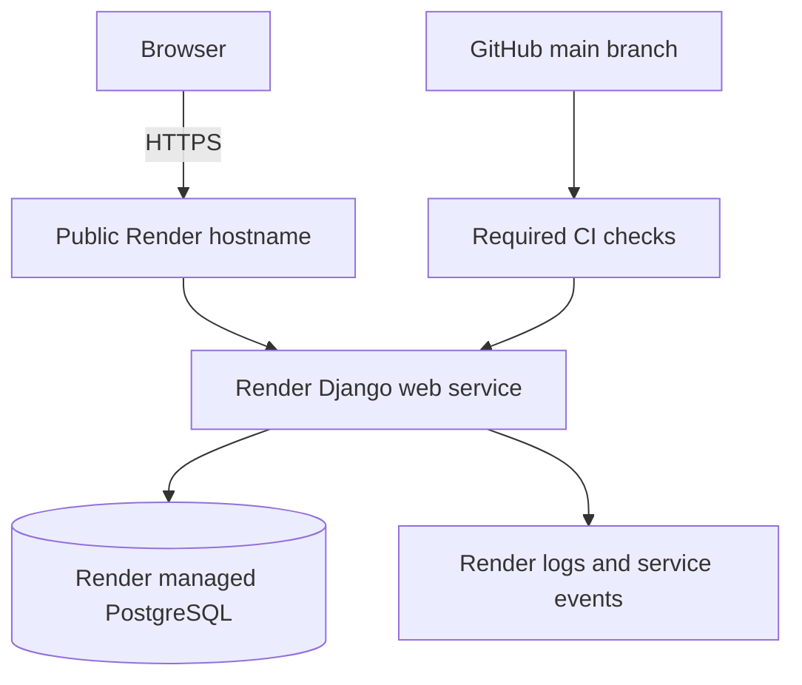

### Deployment assumptions

- repository configuration or the Render dashboard defines the build/start commands;
- application secrets are stored in Render, not committed;
- migrations are reviewed and applied through an explicit release step;
- static assets are collected and served through the configured production path;
- the first request after idle may incur platform wake-up latency;
- smoke tests cover public and authenticated critical paths;
- deployment success and application correctness are recorded separately.

### Canonical live smoke routes

| Route | Purpose |
| --- | --- |
| `https://library-ops.onrender.com/` | Dashboard and counts |
| `https://library-ops.onrender.com/catalog/` | Browse/search |
| `https://library-ops.onrender.com/catalog/6/` | Mixed copy states |
| `https://library-ops.onrender.com/catalog/1/` | Multiple editions |
| `https://library-ops.onrender.com/accounts/login/` | Account entry |

### Rollback thinking

- redeploy the last known-good application revision;
- treat backward-incompatible migrations as high-risk and require an explicit recovery plan;
- avoid coupling irreversible data changes to an unverified UI deploy;
- preserve seed/import reproducibility for demo recovery;
- record the failing revision, migration state, and smoke-test evidence.

---

## 11. Cross-cutting quality and operations

### Validation layers

| Layer | Examples |
| --- | --- |
| **Domain/unit** | State transitions, query normalization, role decisions, archive behavior |
| **Database/integration** | Constraints, transactions, migration behavior, query results |
| **Web/component** | Forms, permission responses, empty/error states, redirects |
| **Property-based** | Circulation invariants across generated action sequences |
| **End-to-end** | Public browse, staff catalog lifecycle, borrow/return, role denial, OAuth fallback |
| **Static quality** | Ruff, Pyright, import boundaries, Django checks |
| **Security/supply chain** | Dependency audit, secret scan, SAST/policy checks, action review, SBOM |
| **Documentation** | Markdown, spelling, links, inclusive language, claim consistency |
| **Agent/control-plane** | Config validation, skill validation, prompt/eval cases, MCP initialization evidence |
| **Release** | Build, migrations, public smoke tests, authenticated smoke tests, rollback readiness |

### Observability

For the demo scale, platform logs and structured application errors are sufficient, but the architecture expects:

- request/error correlation where practical;
- no secrets or passwords in logs;
- mutation failures with enough context to diagnose invariant violations;
- deployment/build/migration logs retained for release diagnosis;
- clear distinction between user validation errors and server faults;
- an upgrade path to error aggregation and metrics only when operational value justifies it.

### Performance

Current priorities:

- indexed exact identifiers;
- bounded query counts for catalog/detail pages;
- prefetch/select-related behavior where model relationships would otherwise produce N+1 queries;
- pagination before catalog scale demands it;
- query plans measured before adding new search infrastructure;
- no semantic inference in the critical availability path.

### Accessibility

The target is WCAG 2.2 AA. Architecture supports this by favoring server-rendered semantic HTML, progressive enhancement, predictable form errors, and keyboard-operable workflows. Manual and browser-assisted verification remain necessary; framework choice alone does not guarantee conformance.

---

## 12. Autonomous delivery control plane

### Purpose

The control plane reduces loss of intent and unsafe autonomy by making specification, task selection, tool access, review, verification, and learning explicit.

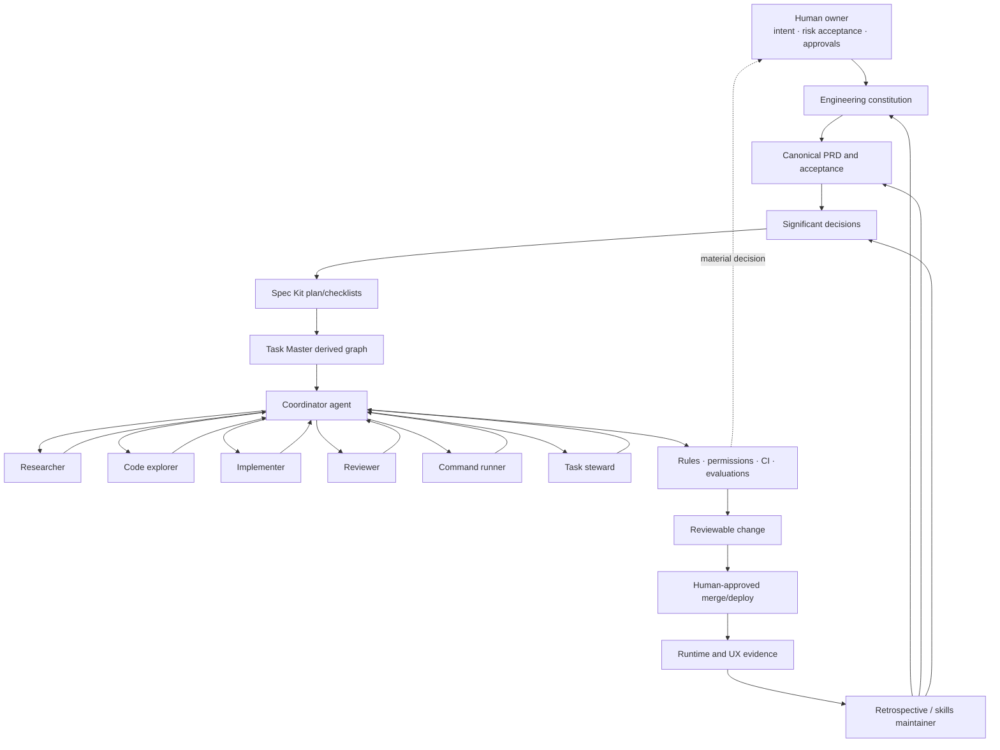

### Agent responsibilities

| Role | Responsibility | Default capability | Must stop when |
| --- | --- | --- | --- |
| **Coordinator** | Reconcile intent, select work, classify risk, delegate, synthesize | Limited workspace + task context | Canonical conflict, material decision, failed gate, missing evidence |
| **Researcher** | Verify current framework/vendor/standards facts | Read-only + approved research | Sources conflict or implementation assumption remains unresolved |
| **Code explorer** | Map symbols, dependencies, ownership, and blast radius | Read-only code intelligence | Change crosses unexpected boundaries |
| **Implementer** | Make one bounded change and tests | Workspace write | Scope expands, security/migration risk emerges, tests are unreliable |
| **Reviewer** | Challenge correctness, security, integrity, architecture, tests | Read-only | Blocking issue remains |
| **Command runner** | Run exact approved checks and summarize raw evidence | Restricted shell | Non-zero gate or unavailable required dependency |
| **Task steward** | Maintain dependency order, notes, and status | Task-state access | Evidence does not support requested state |
| **Retrospective/skills maintainer** | Convert recurring friction into reusable improvement | Read-only analysis + proposed patch | Change weakens policy or bloats always-on context |

### Two-tier topology

```text
Depth 0: Coordinator
Depth 1: Direct specialist agents

Default maximum depth: 1
```

This topology keeps ownership, latency, token use, and accountability understandable. Specialist agents do not create uncontrolled sub-hierarchies.

### Capability boundaries

| Capability | Coordinator | Researcher | Implementer | Reviewer | Command runner |
| --- | :---: | :---: | :---: | :---: | :---: |
| Read repository | ✅ | ✅ | ✅ | ✅ | ✅ |
| Write application files | Limited | ❌ | ✅ | ❌ | Generated outputs only |
| Run shell commands | Limited | Usually no | Targeted | Usually no | Explicit allowlist |
| External research | Task-scoped | ✅ | Only when required | Task-scoped | ❌ |
| Task Master state | ✅ | Read if needed | Read | Read | ❌ |
| Production secrets | ❌ by default | ❌ | ❌ | ❌ | ❌ |
| Destructive git/filesystem | Human only | ❌ | ❌ | ❌ | ❌ |
| Merge/deploy | Human-approved process | ❌ | ❌ | ❌ | ❌ |

### Core controls

| Control | Architectural effect |
| --- | --- |
| `AGENTS.md` | Durable global project law loaded before work |
| Nested overrides | Stricter rules close to sensitive code |
| Skills | Progressive-disclosure procedures and references |
| Custom agents | Role-specific instructions and permissions |
| MCP | Explicit capability boundary for external systems |
| Rules | Allow, prompt, or forbid command patterns |
| Permission profiles | Filesystem/network least privilege |
| Hooks | Trusted lifecycle automation without hidden product mutation |
| Task Master | Dependency-aware execution memory |
| Promptfoo/evals | Regression testing for prompts, routing, and future AI behavior |
| Deterministic scripts | Machine-checkable configuration, docs, policy, and project invariants |

### Human-in-the-loop gates

Human approval is mandatory for:

- changes to product scope or acceptance criteria;
- significant architecture adoption or removal;
- auth/RBAC/security policy changes;
- production data migrations with material risk;
- new credential or external-data exposure;
- destructive source-control or filesystem action;
- production deployment/rollback according to team policy;
- exceptions to quality, security, privacy, or compliance gates;
- adoption of an external agent/tool with material cost or trust implications.

### Risk-tiered autonomy

| Tier | Example | Default handling |
| ---: | --- | --- |
| 1 | Docs, tests, formatting, non-behavioral refactor | Autonomous implementation and verification; normal review |
| 2 | Bounded feature inside an established pattern | Agent implementation + independent agent review + human merge |
| 3 | Authorization, schema migration, public API, privacy, infrastructure | Human-approved plan, restricted permissions, specialist review, staged release |
| 4 | Destructive production action, credential rotation, legal/compliance exception | Human execution or tightly supervised automation only |

### Failure containment

- generated tasks cannot override canonical requirements;
- research claims cite current primary sources;
- unavailable tools are reported, not silently skipped;
- bootstrap exceptions are labeled and removed before readiness claims;
- one coordinator owns final synthesis;
- retrospective changes are proposed and reviewed, not self-applied without bounds;
- global instructions stay compact; specialized procedures live in skills or local overrides;
- evaluations and deterministic checks catch regressions in the control plane itself.

---

## 13. Architecture decisions

The following register consolidates the significant decisions previously distributed across multiple documents. Status refers to the current project, not the date of the first proposal.

| ID | Decision | Status | Consequence / reconsideration trigger |
| --- | --- | --- | --- |
| ADR-001 | Treat the assignment as a product-delivery and engineering-management artifact, not only CRUD. | Accepted | Documentation, evidence, testing, and deployment are first-class deliverables. |
| ADR-002 | Use Django 5.2 LTS and server-rendered views. | Accepted | Compact full-stack path; reconsider for a validated client-heavy product need. |
| ADR-003 | Use PostgreSQL as authoritative data and search baseline. | Accepted | Strong integrity and operational simplicity; measure before adding specialized search. |
| ADR-004 | Deploy the demo on Render with managed PostgreSQL. | Accepted | Low-friction public evidence; monitor platform wake-up and free/low-tier constraints. |
| ADR-005 | Model Contributor/Work/Edition/Copy/Loan separately. | Accepted | Correct inventory/history; added schema complexity is intentional. |
| ADR-006 | Use Borrow/Return language in the UI. | Accepted | Resolves brief ambiguity and aligns with user mental models. |
| ADR-007 | Archive records that have historical references. | Accepted | Preserves audit/history; hard deletion remains exceptional. |
| ADR-008 | Enforce circulation in transactions and database constraints. | Accepted | Correct under concurrency; service-only prechecks are insufficient. |
| ADR-009 | Use exact identifier precedence and PostgreSQL lexical search first. | Accepted | Semantic/BM25 layers remain optional and evidence-triggered. |
| ADR-010 | Use OAuth as optional identity entry, not role authority. | Accepted | Provider config is environment-specific; application authorization stays local. |
| ADR-011 | Source demonstration metadata with provenance and provider-responsible methods. | Accepted | Avoid bulk API misuse; preserve source identifiers/licensing context. |
| ADR-012 | Use Spec Kit for specification integrity and Task Master as a derived task graph. | Accepted | Canonical intent and execution state remain distinct. |
| ADR-013 | Use arc42-style architecture, selected C4 views, strategic DDD, and MADR-light records. | Accepted | Sufficient structure without documentation sprawl. |
| ADR-014 | Use a two-tier coordinator/direct-specialist agent topology. | Accepted | Bounded parallelism and clear final ownership. |
| ADR-015 | Keep Figma and heavyweight integrations task-scoped. | Accepted | Ordinary development is not blocked by irrelevant tools or credentials. |
| ADR-016 | Use Promptfoo and deterministic validators for control-plane evaluation. | Accepted | Agent instructions are testable artifacts; provider-backed runs remain environment-dependent. |
| ADR-017 | Consolidate human-facing documentation into six files. | Accepted | Removes contradictory sources; Git history preserves detail. |
| ADR-018 | Defer product AI until core workflows, grounding, and evaluation are mature. | Accepted | AI-assisted engineering remains separate from product capability claims. |
| ADR-019 | Initial Next.js/Supabase/Vercel stack. | Superseded | Preserved as considered alternative; Django/PostgreSQL/Render is current. |
| ADR-020 | Hosted BM25/ParadeDB or pgvector as immediate requirements. | Deferred | Adopt only when measured relevance/scale justifies cost and complexity. |

### Decision template for future material changes

```text
Decision status:
User or business tie-back:
Problem:
Alternatives considered:
Counterfactual evidence:
Recommendation:
Validation / smoke test:
Security, cost, and privacy impact:
Rollback:
Reconsideration trigger:
Open question:
```

---

## 14. Risks and technical debt

| Risk | Impact | Current mitigation | Next evidence |
| --- | ---: | --- | --- |
| Anonymous evaluator cannot prove staff workflows | High | Public catalog evidence + private credential policy | Authenticated screenshots or evaluator-safe account |
| Account auxiliary pages are visually inconsistent | Medium | Functional Django account routes | Branded shell and accessibility pass |
| UI copy exposes implementation language | Medium | Documented content backlog | Replace “Foundation” terminology |
| Circulation concurrency bug | High | Transaction and active-loan invariant design | Database constraint and race-focused tests |
| Seed source/license ambiguity | Medium | Provenance-aware design and public-domain sources | Automated provenance validation and dataset note |
| OAuth environment drift | Medium | Password fallback and claim calibration | Provider-specific smoke tests per environment |
| Free/low-tier platform wake-up and limits | Medium | Reviewer note and deterministic local setup | Availability/latency observation and alternate host plan if needed |
| Overgrown agent toolchain | Medium | Task-scoped integrations and profiles | Tool usage/cost/failure metrics |
| Agent completion overclaim | High | Evidence requirements, reviewer, command runner, task steward | Evaluations for blocked/not-run/pass distinctions |
| Documentation drift after consolidation | Medium | Small authoritative set and docs checks | Link/status consistency validator |
| Search degrades with catalog growth | Medium | PostgreSQL indexes and measured baseline | Relevance/performance benchmark before semantic/BM25 adoption |
| Data migration without rollback | High | Human gate and release procedure | Migration rehearsal and backup/restore evidence |

---

## 15. Evolution roadmap and architecture fitness functions

### Near-term improvements

1. Brand all account routes consistently.
2. Add evaluator-safe evidence for staff CRUD and circulation.
3. Remove implementation-stage vocabulary from public UI.
4. Strengthen database-enforced active-loan uniqueness and concurrency tests where not already present.
5. Add availability summary to catalog rows.
6. Add automated documentation link/status validation for the consolidated set.

### Conditional extensions

| Extension | Required evidence before adoption |
| --- | --- |
| Semantic search | Query set, lexical baseline, measurable relevance gain, grounding/fallback design, cost/latency budget |
| Holds | User demand for unavailable items, queue semantics, notification design, role/expiry rules |
| Multi-branch | Branch ownership, transfer, shelf/location semantics, authorization model |
| AI metadata assistance | Real staff workload, structured output schema, approval UI, evaluation dataset, privacy/cost controls |
| Hosted search | Measured PostgreSQL limit, operations ownership, failure/fallback plan |
| External API | Named consumer, versioning/auth/rate-limit/error contract, OpenAPI and security review |
| Event-driven services | Proven coupling/scale/ownership problem that a modular monolith cannot solve cleanly |

### Fitness functions

The architecture should remain healthy when the following are continuously true:

- no copy can have two active loans;
- a member cannot call staff mutations;
- exact identifiers outrank fuzzy retrieval;
- archived history remains queryable;
- migrations are deterministic and reviewed;
- application startup does not require irrelevant optional MCPs;
- generated task state cannot outrank the PRD;
- documentation links only to current authoritative files;
- live evaluator routes remain smoke-tested;
- deferred features remain labeled and absent from shipped claims.

---

## 16. Architecture verification checklist

- [ ] Context, containers, bounded contexts, and runtime scenarios match current code.
- [ ] Work/Edition/Copy/Loan terminology matches models and UI.
- [ ] RBAC matrix matches server-side authorization tests.
- [ ] Active-loan uniqueness is enforced under concurrency.
- [ ] Search ordering and normalization are tested.
- [ ] OAuth claims distinguish configured entry points from verified provider completion.
- [ ] Seed data records provenance and follows provider guidance.
- [ ] Render build, migration, startup, and rollback procedures match repository configuration.
- [ ] Agent config paths, permissions, MCP requirements, and skills validate.
- [ ] Optional tools do not block unrelated application work.
- [ ] Architecture decisions have consequences and reconsideration triggers.
- [ ] Deferred extensions are not presented as current runtime components.

---

## 📚 Primary references

- [Django supported releases](https://www.djangoproject.com/download/)
- [PostgreSQL transaction isolation](https://www.postgresql.org/docs/current/transaction-iso.html)
- [Render Django deployment](https://render.com/docs/deploy-django)
- [C4 model](https://c4model.com/)
- [arc42](https://arc42.org/)
- [MADR](https://adr.github.io/madr/)
- [Domain-Driven Design Reference](https://www.domainlanguage.com/ddd/reference/)
- [GitHub Spec Kit](https://github.com/github/spec-kit)
- [Task Master](https://github.com/eyaltoledano/claude-task-master)
- [OpenAI Codex documentation](https://developers.openai.com/codex/)
- [OWASP ASVS](https://owasp.org/www-project-application-security-verification-standard/)
- [OWASP Top 10](https://owasp.org/www-project-top-ten/)
- [WCAG 2.2](https://www.w3.org/TR/WCAG22/)
- [Open Library API guidance](https://openlibrary.org/developers/api)
- [Open Library data dumps](https://openlibrary.org/developers/dumps)
- [Project Gutenberg license](https://www.gutenberg.org/policy/license.html)
