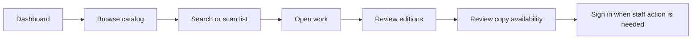
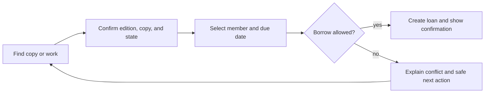
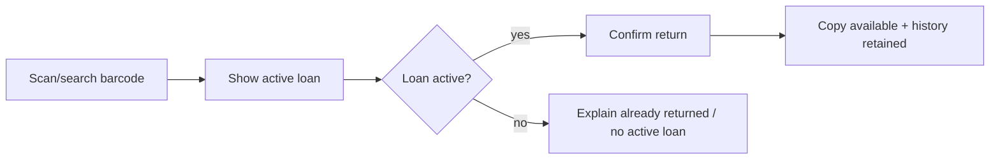

# 🎨 Library Ops Product and Experience Design

> **Status:** as-built public experience plus prioritized authenticated-flow and polish backlog<br>
> **Last live review:** 22 June 2026<br>
> **Audience:** product, design, engineering, accessibility, and evaluation reviewers

[← Documentation index](README.md) · [Product requirements](PRD.md) · [Architecture](ARCHITECTURE.md) · [Setup](../SETUP.md) · [Open the live demo](https://library-ops.onrender.com/)

---

## 📌 Design brief

Library Ops should feel like a small, dependable operations tool—not a generic CRUD scaffold and not a speculative AI showcase.

The experience must help four groups answer distinct questions:

- **Evaluator:** Is the product complete, coherent, usable, and technically credible?
- **Member:** What is in the catalog, and is a physical copy available?
- **Librarian:** What action is needed now, and can it be completed safely?
- **Administrator:** Who can do what, and how is the system governed?

The current public experience successfully demonstrates the catalog hierarchy and seeded circulation states. The highest-value design work now is to make authenticated operations equally inspectable, unify account pages, remove implementation-stage language, and deepen accessibility evidence.

---

## 1. Experience principles

| Principle | Design implication |
| --- | --- |
| **Browse before commitment** | Anonymous users can inspect the dashboard, catalog, works, editions, and copy states before signing in. |
| **Use library language** | Prefer Work, Edition, Copy, Borrow, Return, Available, and On loan over implementation vocabulary. |
| **Show the physical truth** | Availability belongs to copies. A work-level summary must expand to edition and copy detail. |
| **Make role boundaries legible** | Explain why an action is unavailable; do not rely only on hiding controls. |
| **Optimize the common path** | Public browse/search and staff borrow/return require minimal navigation and clear confirmation. |
| **Prevent, then recover** | Disable or reject invalid actions with specific guidance; preserve form input and context. |
| **Use progressive disclosure** | Show a concise work summary first, then editions, copies, history, and staff actions. |
| **Design for keyboard and assistive technology** | Semantic structure, focus order, labels, errors, status announcements, and target size are first-class requirements. |
| **Calibrate claims** | A configured OAuth button, planned AI feature, or hidden staff route is not presented as public proof without evidence. |
| **Keep evaluation easy** | Canonical records and routes intentionally demonstrate multiple editions, copy states, and authentication entry points. |

---

## 2. Personas and jobs to be done

### Evaluator

**Context:** limited review time, no prior domain knowledge, may not receive privileged credentials immediately.

#### Jobs

- verify the assignment minimum quickly;
- see evidence of product and engineering quality;
- understand what is public, authenticated, deferred, or superseded;
- inspect domain and architecture decisions without reading the entire codebase;
- identify trade-offs and next priorities.

#### Design needs

- a five-minute guided path;
- live route links and current seeded counts;
- clear status language;
- authenticated screenshots or a safe staff account;
- concise architecture and development history.

### Member

**Context:** wants to find material and understand availability.

#### Jobs

- search by known title, author/contributor, subject, or identifier;
- distinguish different editions;
- see whether a copy can be borrowed;
- understand account access and, where supported, personal loan information.

#### Design needs

- forgiving search;
- readable work and edition hierarchy;
- availability summary before deep detail;
- plain-language empty and error states;
- no staff-only jargon.

### Librarian

**Context:** handles repetitive catalog and circulation work where mistakes affect patrons and inventory.

#### Jobs

- create or correct contributors, works, editions, and copies;
- find a copy quickly by barcode or identifier;
- borrow an available copy to a member;
- return an active loan;
- identify overdue and recently returned loans;
- understand why an action cannot proceed.

#### Design needs

- task-oriented navigation;
- barcode-first retrieval;
- transaction confirmation and error recovery;
- role-appropriate actions near the affected record;
- dense but scannable circulation tables;
- keyboard-efficient forms.

### Administrator

**Context:** responsible for access and overall system integrity.

#### Jobs

- manage users and roles;
- inspect privileged operations and exceptions;
- recover or archive problematic records;
- verify system and data health.

#### Design needs

- explicit authorization boundaries;
- confirmation for destructive/archival operations;
- audit/context information;
- clear distinction between application administration and ordinary library workflows.

---

## 3. Information architecture

### Public navigation

```text
Home / Dashboard
├── Catalog
│   ├── Search and browse
│   └── Work detail
│       ├── Contributors
│       ├── Editions
│       └── Physical copies and availability
└── Account access
    ├── Sign in
    ├── Sign up
    ├── Password reset
    └── Optional OAuth
```

### Authenticated navigation target

```text
Library Ops
├── Dashboard
│   ├── Catalog summary
│   ├── Inventory summary
│   ├── Active / overdue loans
│   └── Quick actions
├── Catalog
│   ├── Works
│   ├── Contributors
│   ├── Editions
│   └── Copies
├── Circulation
│   ├── Borrow
│   ├── Return
│   ├── Active loans
│   ├── Overdue loans
│   └── Recent returns
├── Members / Users        [role-dependent]
├── Administration         [Admin]
└── Account
```

### Current public routes

| Route | Current purpose | Design note |
| --- | --- | --- |
| `/` | Dashboard with current seeded counts and next action | Strong evaluator entry point; cards should become actionable. |
| `/catalog/` | Browse and search | Rename “Catalog Foundation”; add availability summaries and search coaching. |
| `/catalog/6/` | Mixed copy-state example | Best public circulation-state evidence. |
| `/catalog/1/` | Multiple-edition example | Best public hierarchy evidence. |
| `/accounts/login/` | Password and optional social entry | Most polished account route. |
| `/accounts/signup/` | Local account creation | Bring into the branded shell. |
| `/accounts/password/reset/` | Password recovery | Bring into the branded shell and clarify completion. |

Authenticated routes should be documented from current URL configuration during implementation rather than invented in this design document.

---

## 4. Current live UX review

### Review method

The public deployment was reviewed on 22 June 2026 through the dashboard, catalog, two representative work-detail routes, sign-in, sign-up, password reset, and social-provider entry points. The review evaluated:

- task clarity;
- information hierarchy;
- domain-language accuracy;
- public evaluator access;
- navigation and recovery;
- status communication;
- accessibility indicators observable without a full audit;
- consistency across first-party and account-framework screens.

This is a focused heuristic review, not a formal WCAG conformance audit or complete authenticated usability study.

### Strengths

| Area | Observation | Why it works |
| --- | --- | --- |
| Dashboard | Current seeded counts are visible immediately. | Gives the evaluator concrete state rather than an empty landing page. |
| Browse-first flow | Catalog access does not require sign-in. | Reduces evaluator friction and respects public discovery use cases. |
| Domain evidence | Work detail separates editions and physical copies. | Makes the architectural decision visible in the product. |
| Demonstration records | One record has mixed copy states; another has two editions. | The seed set is intentionally useful for evaluation. |
| Search framing | Identifier, title, contributor, and subject are named. | Sets a clear expectation for retrieval. |
| Copy status | `Available` and `On loan` are attached to specific barcodes. | Avoids misleading title-level availability. |
| Account fallback | Password access remains available alongside OAuth. | Demo reliability does not depend entirely on external providers. |
| Role cues | Public copy identifies Admin/Librarian-only operations. | Communicates authorization boundaries before login. |

### Problems and opportunities

| Priority | Finding | Impact | Recommendation |
| ---: | --- | --- | --- |
| P1 | Sign-up and password-reset pages are visually less integrated than sign-in. | Account journey feels fragmented and framework-default. | Apply the same shell, spacing, headings, help text, errors, and navigation to every account page. |
| P1 | Staff workflows are not publicly inspectable without private credentials. | Evaluator cannot independently prove the full assignment. | Add an evaluator-safe role, guided read-only staff tour, or refreshed authenticated screenshots/video. |
| P1 | “Catalog Foundation” and “foundation records” are implementation-stage terms. | Users see project scaffolding language instead of library tasks. | Rename to “Catalog” and “catalog records” or task-specific copy. |
| P1 | Seeded demo account language does not explain how credentials are obtained. | Reviewer may assume a missing credential or broken flow. | State that staff credentials are supplied privately; optionally add a disposable member account. |
| P2 | Catalog rows do not summarize availability. | Users must open each work to understand borrowability. | Add available/total copy counts and edition count. |
| P2 | Search gives no examples or visible recovery pattern. | Users may not discover identifier precedence or supported fields. | Add example chips, preserved query, clear button, and no-results suggestions. |
| P2 | Work detail gives equal visual weight to IDs and operational state. | Barcodes dominate when availability and edition grouping matter more. | Group copies by state; make identifiers secondary but copyable. |
| P2 | Dashboard summary cards appear informational only. | Counts do not accelerate the next task. | Link cards to filtered catalog/circulation views with clear focus styles. |
| P2 | There is no in-product demo/about explanation. | Product, roles, seed data, and limitations are visible only in repository docs. | Add a compact “About this demo” panel or route. |
| P3 | Full keyboard, screen-reader, contrast, reflow, zoom, and live-region behavior is unverified. | Accessibility remains an aspiration rather than demonstrated quality. | Run automated and manual WCAG 2.2 AA evaluation and record results. |

---

## 5. Content design

### Preferred language

| Avoid | Use | Reason |
| --- | --- | --- |
| Book status | Copy availability / copy status | A work can have several independent copies. |
| Check in / check out without context | Borrow / Return | Removes ambiguity in the assignment wording. |
| Foundation record | Catalog record, work, edition, or copy | Implementation phase is not a user concept. |
| Delete | Archive, unless deletion is truly safe | Preserves history and communicates consequence. |
| Invalid | Explain the specific problem and correction | Supports recovery. |
| Unauthorized | “You need a Librarian or Admin account to…” | Makes the role boundary actionable. |
| AI search | Semantic search, only when it is actually shipped | Avoids vague or overstated capability. |

### Voice

- direct and operational;
- calm around errors;
- specific about state and next action;
- no marketing claims unsupported by evidence;
- no developer jargon in member-facing pages;
- use sentence case for headings and controls;
- reserve emoji for evaluator documentation, not dense operational screens.

### Example messages

#### Borrow conflict

> This copy is already on loan. Refresh the record or select another available copy.

#### Return conflict

> This loan has already been returned. No inventory change was made.

#### Permission boundary

> A Librarian or Admin account is required to edit catalog records.

#### No search results

> No catalog records matched “distributed systems.” Try a title, contributor, subject, ISBN, or barcode.

#### Archive confirmation

> Archive this edition? It will leave the active catalog, but its loan history will be preserved.

---

## 6. Interaction model

### Public catalog journey



### Staff circulation journey



### Return journey



### Permission behavior

- Anonymous and Member users may see that a staff action exists, but the UI should explain the required role.
- Direct requests to protected endpoints must fail safely even when a control is absent from the page.
- Redirect-to-login should preserve the intended destination when appropriate.
- A signed-in but underprivileged user should receive a role-specific explanation, not an authentication loop.
- Destructive or archival actions require consequence text and a deliberate confirmation.

---

## 7. Wireframes

These wireframes replace the earlier isolated wireframe notes. They are deliberately low fidelity so they communicate hierarchy, content, actions, states, and accessibility behavior without pretending to be pixel-perfect visual designs.

### 7.1 Dashboard

```text
┌─────────────────────────────────────────────────────────────────────┐
│ Library Ops                         Catalog   Sign in / Account       │
├─────────────────────────────────────────────────────────────────────┤
│ Library dashboard                                                   │
│ A demo-ready catalog and circulation workspace.                     │
│                                                                     │
│ [ Browse catalog ]  [ Sign in for staff workflows ]                 │
│                                                                     │
│ ┌─────────────────┐ ┌─────────────────┐ ┌─────────────────────────┐ │
│ │ 9 works         │ │ 16 copies       │ │ Active / overdue loans │ │
│ │ View catalog →  │ │ View inventory →│ │ Sign in / View →       │ │
│ └─────────────────┘ └─────────────────┘ └─────────────────────────┘ │
│                                                                     │
│ Demonstration records                                               │
│ • A Tale of Two Cities — mixed availability                         │
│ • Pride and Prejudice — multiple editions                           │
│                                                                     │
│ About this demo: roles · seed data · limitations · source code      │
└─────────────────────────────────────────────────────────────────────┘
```

#### Behavior notes

- summary cards are links with visible focus;
- current counts have descriptive labels, not color-only meaning;
- the staff call to action changes when authenticated;
- demonstration records accelerate evaluation;
- avoid auto-updating numbers without an accessible announcement.

### 7.2 Catalog and search

```text
┌─────────────────────────────────────────────────────────────────────┐
│ Catalog                                                             │
│ Search by title, contributor, subject, ISBN, or barcode.             │
│                                                                     │
│ [ Search __________________________________ ] [ Search ] [ Clear ]   │
│ Examples: [9780486417769] [Jane Austen] [gothic]                    │
│                                                                     │
│ Filters: Availability [Any ▾]  Contributor [Any ▾]                  │
│                                                                     │
│ 9 works                                                             │
│ ┌─────────────────────────────────────────────────────────────────┐ │
│ │ Pride and Prejudice                                             │ │
│ │ Jane Austen · 2 editions · 2/2 copies available                │ │
│ │ Subjects …                                         [View work] │ │
│ └─────────────────────────────────────────────────────────────────┘ │
│ ┌─────────────────────────────────────────────────────────────────┐ │
│ │ A Tale of Two Cities                                            │ │
│ │ Charles Dickens · 1 edition · 4/5 copies available             │ │
│ │ 1 copy on loan                                      [View work] │ │
│ └─────────────────────────────────────────────────────────────────┘ │
│                                                                     │
│ Staff: [ Add work ]                                                 │
└─────────────────────────────────────────────────────────────────────┘
```

#### Behavior notes

- query remains visible after submission;
- result count uses a live region only when results change dynamically;
- exact identifier matches receive a textual “Exact identifier” cue when useful;
- filter controls have labels and can be reset independently;
- staff action is role-gated and should not push public content below the fold.

### 7.3 No-results state

```text
No catalog records matched “distributed systems”.

Try:
• checking the spelling;
• a shorter title or contributor name;
• an ISBN or barcode without spaces;
• a subject such as “science fiction”.

[ Clear search ]  [ Browse all works ]
```

### 7.4 Work detail

```text
┌─────────────────────────────────────────────────────────────────────┐
│ ← Back to catalog                                                   │
│                                                                     │
│ A Tale of Two Cities                                                │
│ Charles Dickens · Author                                            │
│ [ Edit work ] [ Archive work ]                     staff only       │
│                                                                     │
│ Edition 1                                                           │
│ ISBN 9780486417769 · Project Gutenberg · English                    │
│ 4 of 5 copies available                             [Edit edition]  │
│                                                                     │
│ Available (4)                                                       │
│ • CIRC-DEMO-003            Shelf —             [Borrow]             │
│ • CIRC-HIST-0007-01        Shelf Demo-01       [Borrow]             │
│ • CIRC-HIST-0007-02        Shelf Demo-01       [Borrow]             │
│ • CIRC-HIST-0007-03        Shelf Demo-01       [Borrow]             │
│                                                                     │
│ On loan (1)                                                         │
│ • CIRC-DEMO-001            Due 28 Jun 2026     [View loan]          │
│                                                                     │
│ [ Add copy ]                                      staff only        │
└─────────────────────────────────────────────────────────────────────┘
```

#### Behavior notes

- work metadata, edition metadata, and copy state have distinct headings;
- state groups come before raw identifier detail;
- copy barcode can be selected/copied and remains visible for operations;
- multiple editions are separate sections with their own availability summary;
- archived records expose status to staff without confusing public browse.

### 7.5 Sign in

```text
┌───────────────────────────────────────────────┐
│ Library Ops                                   │
│                                               │
│ Sign in                                       │
│ Use a supplied demo account or your provider. │
│                                               │
│ Email                                         │
│ [___________________________________________] │
│ Password                         Forgot?       │
│ [___________________________________________] │
│ [ ] Remember me                               │
│                                               │
│ [ Sign in ]                                   │
│                                               │
│ ─────────────── or ───────────────             │
│ [ Continue with GitHub ]                      │
│ [ Continue with Google ]                      │
│                                               │
│ Create account · Back to catalog              │
└───────────────────────────────────────────────┘
```

#### Behavior notes

- labels stay visible; placeholders are examples only;
- errors appear near fields and in a summary linked to invalid inputs;
- password-manager/autocomplete attributes are correct;
- OAuth availability text distinguishes configured providers from fallback;
- return destination is preserved after successful sign-in where safe.

### 7.6 Account auxiliary pages

Sign-up, password reset, reset confirmation, provider error, and logout pages use the same shell as sign-in:

```text
[Brand/navigation]
[One clear H1]
[Short task explanation]
[Form or status]
[Primary action]
[Recovery / back link]
[Privacy and credential guidance where relevant]
```

No account page should look like an unrelated framework administration screen.

### 7.7 Borrow flow

```text
Borrow copy CIRC-HIST-0007-01
A Tale of Two Cities · Edition ISBN 9780486417769

Member
[ Search email/name _______________________ ]
[ Selected: Sam Member · member@example.test ]

Due date
[ 2026-07-06 ]

[ Cancel ] [ Confirm borrow ]

Before confirmation:
• copy is available;
• member is eligible;
• actor has Librarian/Admin role;
• due date is valid.
```

#### Success

> Borrowed CIRC-HIST-0007-01 to Sam Member. Due 6 July 2026.

The success message links to the loan and the originating work.

### 7.8 Return flow

```text
Return copy
[ Scan or enter barcode __________________ ] [ Find ]

CIRC-DEMO-001
A Tale of Two Cities
Borrowed by Sam Member
Due 28 June 2026

[ Cancel ] [ Confirm return ]
```

#### Success

> Returned CIRC-DEMO-001. The copy is now available.

### 7.9 Circulation dashboard

```text
┌─────────────────────────────────────────────────────────────────────┐
│ Circulation                                                         │
│ [ Borrow a copy ]  [ Return a copy ]                                │
│                                                                     │
│ Active 8       Overdue 2       Returned today 5                     │
│                                                                     │
│ Tabs: [Active] [Overdue] [Recently returned]                        │
│                                                                     │
│ Copy / Work        Member        Due / Returned       Action        │
│ CIRC-DEMO-001      Sam Member    28 Jun 2026          View · Return │
│ …                                                                   │
└─────────────────────────────────────────────────────────────────────┘
```

#### Behavior notes

- status is text, not color alone;
- table remains usable at 200% zoom and narrow viewport;
- row actions have clear names including the record context;
- filters and sort state are preserved in the URL where practical;
- overdue emphasis meets contrast requirements and is not the only cue.

### 7.10 Catalog form hierarchy

A single giant “book” form would obscure domain relationships. Staff workflows should guide record creation in layers:

1. Find or create Contributor.
2. Create Work with title and subjects.
3. Add Edition with ISBN/publisher/language/source.
4. Add one or more Copies with unique barcodes and shelf locations.
5. Review the resulting hierarchy before circulation.

Inline creation can accelerate work, but it must not silently duplicate contributors or identifiers.

---

## 8. Component and visual-system guidance

The current implementation is server-rendered; the design system should remain lightweight and semantic.

### Component inventory

| Component | Required behavior |
| --- | --- |
| Global header | Current location, keyboard-visible links, authenticated role/account state |
| Page header | One H1, concise context, role-appropriate primary action |
| Summary card | Real link/button semantics, value + label + destination |
| Search form | Persistent query, explicit label, clear action, examples, no-results recovery |
| Work card/row | Title, contributors, edition count, availability summary, clear detail link |
| Edition section | Identifier, publisher, language, availability summary, staff actions |
| Copy row | Barcode, shelf, textual status, due/loan context, role action |
| Status badge | Text and icon/shape; never color-only |
| Form field | Persistent label, help, error, described-by relationship, preserved value |
| Alert/flash message | Severity, summary, next action, focus/announcement behavior |
| Empty state | What is empty, why it matters, and the next permitted action |
| Confirmation dialog/page | Specific object, consequence, reversible path, deliberate action |
| Table | Caption/heading, responsive fallback, scoped headers, named actions |

### Token intent

Exact values belong in implementation, but the system should define:

- high-contrast text and muted text pairs;
- background, surface, border, focus, success, warning, and danger semantics;
- spacing scale that remains legible at zoom;
- consistent control height and touch target;
- restrained type scale with one dominant page heading;
- visible focus ring that is not removed for pointer aesthetics;
- status semantics independent of any one hue.

### Responsive behavior

| Viewport | Expected adaptation |
| --- | --- |
| Wide desktop | Multi-column summary cards; detailed tables; side-by-side actions where clear |
| Tablet / narrow desktop | Wrapped cards; filters stack; tables scroll or transform without losing headers |
| Mobile | Single-column hierarchy; primary action remains reachable; copy details group vertically |
| 200% zoom | No horizontal page scrolling for ordinary content except intentionally scrollable data tables |

---

## 9. State design

Every major surface needs more than a happy path.

| State | Required treatment |
| --- | --- |
| Loading | Server-rendered response or explicit progress; no indefinite blank surface |
| Empty catalog | Explain seed/setup or first record action according to role |
| Empty circulation | Confirm that there are no matching loans; do not imply failure |
| No search results | Preserve query and offer specific alternatives |
| Validation error | Summary + field-level error, preserved input, focus to summary |
| Authorization failure | State required role and safe next destination |
| Authentication required | Preserve intended destination and explain why sign-in is needed |
| Concurrent conflict | Explain that state changed and offer refresh/alternative action |
| External provider failure | Preserve password fallback and avoid exposing provider secrets |
| Server error | Human-readable message, correlation/support guidance, no traceback |
| Archived record | Clear status, read-only history, restore action only for authorized role |
| Offline/transient host | Retry guidance; do not lose submitted state where practical |

### Flash-message behavior

- success messages confirm object and resulting state;
- warnings explain consequence and remaining action;
- errors avoid blame and identify recovery;
- messages are announced to assistive technology when inserted after navigation/action;
- critical information remains on the destination page rather than disappearing too quickly.

---

## 10. Accessibility target

Library Ops targets **WCAG 2.2 Level AA**. This is a delivery target, not a certification claim.

### Baseline requirements

| Area | Requirement |
| --- | --- |
| Structure | Logical headings, landmarks, lists, tables, and form grouping |
| Keyboard | All controls reachable and operable; no keyboard trap; visible focus |
| Focus | Focus moves predictably after errors, dialogs, and major route changes |
| Names/labels | Every control has a programmatic accessible name; links describe purpose |
| Errors | Error summary, field association, correction guidance, preserved values |
| Contrast | Text, controls, focus, and non-text indicators meet applicable ratios |
| Reflow | Content usable at 320 CSS px and 200% zoom with limited intentional table scrolling |
| Target size | Controls meet WCAG 2.2 target-size expectations or documented exceptions |
| Status | Dynamic results, errors, and success states are programmatically exposed |
| Authentication | Password managers/paste are not blocked; cognitive burden is minimized |
| Motion | No unnecessary motion; reduced-motion preference respected if motion is added |
| Language | Page language and unusual terminology are clear |

### Verification matrix

| Method | Coverage |
| --- | --- |
| HTML/template review | Semantics, labels, landmarks, heading order |
| Keyboard manual pass | Navigation, forms, dialogs, tables, role actions |
| Screen-reader spot checks | Search results, form errors, success messages, tables |
| Automated browser scan | Common WCAG issues; not a substitute for manual review |
| Contrast tooling | Text, controls, focus, status, disabled states |
| Zoom/reflow | 200% zoom, narrow viewport, responsive tables/forms |
| Cognitive review | Plain language, consistent navigation, recoverable authentication |

### Accessibility acceptance scenarios

```gherkin
Scenario: Search can be completed with a keyboard
  Given I am on the catalog page
  When I navigate using only the keyboard
  Then I can reach the search field, submit the query, inspect results, and clear the query
  And visible focus is present throughout
```

```gherkin
Scenario: Validation errors are announced and linked
  Given I submit an invalid staff form
  Then focus moves to an error summary
  And each error links to its field
  And the entered values remain available for correction
```

```gherkin
Scenario: Copy state is not color-only
  Given I inspect edition inventory
  Then every copy state is expressed in text
  And status remains understandable without color perception
```

---

## 11. Evaluation scenarios

### Public evaluator script

1. Open the dashboard and record the current counts.
2. Browse the catalog and identify supported search fields.
3. Search or navigate to `A Tale of Two Cities`; confirm five copies and mixed states.
4. Open `Pride and Prejudice`; confirm two editions and independent ISBN/publisher data.
5. Open sign-in; inspect password, recovery, sign-up, GitHub, and Google entry points.
6. Compare observed behavior with the README status table.
7. Review deferred scope and known limitations.

### Authenticated evaluator script

When evaluator-safe credentials are available:

1. Sign in as Member and verify staff actions are absent or denied.
2. Sign in as Librarian and create or edit a controlled demo record.
3. Add a copy with a unique barcode.
4. Borrow an available copy to a member.
5. Attempt a duplicate borrow and observe the safe failure.
6. Return the active loan.
7. Verify circulation history and inventory state.
8. Sign in as Admin and verify role-management scope.
9. Archive the controlled record only when history rules allow it.

### Evidence checklist

- [ ] Route and timestamp recorded.
- [ ] Role recorded without exposing credentials.
- [ ] Seeded state or controlled fixture recorded.
- [ ] Expected and observed outcome compared.
- [ ] Screenshot excludes secrets and private user data.
- [ ] Accessibility-relevant state captured where applicable.
- [ ] Known limitation documented rather than edited out of evidence.

---

## 12. Evaluation evidence and screenshot protocol

### Canonical live links

| Evidence | URL |
| --- | --- |
| Dashboard | <https://library-ops.onrender.com/> |
| Catalog | <https://library-ops.onrender.com/catalog/> |
| Mixed copy states | <https://library-ops.onrender.com/catalog/6/> |
| Multiple editions | <https://library-ops.onrender.com/catalog/1/> |
| Sign in | <https://library-ops.onrender.com/accounts/login/> |
| Sign up | <https://library-ops.onrender.com/accounts/signup/> |
| Password reset | <https://library-ops.onrender.com/accounts/password/reset/> |

### Proposed repository captures

```text
docs/assets/
├── dashboard.png
├── catalog.png
├── work-mixed-copy-states.png
├── work-multiple-editions.png
├── sign-in.png
├── staff-catalog-form.png
├── circulation-active.png
├── borrow-confirmation.png
├── duplicate-borrow-error.png
└── return-confirmation.png
```

The consolidated documentation links live routes today rather than fabricating missing image files. Add static captures only when they are freshly produced and kept current.

### Capture requirements

1. Use a clean browser profile and the production URL.
2. Record the capture date and deployed revision in the pull request or release note.
3. Use representative seeded records named in this document.
4. Crop browser chrome only when the URL remains documented nearby.
5. Do not expose passwords, tokens, emails beyond disposable demo identities, OAuth codes, admin sessions, or private logs.
6. Capture one desktop width and one narrow/reflow width for key screens.
7. Include keyboard focus and validation/error examples for accessibility evidence.
8. Optimize images for repository size without making text unreadable.
9. Add accurate alt text adjacent to each image use.
10. Replace stale captures in the same change as visible UI behavior.

### Markdown pattern

```markdown
[](
  https://library-ops.onrender.com/catalog/
)

*Catalog captured on YYYY-MM-DD from revision `<short-sha>`.*
```

---

## 13. Figma and collaborative design tooling

Figma and Miro were considered as planning and handoff tools. They are **task-scoped**, not required dependencies for every contributor or agent session.

Use Figma when:

- a visual-system change needs comparison across screens;
- responsive behavior is easier to review before implementation;
- an authenticated workflow needs a prototype;
- design tokens/components require shared inspection;
- accessibility annotations need a durable visual artifact.

Use Miro or an equivalent collaborative board when:

- mapping the assignment to journeys and release slices;
- facilitating story mapping or risk review;
- comparing architecture or scope alternatives;
- planning an evaluator walkthrough.

Do not duplicate current requirements or architecture as unmaintained text inside design tools. Link back to the canonical Markdown and record only the visual/interactive decision that the tool improves.

### Figma implementation brief

A future design file should include:

```text
Page 1 — Foundations
  type, spacing, color semantics, focus, status, form states
Page 2 — Public flows
  dashboard, catalog, work detail, search/no-results
Page 3 — Account flows
  sign in, sign up, reset, provider error, logout
Page 4 — Staff catalog
  work/edition/copy forms, archive confirmation
Page 5 — Circulation
  dashboard, borrow, return, conflict and success states
Page 6 — Responsive and accessibility
  narrow layouts, 200% zoom, focus order, error annotations
Page 7 — Evaluator evidence
  canonical screenshots and route/revision metadata
```

The Figma MCP should be enabled and authenticated only when an active task needs design context. Lack of Figma access must not block backend fixes, documentation, or unrelated product work.

---

## 14. Design acceptance criteria

### Dashboard

- displays current work and copy counts from authoritative data;
- gives anonymous users a clear catalog action;
- gives signed-in staff a clear circulation action;
- summary cards are semantic links or controls;
- demonstration records are discoverable;
- layout remains usable at narrow widths and zoom.

### Catalog

- supports title, contributor, subject, and identifier input;
- preserves the query and communicates result count;
- exact identifier behavior is understandable;
- each result exposes edition count and availability summary when data exists;
- no-results state offers recovery;
- staff actions are role-gated and use explicit labels.

### Work detail

- separates work, contributor, edition, and copy information;
- groups copies by operational state;
- shows barcode and shelf without letting them dominate hierarchy;
- exposes role-appropriate actions;
- multiple editions are independently understandable;
- archived state and history are not confused with deletion.

### Account flows

- share one branded shell and navigation model;
- support password managers and standard autocomplete;
- provide linked error summaries and field errors;
- explain provider availability honestly;
- preserve password fallback;
- never expose whether an unrelated email account exists more than necessary.

### Circulation

- find/scan by exact copy identifier;
- show enough context to prevent wrong-item action;
- require explicit confirmation for borrow/return;
- explain conflicts and current state;
- display success with the resulting copy/loan state;
- remain keyboard efficient;
- preserve historical loan information.

---

## 15. Prioritized design backlog

| Priority | Item | Definition of success |
| ---: | --- | --- |
| P1 | Unified account shell | Sign-in, sign-up, reset, provider errors, and logout share navigation, style, error, and accessibility behavior. |
| P1 | Evaluator-safe authenticated evidence | Staff CRUD and circulation can be reviewed without publishing privileged credentials. |
| P1 | Product-language cleanup | No public “Foundation” or implementation-phase copy remains. |
| P1 | Circulation conflict UX | Duplicate borrow, already-returned, archived, and permission conflicts have tested recovery messages. |
| P2 | Catalog availability summary | Results show edition count and available/total copies. |
| P2 | Search coaching | Examples, clear/reset, preserved query, and no-results guidance ship. |
| P2 | Copy-state grouping | Available/on-loan/other inventory states are visually and semantically grouped. |
| P2 | Actionable dashboard | Summary cards link to relevant filtered surfaces. |
| P2 | About/demo surface | Roles, scope, representative records, and limitations are visible in-product. |
| P2 | Accessibility evidence | Automated scan plus keyboard, screen-reader, contrast, zoom, and reflow evidence recorded. |
| P3 | Responsive staff tables/forms | Circulation and catalog operations remain efficient on tablet/narrow layouts. |
| P3 | Optional visual design file | Figma file reflects implemented components and links canonical requirements. |

---

## 16. Design risks

| Risk | Failure mode | Mitigation |
| --- | --- | --- |
| Demo-first copy leaks into real product language | Users see “foundation”, “seed”, or evaluator instructions in operational workflows | Keep evaluator context in an About surface; use domain language in tasks |
| Availability summary becomes stale or misleading | Work appears available while all relevant copies are unavailable | Derive from authoritative copy/loan state on request |
| Role hiding substitutes for authorization | Member calls staff endpoint directly | Server-side permission tests and explicit denial states |
| Dense inventory becomes inaccessible | Copy table fails at zoom/mobile/screen reader | Semantic grouping, responsive design, named actions, targeted manual testing |
| Screenshots become stale | Documentation contradicts live deployment | Date/revision metadata and same-change replacement rule |
| OAuth design overpromises | Provider button exists but credentials/callback fail | Honest provider status and password fallback |
| AI branding outruns product behavior | Users expect semantic assistant that is not shipped | Keep product AI deferred and engineering agents described separately |
| Visual polish hides integrity errors | Beautiful UI permits duplicate loans or destructive history loss | Domain invariants and transaction tests remain the primary quality gate |

---

## 17. Design verification checklist

- [ ] Public routes match the documented information architecture.
- [ ] Dashboard counts and demonstration records match current seed data.
- [ ] Product language uses Work/Edition/Copy/Borrow/Return consistently.
- [ ] Account pages use one branded shell.
- [ ] Catalog results expose useful availability summaries.
- [ ] Search has examples, preserved query, reset, and recovery.
- [ ] Work detail distinguishes editions and groups copy states.
- [ ] Staff actions are both role-gated and server-protected.
- [ ] Borrow/return success and conflict states are specific and recoverable.
- [ ] Empty, error, loading, archived, and permission states are implemented.
- [ ] Keyboard, focus, screen-reader, contrast, target size, zoom, and reflow are tested.
- [ ] Screenshots contain no secrets and record date/revision.
- [ ] Figma or other design tools do not become a second requirements source.
- [ ] Deferred capabilities are not visible as unsupported promises.

---

## 📚 References

- [WCAG 2.2](https://www.w3.org/TR/WCAG22/)
- [WAI-ARIA Authoring Practices](https://www.w3.org/WAI/ARIA/apg/)
- [GOV.UK Design System: error messages](https://design-system.service.gov.uk/components/error-message/)
- [GOV.UK Design System: error summary](https://design-system.service.gov.uk/components/error-summary/)
- [Nielsen Norman Group usability heuristics](https://www.nngroup.com/articles/ten-usability-heuristics/)
- [Figma Dev Mode](https://www.figma.com/dev-mode/)
- [C4 model](https://c4model.com/)
- [Library Ops live dashboard](https://library-ops.onrender.com/)
- [Library Ops live catalog](https://library-ops.onrender.com/catalog/)
