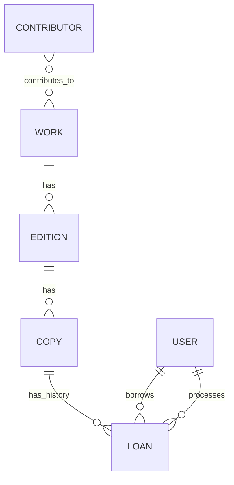

# 📋 Library Ops Product Requirements and Delivery Record

> **Document type:** canonical as-built PRD, requirements specification, and delivery record<br>
> **Status:** accepted current baseline<br>
> **Last reviewed:** 22 June 2026<br>
> **Product:** Library Ops<br>
> **Live demo:** <https://library-ops.onrender.com/><br>
> **Audience:** product, engineering, design, security, evaluation, and autonomous-delivery agents

[← Documentation index](README.md) · [Architecture](ARCHITECTURE.md) · [Design](DESIGN.md) · [Setup](../SETUP.md) · [Evaluator README](../README.md)

---

## 📌 Document control

### Purpose

This document answers five questions in one authoritative place:

1. **Why does Library Ops exist?**
2. **What must the product and delivery system do?**
3. **What was actually implemented, authenticated, deferred, superseded, or left unverified?**
4. **How is completion demonstrated?**
5. **What evidence should trigger the next investment?**

It consolidates the original assignment interpretation, broad product concept, later Django/Render convergence, Task Master PRD, Spec Kit governance, architectural decisions, security and quality requirements, wireframes, live UX review, implementation history, risk register, and delivery evidence.

### Authority

- This is the **canonical human-readable product requirements document**.
- Architecture constraints and significant decisions are expanded in [ARCHITECTURE.md](ARCHITECTURE.md).
- Experience behavior and wireframes are expanded in [DESIGN.md](DESIGN.md).
- Commands and operations are expanded in [SETUP.md](../SETUP.md).
- Task Master state, generated plans, diagrams, and agent summaries are derived artifacts and must be reconciled to this document.
- Code, tests, migrations, and deployment configuration are authoritative evidence of implementation details.
- The live deployment is authoritative evidence of public behavior at a point in time.

### Normative language

The keywords **MUST**, **MUST NOT**, **REQUIRED**, **SHOULD**, **SHOULD NOT**, and **MAY** are used in the sense described by [RFC 2119](https://datatracker.ietf.org/doc/html/rfc2119), as clarified by [RFC 8174](https://datatracker.ietf.org/doc/html/rfc8174), when they appear in uppercase.

### Status taxonomy

| Status | Meaning |
| --- | --- |
| **Shipped / public** | Observable without privileged credentials in the live deployment. |
| **Implemented / authenticated** | Implemented behind authentication or staff permissions; public verification requires evaluator-safe access or captured evidence. |
| **Control-plane** | Implemented for engineering delivery rather than end-user runtime. |
| **Target / partially verified** | Required or configured, but complete evidence is not yet available. |
| **Deferred** | Deliberately excluded until an explicit trigger is met. |
| **Superseded** | Former direction retained as decision history, not current implementation. |
| **Out of scope** | Not needed for the assignment or current product boundary. |

> [!IMPORTANT]
> Status is evidence-calibrated. “Configured,” “button visible,” “planned,” “agent-generated,” “test defined,” and “verified in production” are different claims.

---

## 🧭 Table of contents

1. [Executive summary](#-executive-summary)
2. [Assignment interpretation](#1-assignment-interpretation)
3. [How the PRD was derived](#2-how-the-prd-was-derived)
4. [Product evolution](#3-product-evolution)
5. [Vision, goals, and non-goals](#4-vision-goals-and-non-goals)
6. [Personas and journeys](#5-personas-and-journeys)
7. [Ubiquitous language](#6-ubiquitous-language)
8. [Scope and delivery status](#7-scope-and-delivery-status)
9. [Functional requirements](#8-functional-requirements)
10. [Non-functional requirements](#9-non-functional-requirements)
11. [Domain, RBAC, and invariants](#10-domain-rbac-and-invariants)
12. [Experience requirements and wireframes](#11-experience-requirements-and-wireframes)
13. [Autonomous delivery requirements](#12-autonomous-delivery-requirements)
14. [Acceptance criteria](#13-acceptance-criteria)
15. [Quality and test strategy](#14-quality-and-test-strategy)
16. [Delivery record and timeline](#15-delivery-record-and-timeline)
17. [Success measures](#16-success-measures)
18. [Risks, assumptions, and limitations](#17-risks-assumptions-and-limitations)
19. [Roadmap and reconsideration triggers](#18-roadmap-and-reconsideration-triggers)
20. [Requirements traceability](#19-requirements-traceability)
21. [Definition of done](#-definition-of-done)
22. [Appendices](#-appendices)

---

## 📌 Executive summary

Library Ops is a deployed mini library-management system built to demonstrate both hands-on engineering quality and engineering-management judgment.

The product supports:

- a public catalog of seeded works;
- contributors, works, editions, and physical copies as distinct concepts;
- copy-level availability;
- search by identifier, title, contributor, and subject;
- password account flows and optional social identity entry points;
- Admin, Librarian, and Member role boundaries;
- authenticated catalog operations;
- authenticated borrow/return and circulation views;
- a live Django/PostgreSQL application on Render.

The project also includes a governed autonomous engineering system:

- Spec Kit structures specification discipline;
- this PRD and significant decisions preserve canonical intent;
- Task Master derives dependency-aware execution work;
- a coordinator delegates bounded specialists for research, exploration, implementation, review, command execution, task stewardship, and retrospectives;
- `AGENTS.md`, skills, MCP integrations, rules, permissions, hooks, deterministic validators, and evaluations constrain behavior;
- human approval remains mandatory for material risk and final accountability.

The most important scope decision was restraint. Product semantic search, AI metadata assistance, holds, fines, notifications, acquisitions, multi-branch inventory, and enterprise identity were not presented as shipped merely because they appeared in early planning. The current system prioritizes correct domain boundaries, integrity, deployment, evidence, and usability.

### Current public evidence

As reviewed on 22 June 2026:

| Evidence | Observed state |
| --- | --- |
| Dashboard | 9 catalog works and 16 physical copies |
| Catalog | 9 public-domain works; one work has 2 editions |
| A Tale of Two Cities | 1 edition, 5 copies, 1 on loan, 4 available |
| Pride and Prejudice | 2 editions with distinct ISBN/publisher metadata |
| Account access | Password form, remember-me, sign-up, reset, GitHub, and Google entry points |

---

## 1. Assignment interpretation

### 1.1 Raw brief

The assignment requested a mini library-management system with:

| Category | Requirement |
| --- | --- |
| Minimum product | Add/edit/delete books, check-in/check-out, search |
| Technical choice | Any language, framework, IDE, and AI tools |
| Submission | Source code and README |
| Bonus | Live deployment, video, SSO/auth and roles, AI, creative extras |
| Evaluation | Completeness, creativity, product quality, usability |

### 1.2 Ambiguity: check-in and check-out

The original wording associated “checked in” with borrowed and “checked out” with returned, which is inverted relative to common library usage.

Library Ops resolves the ambiguity as:

| User-facing action | Meaning | State transition |
| --- | --- | --- |
| **Borrow** | A member receives an available physical copy | `AVAILABLE → ON_LOAN` |
| **Return** | Staff closes the active loan | `ON_LOAN → AVAILABLE` |

Internal names may use `checkout` and `checkin` when framework/library conventions require them, but user-facing copy MUST prefer **Borrow** and **Return**.

### 1.3 Ambiguity: “book” versus inventory

A single “book” row is not enough to model a library. The assignment’s CRUD language was interpreted as managing a catalog and inventory hierarchy:

```text
Contributor → Work → Edition → Copy → Loan
```

This interpretation allows:

- multiple contributors per work;
- multiple editions per work;
- multiple physical copies per edition;
- independent availability and shelf state per copy;
- durable circulation history.

### 1.4 Evaluation strategy

The submission is optimized for evaluator speed:

1. a public live route;
2. seeded records that intentionally demonstrate key domain cases;
3. an evaluator-focused README;
4. current architecture, design, setup, and PRD documentation;
5. explicit shipped/authenticated/deferred status;
6. tests and quality gates tied to high-risk invariants;
7. a clear development and decision history;
8. honest limitations rather than hidden scope gaps.

---

## 2. How the PRD was derived

The PRD was not produced from one prompt or one framework. It was synthesized through iterative product analysis, research, architecture review, implementation feedback, and live UX evidence.

### 2.1 Socratic product analysis

The planning process began with questions that force trade-offs into the open:

| Question | Why it matters | Current decision |
| --- | --- | --- |
| Are we managing titles or physical inventory? | A title-wide status fails when multiple copies exist. | Model Work, Edition, Copy, and Loan separately. |
| What does delete mean when history exists? | Hard deletion can erase circulation truth. | Archive referenced records; hard delete only when safe. |
| Who may perform each operation? | Bonus roles are meaningful only with server enforcement. | Admin/Librarian/Member with least privilege. |
| Should AI be decorative or useful? | A generic chatbot can overpromise and hallucinate availability. | Defer product AI; use AI in governed engineering delivery. |
| What proves quality? | Feature lists do not prove integrity or usability. | Acceptance criteria, invariant tests, CI, live deployment, UX review, explicit evidence. |
| What is the minimum impressive scope? | Overbuilding can reduce polish and truthfulness. | Complete the core product before optional search/AI/enterprise scope. |
| What should a reviewer see first? | Review time is constrained. | Live links, representative records, status table, decisions, limitations. |
| How is engineering-management judgment visible? | The role is broader than code production. | PRD, architecture, risk, task graph, quality gates, delivery evidence, retrospectives. |

### 2.2 Requirements engineering

The structure was informed by [ISO/IEC/IEEE 29148:2018](https://www.iso.org/standard/72089.html): stakeholder needs, system requirements, quality attributes, acceptance, traceability, and change discipline are explicit.

Normative requirement keywords follow RFC 2119/8174. Requirement IDs remain stable so code, tests, tasks, and reviews can refer to the same intent.

### 2.3 Architecture methods

The design uses:

- [arc42](https://arc42.org/) for pragmatic architecture coverage;
- [C4](https://c4model.com/) for context/container/component views where diagrams reduce ambiguity;
- strategic domain-driven design for bounded contexts and ubiquitous language;
- [MADR](https://adr.github.io/madr/)-style lightweight records for significant decisions;
- explicit quality attributes, risks, trust boundaries, and evolution triggers.

These methods are selective. Documentation exists to improve decisions and delivery, not to satisfy a template mechanically.

### 2.4 Specification and task methods

- [GitHub Spec Kit](https://github.com/github/spec-kit) is the specification backbone: constitution, specification, clarification, planning, task/checklist preparation, analysis, and implementation alignment.
- [Task Master](https://github.com/eyaltoledano/claude-task-master) is the derived execution graph: dependencies, priorities, complexity, subtasks, current status, notes, and next work.
- The PRD remains canonical. Generated tasks MUST be regenerated or reconciled when requirements change.

### 2.5 Research protocol

Version-sensitive or niche decisions use current primary sources first:

- official framework and vendor documentation;
- standards bodies;
- provider API/license guidance;
- official security and accessibility references;
- live deployment inspection;
- current code, tests, migrations, configuration, and CI output.

Secondary sources are used only for comparison or gaps. Research-tool use and source availability are recorded honestly; configured connectors are not described as used unless evidence exists.

### 2.6 Live implementation and UX feedback

The PRD was updated after implementation and live review rather than remaining a plan-only artifact. Public routes were inspected for current counts, catalog hierarchy, copy states, account flows, terminology, and evaluator friction. Findings were converted into requirement dispositions and backlog priorities.

### 2.7 Engineering-manager lens

The process explicitly covers:

- ambiguity management;
- scope and sequencing;
- stakeholder/evaluator experience;
- architecture and risk;
- role separation and ownership;
- quality strategy;
- secure delivery and evidence;
- human-in-the-loop autonomy;
- operational feedback;
- retrospective learning;
- scalable team adoption.

---

## 3. Product evolution

### 3.1 Initial concept

The earliest concept, named **LibraryOps AI**, proposed:

- TypeScript and Next.js App Router;
- Supabase PostgreSQL/Auth/RLS/vector storage;
- Vercel deployment;
- Tailwind/shadcn/Radix UI;
- keyword and semantic search;
- AI metadata suggestions and recommendation explanations;
- Figma and Miro artifacts;
- broader SSO and enterprise extensions.

This work remains valuable as alternative analysis and future-option discovery. It is not the current stack or a shipped-feature claim.

### 3.2 Domain and governance convergence

Subsequent planning improved the model and process:

- Work/Edition/Copy/Loan replaced title-level status;
- deterministic seed/provenance requirements were added;
- hybrid search was ordered exact → lexical → optional semantic;
- Spec Kit, Task Master, architecture decisions, C4/arc42, strategic DDD, risk review, and evidence calibration were introduced;
- a Codex-native agent control plane was designed with direct specialists and least privilege.

### 3.3 Django implementation convergence

The current product converged on:

- Django 5.2 LTS;
- PostgreSQL;
- server-rendered views/forms;
- Render deployment;
- optional GitHub/Google OAuth;
- a public seeded catalog;
- authenticated catalog and circulation workflows;
- a control plane that supports, but does not become, product runtime.

### 3.4 Why the change was correct

The Django path reduced integration surface and made the assignment easier to review as one coherent system. The decision favored:

- faster end-to-end delivery;
- direct server-side authorization;
- a mature ORM and migration system;
- single-platform deployment;
- accessibility-friendly semantic HTML;
- lower operational complexity than a split frontend/backend stack;
- clear separation between shipped product behavior and deferred AI exploration.

---

## 4. Vision, goals, and non-goals

### 4.1 Product vision

> Library Ops gives a small library a clear, reliable way to describe its catalog, track physical inventory, find material, and process borrowing—while demonstrating how a modern engineering team can use autonomous tools responsibly.

### 4.2 Goals

| ID | Goal | Current outcome |
| --- | --- | --- |
| G-001 | Complete the assignment’s core product requirements. | Catalog, search, authenticated lifecycle, and circulation are represented. |
| G-002 | Provide a publicly reviewable deployment. | Live Render application and canonical routes. |
| G-003 | Model the domain beyond trivial CRUD. | Contributor/Work/Edition/Copy/Loan hierarchy. |
| G-004 | Enforce roles and protected operations. | Admin/Librarian/Member model with server-side intent. |
| G-005 | Preserve circulation integrity and history. | Transactional invariant design and archival semantics. |
| G-006 | Make quality and trade-offs visible. | Requirements, architecture, tests/gates, UX review, limitations, roadmap. |
| G-007 | Use AI where evidence supports it. | Governed autonomous engineering shipped; end-user AI deferred. |
| G-008 | Demonstrate an SDLC that can scale to teams. | Specification, task graph, specialist roles, risk gates, evidence, retrospectives. |

### 4.3 Non-goals

| ID | Non-goal | Reason |
| --- | --- | --- |
| NG-001 | Full integrated library system | MARC cataloging, acquisitions, serials, interlibrary loan, and patron services exceed the assignment. |
| NG-002 | Payments and fines | High compliance and operational complexity with limited evaluation value. |
| NG-003 | Native mobile app | Responsive web is sufficient for the current product. |
| NG-004 | Multi-branch logistics | No branch ownership/transfer requirement exists. |
| NG-005 | Generic chatbot | Weak grounding and unclear user value. |
| NG-006 | Product AI without evaluation | Semantic or generative features require real workload and measurable benefit. |
| NG-007 | Microservices | The domain and scale do not justify distributed-system overhead. |
| NG-008 | Unrestricted autonomous production operation | Human accountability and least privilege remain mandatory. |
| NG-009 | Documentation for every code detail | Architecture and decisions are documented only where they reduce risk or ambiguity. |

---

## 5. Personas and journeys

### 5.1 Evaluator

**Need:** verify completeness, creativity, quality, usability, and engineering judgment quickly.

**Primary journey:** README → dashboard → catalog → mixed-state work → multi-edition work → sign-in → authenticated evidence → architecture/PRD.

### 5.2 Member

**Need:** search, distinguish editions, understand copy availability, and access permitted account information.

**Primary journey:** dashboard/catalog → search/browse → work → edition/copy state → account.

### 5.3 Librarian

**Need:** maintain catalog/inventory and process borrowing/return safely.

**Primary journey:** sign in → find/create records → add copy → borrow/return → inspect active/overdue/history.

### 5.4 Administrator

**Need:** manage roles, recover records, and oversee privileged behavior.

**Primary journey:** sign in → user/role administration → catalog/circulation oversight → audit/exception handling.

### 5.5 Contributor/operator

**Need:** install, test, seed, deploy, troubleshoot, and produce evidence reproducibly.

**Primary journey:** setup → current task/requirements → small change → tests/gates → review → deployment → smoke evidence.

### 5.6 Engineering agent

**Need:** complete one approved engineering task with sufficient context and bounded capabilities.

**Primary journey:** policy → canonical requirement → task → risk classification → specialist work → deterministic verification → evidence → stop or handoff.

---

## 6. Ubiquitous language

| Term | Definition |
| --- | --- |
| **Contributor** | A person or organization associated with a work in a role such as author. |
| **Work** | The conceptual intellectual creation, independent of a publication. |
| **Edition** | A publication/manifestation of a work with edition-specific metadata. |
| **Copy** | A physical inventory item belonging to an edition. |
| **Loan** | A borrowing lifecycle connecting one copy, a member, staff participants, due date, and return state. |
| **Borrow** | Create an active loan and make a copy unavailable. |
| **Return** | Close an active loan and make the copy available. |
| **Available** | A copy is eligible to be borrowed now. |
| **On loan** | A copy has an active, unreturned loan. |
| **Overdue** | An active loan is past its due date. |
| **Archived** | Removed from normal active use while references/history remain. |
| **Exact identifier** | ISBN, barcode, source ID, or another normalized identifier with deterministic lookup. |
| **Lexical search** | Retrieval based on indexed terms such as title, contributor, and subject. |
| **Semantic search** | Meaning-based retrieval; deferred and additive, never availability authority. |
| **Canonical artifact** | Human-reviewed source of product or engineering truth. |
| **Derived artifact** | Generated execution aid that must remain aligned with canonical intent. |
| **Control plane** | Engineering-time policies, agents, tools, tasks, gates, and evidence—not the end-user product. |
| **Bounded autonomy** | Agents may act inside approved scope and capabilities, with explicit stop conditions and human gates. |

---

## 7. Scope and delivery status

### 7.1 Current release scope

| Capability group | Status | Summary |
| --- | --- | --- |
| Public dashboard | Shipped / public | Seeded counts and browse/sign-in entry points. |
| Catalog browse/detail | Shipped / public | Works, contributors, editions, copies, and copy state. |
| Search | Shipped / public | Identifier/title/contributor/subject framing with exact-first intent. |
| Password accounts | Shipped / public | Sign-in, remember-me, sign-up, password reset. |
| OAuth entry | Shipped / public, provider-dependent | GitHub and Google entry points; complete success depends on configured deployment credentials. |
| Role model | Implemented / authenticated | Admin, Librarian, Member. |
| Catalog lifecycle | Implemented / authenticated | Staff create/edit/archive and inventory operations. |
| Circulation | Implemented / authenticated | Borrow, return, active/overdue/recent history views. |
| Seed/provenance | Shipped + repository | Public-domain demonstration records with source metadata. |
| Deployment | Shipped / public | Django/PostgreSQL on Render. |
| Autonomous engineering | Control-plane | Spec Kit, Task Master, Codex agents/skills/tools, rules, gates, retrospectives. |
| Product semantic search | Deferred | Requires relevance evidence. |
| Product metadata AI | Deferred | Requires staff workload and evaluation. |
| Holds/fines/notifications/acquisitions | Out of scope | Not needed for current assignment. |
| Next.js/Supabase/Vercel | Superseded | Retained as an alternative considered. |

### 7.2 Demonstration dataset

The reviewed production seed contains:

- 9 works;
- 10 editions;
- 16 physical copies;
- at least one multi-edition work;
- at least one work with mixed available/on-loan copy states;
- Project Gutenberg and Open Library demonstration metadata visible in representative records.

The seed set exists to demonstrate behavior, not to approximate a production collection.

---

## 8. Functional requirements

### 8.1 Public dashboard and evaluator access

| ID | Requirement | Disposition | Evidence / notes |
| --- | --- | --- | --- |
| FR-DASH-001 | The system **MUST** provide a public landing/dashboard route. | Shipped / public | `/` |
| FR-DASH-002 | The dashboard **MUST** expose current work and copy counts from authoritative data. | Shipped / public | 9 works, 16 copies on 22 June 2026. |
| FR-DASH-003 | The dashboard **MUST** link to public catalog browse. | Shipped / public | Public catalog CTA. |
| FR-DASH-004 | The dashboard **SHOULD** explain that circulation is staff-authenticated. | Shipped / public | Sign-in CTA and circulation copy. |
| FR-DASH-005 | Summary cards **SHOULD** be actionable and keyboard-visible. | Target / partially verified | UX P2 backlog. |
| FR-DASH-006 | The product **SHOULD** expose an in-product demo/about explanation. | Deferred / P2 | Repository README currently provides this context. |

### 8.2 Contributor and work management

| ID | Requirement | Disposition | Evidence / notes |
| --- | --- | --- | --- |
| FR-WORK-001 | The system **MUST** represent contributors independently from works. | Shipped / public | Contributor names/roles visible on work/catalog pages. |
| FR-WORK-002 | A work **MUST** support one or more contributor relationships with roles. | Shipped / public | Author role shown; repository model/tests remain authoritative for cardinality. |
| FR-WORK-003 | A work **MUST** have a title. | Shipped / public | Catalog records. |
| FR-WORK-004 | A work **SHOULD** support descriptive metadata and subjects. | Shipped / partial public evidence | Search framing includes subjects. |
| FR-WORK-005 | Admin or Librarian **MUST** be able to create a work. | Implemented / authenticated | Requires evaluator-safe staff evidence. |
| FR-WORK-006 | Admin or Librarian **MUST** be able to edit a work. | Implemented / authenticated | Requires evaluator-safe staff evidence. |
| FR-WORK-007 | The system **MUST** block anonymous/member work mutation. | Implemented / authenticated | Server-side authorization expected and tested. |
| FR-WORK-008 | Referenced works **SHOULD** be archived rather than hard-deleted. | Implemented architectural requirement | Preserve edition/copy/loan history. |
| FR-WORK-009 | Public catalog copy **MUST NOT** use implementation-stage terms such as “foundation records.” | Not yet met | P1 content correction. |

### 8.3 Edition management

| ID | Requirement | Disposition | Evidence / notes |
| --- | --- | --- | --- |
| FR-ED-001 | A work **MUST** support zero or more editions. | Shipped / public | Pride and Prejudice has two editions. |
| FR-ED-002 | An edition **MUST** belong to exactly one work. | Shipped / public/domain | Hierarchy visible. |
| FR-ED-003 | An edition **SHOULD** support ISBN, publisher, language, year, and source metadata. | Shipped / public | ISBN, publisher, language visible. |
| FR-ED-004 | Edition identifiers **MUST** be normalized and protected against unsafe duplication where applicable. | Implemented target | Exact constraints defined by models/migrations. |
| FR-ED-005 | Admin or Librarian **MUST** be able to create and edit editions. | Implemented / authenticated | Requires staff evidence. |
| FR-ED-006 | Referenced editions **SHOULD** be archived rather than destructively removed. | Implemented architectural requirement | Preserve copies/history. |
| FR-ED-007 | Public work detail **MUST** distinguish multiple editions. | Shipped / public | `/catalog/1/`. |

### 8.4 Copy and inventory management

| ID | Requirement | Disposition | Evidence / notes |
| --- | --- | --- | --- |
| FR-COPY-001 | An edition **MUST** support one or more physical copies for circulation. | Shipped / public | Representative records show copy lists. |
| FR-COPY-002 | Every copy **MUST** have a unique barcode/inventory identifier. | Shipped / public + database target | Barcodes visible; uniqueness must remain constrained. |
| FR-COPY-003 | A copy **SHOULD** store a shelf/location. | Shipped / public | Demo shelves visible. |
| FR-COPY-004 | A copy **MUST** have an operational state such as available, on loan, maintenance/lost, or archived. | Shipped / public for available/on-loan | Additional states depend on current model. |
| FR-COPY-005 | Availability **MUST** be calculated at copy level. | Shipped / public | Mixed states on `/catalog/6/`. |
| FR-COPY-006 | Admin or Librarian **MUST** be able to add/edit/archive copies. | Implemented / authenticated | Requires staff evidence. |
| FR-COPY-007 | Barcode duplication **MUST** fail safely. | Implemented target | Database/form test required. |
| FR-COPY-008 | Catalog results **SHOULD** summarize available/total copies. | Not yet met | P2 design backlog. |
| FR-COPY-009 | Work detail **SHOULD** group copies by operational state. | Not yet met | P2 design backlog. |

### 8.5 Catalog browse and detail

| ID | Requirement | Disposition | Evidence / notes |
| --- | --- | --- | --- |
| FR-CAT-001 | Anonymous users **MUST** be able to browse active works. | Shipped / public | `/catalog/`. |
| FR-CAT-002 | A result **MUST** show title and contributor. | Shipped / public | Catalog list. |
| FR-CAT-003 | A result **SHOULD** show edition count. | Shipped / public | Catalog list. |
| FR-CAT-004 | A result **SHOULD** show availability summary. | Not yet met | P2. |
| FR-CAT-005 | Work detail **MUST** show contributors, editions, and copies. | Shipped / public | Representative detail pages. |
| FR-CAT-006 | Archived records **MUST NOT** appear in ordinary public browse. | Implemented target | Verify with tests. |
| FR-CAT-007 | Staff actions **MUST** be role-gated and clearly labeled. | Implemented / authenticated | Public page prompts Admin/Librarian sign-in. |
| FR-CAT-008 | Public pages **SHOULD** link back to catalog and preserve navigation context. | Shipped / public | Back link present. |

### 8.6 Search and discovery

| ID | Requirement | Disposition | Evidence / notes |
| --- | --- | --- | --- |
| FR-SEARCH-001 | The catalog **MUST** support search by title. | Shipped / public | Search surface. |
| FR-SEARCH-002 | The catalog **MUST** support search by contributor. | Shipped / public | Search surface. |
| FR-SEARCH-003 | The catalog **SHOULD** support search by subject. | Shipped / public | Search surface. |
| FR-SEARCH-004 | The catalog **MUST** support exact identifiers where present. | Shipped / public intent | Exact identifiers stated to rank first. |
| FR-SEARCH-005 | Exact identifier matches **MUST** outrank lexical/fuzzy matches. | Shipped target | Verify ranking tests. |
| FR-SEARCH-006 | Search **MUST** exclude archived records by default. | Implemented target | Query tests required. |
| FR-SEARCH-007 | Search **SHOULD** preserve the submitted query. | Target / verify | UX acceptance. |
| FR-SEARCH-008 | Search **SHOULD** provide examples, clear/reset, and no-result recovery. | Not yet met | P2 backlog. |
| FR-SEARCH-009 | Semantic retrieval **MAY** be added only as an additive layer over real catalog IDs. | Deferred | Requires relevance evaluation. |
| FR-SEARCH-010 | Semantic retrieval **MUST NOT** invent works or availability. | Future mandatory constraint | Applies if feature is adopted. |

### 8.7 Authentication and account lifecycle

| ID | Requirement | Disposition | Evidence / notes |
| --- | --- | --- | --- |
| FR-AUTH-001 | The application **MUST** support password sign-in. | Shipped / public | `/accounts/login/`. |
| FR-AUTH-002 | The application **SHOULD** support account creation in environments where enabled. | Shipped / public | Sign-up route linked. |
| FR-AUTH-003 | The application **MUST** support password recovery. | Shipped / public | Reset route linked. |
| FR-AUTH-004 | The application **MAY** support GitHub and Google OAuth. | Shipped entry / provider-dependent | Buttons/redirects visible; credentials determine completion. |
| FR-AUTH-005 | Password sign-in **MUST** remain a reliable fallback for the demo. | Shipped / public | Login copy states fallback. |
| FR-AUTH-006 | Authentication **MUST** protect sessions against CSRF/session attacks according to Django production guidance. | Implemented target | Verify production settings. |
| FR-AUTH-007 | Account pages **SHOULD** share one branded, accessible shell. | Partially met | Sign-up/reset P1 improvement. |
| FR-AUTH-008 | Public documentation **MUST NOT** publish privileged credentials. | Met | Private evaluator sharing policy. |
| FR-AUTH-009 | Provider identity **MUST NOT** automatically grant staff privileges. | Implemented architectural requirement | Local role resolution. |

### 8.8 Roles and authorization

| ID | Requirement | Disposition | Evidence / notes |
| --- | --- | --- | --- |
| FR-RBAC-001 | Every authenticated user **MUST** resolve to an application permission set/role. | Implemented / authenticated | Exact representation is code-defined. |
| FR-RBAC-002 | Members **MUST NOT** create/edit/archive catalog records or operate circulation. | Implemented / authenticated | Server-side denial tests required. |
| FR-RBAC-003 | Librarians **MUST** be able to manage catalog and circulation. | Implemented / authenticated | Requires evaluator-safe evidence. |
| FR-RBAC-004 | Librarians **MUST NOT** manage application roles unless separately authorized. | Implemented target | Permission tests. |
| FR-RBAC-005 | Admins **MUST** be able to manage roles and supported administration. | Implemented / authenticated | Staff evidence. |
| FR-RBAC-006 | Protected operations **MUST** fail server-side even when controls are hidden. | Mandatory implemented target | Security test requirement. |
| FR-RBAC-007 | Authorization failure **SHOULD** explain the required role and safe next action. | Design target | P1/P2 UX. |

### 8.9 Borrow and return

| ID | Requirement | Disposition | Evidence / notes |
| --- | --- | --- | --- |
| FR-LOAN-001 | Admin or Librarian **MUST** be able to borrow an available copy to a Member. | Implemented / authenticated | Staff flow. |
| FR-LOAN-002 | Borrow **MUST** create a loan with copy, patron, processing actor, checkout time, and due date. | Implemented target | Models/migrations/tests. |
| FR-LOAN-003 | A copy **MUST NOT** have more than one active loan. | Mandatory implemented target | Database constraint + transaction test. |
| FR-LOAN-004 | Borrow **MUST** fail when copy state is not eligible. | Implemented target | Domain test. |
| FR-LOAN-005 | Admin or Librarian **MUST** be able to return an active loan. | Implemented / authenticated | Staff flow. |
| FR-LOAN-006 | Return **MUST** record return time/actor and restore copy availability atomically. | Implemented target | Transaction test. |
| FR-LOAN-007 | Returning an already returned/no-active-loan copy **MUST** fail safely or be explicitly idempotent. | Implemented target | Conflict test and message. |
| FR-LOAN-008 | Historical loans **MUST** remain available after return and catalog archival. | Implemented architectural requirement | Protected history. |
| FR-LOAN-009 | User-facing actions **MUST** be labeled Borrow and Return. | Implemented target | Product language. |
| FR-LOAN-010 | Borrow/return success **SHOULD** name the copy and resulting state. | Design target | Authenticated UX evidence needed. |

### 8.10 Circulation dashboard

| ID | Requirement | Disposition | Evidence / notes |
| --- | --- | --- | --- |
| FR-CIRC-001 | Authorized staff **MUST** be able to review active loans. | Implemented / authenticated | Dashboard described by live public copy. |
| FR-CIRC-002 | Authorized staff **SHOULD** be able to review overdue loans. | Implemented / authenticated | Dashboard described. |
| FR-CIRC-003 | Authorized staff **SHOULD** be able to review recently returned loans. | Implemented / authenticated | Dashboard described. |
| FR-CIRC-004 | Circulation views **SHOULD** support exact copy lookup. | Implemented target | Barcode-first task. |
| FR-CIRC-005 | Tables/lists **MUST** remain keyboard and zoom usable. | Target / unverified | Accessibility pass required. |
| FR-CIRC-006 | Member access to own loans **MAY** be provided without exposing other patrons. | Partial/deferred detail | Verify current behavior before claiming. |

### 8.11 Seed data and provenance

| ID | Requirement | Disposition | Evidence / notes |
| --- | --- | --- | --- |
| FR-SEED-001 | The repository **MUST** provide reproducible demonstration data. | Shipped/repository | Live state demonstrates seed. |
| FR-SEED-002 | Seed data **MUST** include a multi-edition work. | Shipped / public | Pride and Prejudice. |
| FR-SEED-003 | Seed data **MUST** include mixed copy states. | Shipped / public | A Tale of Two Cities. |
| FR-SEED-004 | Seed/import records **SHOULD** preserve source/provenance identifiers. | Implemented target | Publisher/source visible; exact schema is code-defined. |
| FR-SEED-005 | Seed/import workflows **MUST NOT** depend on private production credentials. | Mandatory | Reproducible demo requirement. |
| FR-SEED-006 | Bulk metadata acquisition **MUST** follow provider guidance and licensing. | Mandatory | Prefer Open Library dumps for bulk; observe Project Gutenberg license/trademark terms. |
| FR-SEED-007 | Seed commands **SHOULD** support safe dry-run/limit/refresh semantics where useful. | Target | Verify current management command. |
| FR-SEED-008 | Seed data **MUST NOT** expose real patron data. | Mandatory | Use disposable/demo identities. |

### 8.12 Documentation and evaluator evidence

| ID | Requirement | Disposition | Evidence / notes |
| --- | --- | --- | --- |
| FR-DOC-001 | The repository **MUST** contain an evaluator-focused README. | Met | Root `README.md`. |
| FR-DOC-002 | The repository **MUST** contain current setup/operator guidance. | Met | `SETUP.md`. |
| FR-DOC-003 | Architecture, design, and PRD **MUST** be current and navigable. | Met baseline | Consolidated docs. |
| FR-DOC-004 | Documentation **MUST** distinguish shipped, authenticated, control-plane, deferred, and superseded scope. | Met | Shared taxonomy. |
| FR-DOC-005 | Public evidence **MUST** link canonical live routes. | Met | README/design tables. |
| FR-DOC-006 | Authenticated claims **SHOULD** include evaluator-safe credentials, screenshots, or video. | Not yet fully met | P1. |
| FR-DOC-007 | Screenshots **MUST NOT** expose secrets/private user data and **SHOULD** record capture date/revision. | Design target | Capture protocol. |
| FR-DOC-008 | Removed fragmented docs **MUST NOT** remain competing sources of truth. | Consolidation target | Delete/replace old docs; Git history preserves them. |
| FR-DOC-009 | Documentation checks **SHOULD** cover style, spelling, links, inclusive language, and structure. | Control-plane | Repository scripts. |

### 8.13 Deployment and operations

| ID | Requirement | Disposition | Evidence / notes |
| --- | --- | --- | --- |
| FR-OPS-001 | The application **MUST** have a stable public HTTPS deployment. | Shipped / public | Render URL. |
| FR-OPS-002 | Production **MUST** use PostgreSQL. | Shipped architecture | Render-managed path. |
| FR-OPS-003 | Production secrets **MUST** be externalized. | Mandatory implemented target | Render environment/secret store. |
| FR-OPS-004 | Releases **MUST** apply reviewed migrations safely. | Mandatory process | Setup/release procedure. |
| FR-OPS-005 | Deployment **MUST** be followed by public smoke tests. | Control-plane target | Canonical routes. |
| FR-OPS-006 | Authenticated critical paths **SHOULD** be smoke-tested with safe accounts. | Target / evidence gap | P1. |
| FR-OPS-007 | A rollback/redeploy path **MUST** exist for failed releases. | Process requirement | Last known-good revision. |
| FR-OPS-008 | Platform wake-up/availability limitations **MUST** be disclosed. | Met | README note. |

### 8.14 Product AI

| ID | Requirement | Disposition | Evidence / notes |
| --- | --- | --- | --- |
| FR-AI-001 | Semantic search **MAY** retrieve catalog records by meaning. | Deferred | Not shipped. |
| FR-AI-002 | AI metadata suggestions **MAY** propose tags/subjects/descriptions. | Deferred | Not shipped. |
| FR-AI-003 | AI-generated metadata **MUST** require human review before persistence. | Future mandatory constraint | Applies if adopted. |
| FR-AI-004 | AI output **MUST** be grounded in real catalog records and **MUST NOT** invent availability. | Future mandatory constraint | Availability from PostgreSQL only. |
| FR-AI-005 | Product AI **MUST** have an evaluation set, fallback, cost/latency budget, and privacy review. | Future mandatory constraint | Adoption gate. |
| FR-AI-006 | The product **MUST NOT** advertise AI capability that is only present in engineering tooling. | Met | README distinguishes systems. |

---

## 9. Non-functional requirements

### 9.1 Security

| ID | Requirement | Current posture |
| --- | --- | --- |
| NFR-SEC-001 | The project **SHOULD** use OWASP ASVS as the verification baseline. | Adopted target; not a certification claim. |
| NFR-SEC-002 | Every privileged mutation **MUST** enforce server-side authorization. | Mandatory implementation/test requirement. |
| NFR-SEC-003 | Inputs **MUST** be validated at trust boundaries. | Django forms/domain validation. |
| NFR-SEC-004 | Production **MUST** use HTTPS and secure host/origin/cookie settings. | Render HTTPS; settings verification required. |
| NFR-SEC-005 | Secrets **MUST NOT** be committed or exposed to unnecessary agents/tools. | Repository/control-plane policy. |
| NFR-SEC-006 | OAuth callbacks **MUST** validate state and use exact approved redirect URIs. | Provider configuration requirement. |
| NFR-SEC-007 | Logs and screenshots **MUST NOT** expose passwords, tokens, OAuth codes, or private patron data. | Mandatory evidence rule. |
| NFR-SEC-008 | Dependencies and workflows **SHOULD** be audited with locked versions and least privilege. | Control-plane/release target. |
| NFR-SEC-009 | Destructive production and source-control actions **MUST** require explicit human authorization. | Agent/rules policy. |

### 9.2 Reliability and integrity

| ID | Requirement | Current posture |
| --- | --- | --- |
| NFR-REL-001 | Borrow and return **MUST** be transactional. | Core architecture invariant. |
| NFR-REL-002 | Database constraints **MUST** prevent duplicate active loans. | Core implementation/test requirement. |
| NFR-REL-003 | Historical loan records **MUST** survive ordinary archival. | Archive design. |
| NFR-REL-004 | Seed/import operations **SHOULD** be reproducible and safely repeatable. | Management-command target. |
| NFR-REL-005 | Migration failures **MUST** block release. | Release policy. |
| NFR-REL-006 | External OAuth failure **MUST NOT** remove password fallback. | Public account design. |
| NFR-REL-007 | Search or optional AI degradation **MUST NOT** corrupt catalog/circulation truth. | PostgreSQL remains authoritative. |

### 9.3 Accessibility and usability

| ID | Requirement | Current posture |
| --- | --- | --- |
| NFR-ACC-001 | The UI **SHOULD** meet WCAG 2.2 AA. | Target; full audit outstanding. |
| NFR-ACC-002 | Primary workflows **MUST** be keyboard operable. | Requirement; authenticated evidence needed. |
| NFR-ACC-003 | Focus **MUST** remain visible and predictable. | Requirement. |
| NFR-ACC-004 | Form errors **MUST** be programmatically associated and recoverable. | Requirement. |
| NFR-ACC-005 | Status **MUST NOT** rely on color alone. | Public state currently textual. |
| NFR-ACC-006 | Layout **SHOULD** support 200% zoom and narrow reflow. | Verification outstanding. |
| NFR-UX-001 | Public catalog review **MUST** not require external documentation. | Largely met. |
| NFR-UX-002 | Product copy **MUST** use domain/task language, not build-stage language. | P1 gap. |
| NFR-UX-003 | Error and conflict states **MUST** explain safe recovery. | Authenticated UX/test requirement. |
| NFR-UX-004 | Reviewer-safe evidence **SHOULD** cover hidden staff flows. | P1 gap. |

### 9.4 Performance and scalability

| ID | Requirement | Current posture |
| --- | --- | --- |
| NFR-PERF-001 | Catalog browse/search **SHOULD** respond promptly for the demo dataset. | Live demo acceptable subject to platform wake-up. |
| NFR-PERF-002 | Exact identifiers **SHOULD** use database indexes. | Architecture requirement. |
| NFR-PERF-003 | Detail/browse queries **SHOULD** avoid N+1 relationship loading. | Code review/test target. |
| NFR-PERF-004 | Pagination **SHOULD** be introduced before catalog growth harms usability/performance. | Conditional roadmap. |
| NFR-PERF-005 | Specialized search infrastructure **MUST NOT** be added without measured need. | Accepted architecture constraint. |
| NFR-SCALE-001 | The modular monolith **SHOULD** remain the default until ownership/scale evidence justifies distribution. | Accepted architecture constraint. |

### 9.5 Maintainability and developer experience

| ID | Requirement | Current posture |
| --- | --- | --- |
| NFR-MNT-001 | Domain boundaries and ubiquitous language **MUST** remain consistent across code, docs, UI, and tasks. | Consolidated baseline. |
| NFR-MNT-002 | Significant architecture changes **MUST** record alternatives/consequences. | Decision register. |
| NFR-MNT-003 | Setup **MUST** use locked/reproducible dependencies. | `uv` + `npm ci`. |
| NFR-MNT-004 | Repeated process rules **SHOULD** become scripts, skills, or CI checks rather than duplicated prose. | Control-plane principle. |
| NFR-MNT-005 | Documentation **MUST** change with behavior. | Definition of done. |
| NFR-MNT-006 | Optional tools **MUST NOT** block unrelated work. | Profile/task-scoped tooling. |
| NFR-MNT-007 | Generated task state **MUST NOT** become a second product authority. | Source-of-truth rule. |

### 9.6 Observability and evidence

| ID | Requirement | Current posture |
| --- | --- | --- |
| NFR-OBS-001 | Application errors **SHOULD** be logged without secrets. | Platform/application target. |
| NFR-OBS-002 | Privileged/circulation actions **SHOULD** preserve actor and timestamp evidence. | Loan model target; broader audit may be deferred. |
| NFR-OBS-003 | Release evidence **MUST** distinguish build, migration, startup, public smoke, and authenticated smoke status. | Process requirement. |
| NFR-OBS-004 | Task completion **MUST** record checks run and results. | Control-plane requirement. |
| NFR-OBS-005 | “Blocked” and “not run” **MUST NOT** be represented as “passed.” | Evidence-calibration rule. |

### 9.7 Autonomous delivery quality

| ID | Requirement | Current posture |
| --- | --- | --- |
| NFR-AGENT-001 | Agents **MUST** read repository policy and current task context before implementation. | `AGENTS.md`/workflow requirement. |
| NFR-AGENT-002 | Agent topology **SHOULD** remain coordinator + direct specialists by default. | Accepted architecture. |
| NFR-AGENT-003 | Agents **MUST** use least-privilege filesystem/network/tool access. | Permissions/rules target. |
| NFR-AGENT-004 | Material decisions **MUST** stop for human approval. | HITL policy. |
| NFR-AGENT-005 | Implementation and review **SHOULD** be separated for material work. | Specialist roles. |
| NFR-AGENT-006 | Control-plane prompts/configuration **SHOULD** have regression evaluations. | Promptfoo/deterministic validation lane. |
| NFR-AGENT-007 | Retrospectives **SHOULD** improve skills/tests/policy without bloating global context. | Skills-maintenance loop. |
| NFR-AGENT-008 | MCPs/tools **MUST** be described as operational only after initialization evidence. | Claim-calibration rule. |

---

## 10. Domain, RBAC, and invariants

### 10.1 Conceptual data model



See [ARCHITECTURE.md](ARCHITECTURE.md#6-domain-model) for the expanded conceptual schema and runtime sequences.

### 10.2 RBAC matrix

| Capability | Admin | Librarian | Member | Anonymous |
| --- | :---: | :---: | :---: | :---: |
| Browse/search catalog | ✅ | ✅ | ✅ | ✅ |
| View public copy availability | ✅ | ✅ | ✅ | ✅ |
| Create/edit/archive work/edition/copy | ✅ | ✅ | ❌ | ❌ |
| Borrow/return | ✅ | ✅ | ❌ | ❌ |
| View all active/overdue/recent loans | ✅ | ✅ | ❌ or limited | ❌ |
| View own account/loans | ✅ | ✅ | ✅ where implemented | ❌ |
| Manage application roles | ✅ | ❌ | ❌ | ❌ |
| Access privileged administration | As configured | As configured | ❌ | ❌ |

### 10.3 Mandatory invariants

| ID | Invariant |
| --- | --- |
| INV-001 | One copy can have at most one active loan. |
| INV-002 | Only an available, active copy can be borrowed. |
| INV-003 | Return requires an active loan unless an explicit idempotent design is adopted. |
| INV-004 | Loan and copy state change atomically. |
| INV-005 | Copy barcodes are unique. |
| INV-006 | Members/anonymous users cannot perform staff mutations. |
| INV-007 | Archival preserves referenced history. |
| INV-008 | Exact identifiers resolve deterministically before lexical/semantic ranking. |
| INV-009 | Availability is rehydrated from authoritative current data. |
| INV-010 | Product AI never creates nonexistent catalog or availability claims. |
| INV-011 | Seed provenance survives import and refresh. |
| INV-012 | Generated task state cannot override canonical product intent. |

---

## 11. Experience requirements and wireframes

The authoritative UX detail is [DESIGN.md](DESIGN.md). This PRD makes the design outcomes normative.

### 11.1 Core experience requirements

| ID | Requirement |
| --- | --- |
| UX-001 | The public path **MUST** support dashboard → catalog → work → edition/copy without sign-in. |
| UX-002 | The UI **MUST** use Work/Edition/Copy/Borrow/Return language consistently. |
| UX-003 | Catalog results **SHOULD** communicate edition count and availability before detail. |
| UX-004 | Work detail **MUST** separate work metadata, editions, and physical copies. |
| UX-005 | Copy state **MUST** be textual and not color-only. |
| UX-006 | Staff actions **MUST** include enough object context to prevent wrong-record operations. |
| UX-007 | Invalid circulation actions **MUST** explain current state and recovery. |
| UX-008 | Account pages **SHOULD** share one branded and accessible shell. |
| UX-009 | Search **SHOULD** preserve input, provide examples, and recover from no results. |
| UX-010 | Every major surface **MUST** define empty, validation, permission, conflict, and server-error states. |
| UX-011 | Screenshots/evidence **MUST** exclude secrets and identify capture date/revision. |
| UX-012 | Evaluator-safe authenticated evidence **SHOULD** cover CRUD, role denial, borrow conflict, return, and history. |

### 11.2 Wireframe reference

The consolidated wireframes cover:

- dashboard;
- catalog and no-results;
- work detail and copy-state grouping;
- sign-in and account auxiliary pages;
- borrow and return;
- circulation dashboard;
- layered catalog creation.

See [Design wireframes](DESIGN.md#7-wireframes).

### 11.3 Current design gaps

1. sign-up/reset visual consistency;
2. evaluator access to staff flows;
3. implementation-stage public copy;
4. catalog availability summary;
5. search coaching/recovery;
6. copy-state grouping;
7. actionable dashboard cards;
8. full WCAG 2.2 AA evidence.

---

## 12. Autonomous delivery requirements

The autonomous system is part of the project’s engineering capability and must be documented with the same rigor as runtime architecture.

### 12.1 Source-of-truth hierarchy

| Priority | Artifact |
| ---: | --- |
| 1 | Human-approved constitution and this PRD |
| 2 | Accepted significant architecture decisions |
| 3 | Current code, tests, migrations, and deployment configuration |
| 4 | Current approved task and acceptance evidence |
| 5 | `AGENTS.md`, local overrides, skills, and specialist instructions |
| 6 | Derived Task Master state, generated plans, diagrams, summaries, and context packs |
| 7 | Operator-local logs, caches, credentials, OAuth state, and temporary outputs |

A conflict MUST stop implementation and be reconciled at the canonical source.

### 12.2 Agent topology

```text
Coordinator
├── Researcher
├── Code explorer
├── Implementer
├── Reviewer
├── Command runner
├── Task steward
└── Retrospective / skills maintainer
```

Direct specialists MAY run in parallel when work is separable. Recursive delegation is off by default.

### 12.3 Functional control-plane requirements

| ID | Requirement | Disposition |
| --- | --- | --- |
| CP-001 | The repository **MUST** define always-on agent policy. | Control-plane (`AGENTS.md`). |
| CP-002 | Sensitive subsystems **SHOULD** support local policy overrides. | Control-plane design. |
| CP-003 | Reusable procedures **SHOULD** be packaged as skills with progressive disclosure. | Control-plane. |
| CP-004 | Specialist agents **MUST** have bounded responsibilities and capabilities. | Control-plane. |
| CP-005 | The coordinator **MUST** own final synthesis and stop conditions. | Control-plane. |
| CP-006 | Research **MUST** prefer current primary sources and distinguish fact from recommendation. | Control-plane. |
| CP-007 | Implementers **MUST** stay within one approved task and update tests. | Control-plane. |
| CP-008 | Reviewers **MUST** assess acceptance, security, integrity, architecture, and missing tests. | Control-plane. |
| CP-009 | Command runners **MUST** report exact commands, exit status, and failures. | Control-plane. |
| CP-010 | Task stewards **MUST NOT** mark work done without evidence. | Control-plane. |
| CP-011 | Rules **MUST** block destructive actions and prompt on risk. | Control-plane. |
| CP-012 | Permission profiles **MUST** deny unnecessary secrets and broad machine access. | Control-plane target. |
| CP-013 | Hooks **MUST** be trusted/reviewed and **MUST NOT** silently mutate product code. | Control-plane. |
| CP-014 | MCP integrations **MUST** be enabled only for real task value and verified before required status. | Control-plane. |
| CP-015 | Agent prompts/configuration **SHOULD** have deterministic and provider-backed evaluations. | Control-plane; provider-backed runs environment-dependent. |
| CP-016 | Retrospectives **SHOULD** propose improvements to skills, tests, policy, tasks, or tooling. | Control-plane. |
| CP-017 | Material scope/security/privacy/cost/architecture/migration decisions **MUST** require human approval. | Control-plane. |
| CP-018 | Merge/deploy authority **MUST** remain human-governed according to repository policy. | Control-plane. |

### 12.4 Autonomous task loop

1. select the next unblocked approved task;
2. reconstruct intent and acceptance;
3. identify conflicts and risk tier;
4. obtain human approval when required;
5. delegate bounded specialist work;
6. implement the smallest complete change;
7. review independently;
8. run deterministic checks;
9. record evidence and status;
10. perform a retrospective when meaningful;
11. update canonical artifacts only through review.

### 12.5 Team-scale application

The system is intended to scale through:

- golden repository templates;
- central policy with domain-local overrides;
- specification as a cross-functional handoff;
- dependency-aware tasks as execution memory;
- role-separated agents mirroring healthy team responsibilities;
- risk-tiered autonomy;
- reusable skills as playbooks;
- approved MCP/tool catalogs;
- evidence-by-default completion;
- continuous agent evaluation;
- metrics focused on flow, quality, reliability, governance, and human correction—not code volume.

---

## 13. Acceptance criteria

### 13.1 Public catalog

```gherkin
Scenario: Anonymous evaluator browses the catalog
  Given the production seed is loaded
  When the evaluator opens the catalog
  Then active works are visible without signing in
  And every result shows a title and contributor
  And the evaluator can open a work detail page
```

### 13.2 Multi-edition work

```gherkin
Scenario: Work detail distinguishes editions
  Given a work has two editions
  When a visitor opens the work
  Then both editions are shown separately
  And each edition shows its own identifier, publisher, language, and copies
```

### 13.3 Mixed copy states

```gherkin
Scenario: Copy availability is independent
  Given one edition has several copies
  And at least one copy is on loan
  When a visitor opens the work
  Then each physical copy has its own barcode and textual state
  And available copies are not hidden by the on-loan copy
```

### 13.4 Exact identifier search

```gherkin
Scenario: Exact ISBN takes precedence
  Given an edition has ISBN 9780486417769
  When a visitor searches for that identifier
  Then the matching catalog record ranks before lexical alternatives
  And live availability is loaded from authoritative data
```

### 13.5 Keyword search

```gherkin
Scenario: Search by contributor
  Given the catalog contains works by Jane Austen
  When a visitor searches for "Jane Austen"
  Then matching works appear
  And the query remains visible
```

### 13.6 No-results recovery

```gherkin
Scenario: Search returns no matches
  When a visitor submits a query with no matching work
  Then the page preserves the query
  And explains supported search fields
  And offers a clear way to browse all works
```

### 13.7 Staff creates catalog hierarchy

```gherkin
Scenario: Librarian creates a work, edition, and copy
  Given I am authenticated as a Librarian
  When I create a valid work and edition
  And add a copy with a unique barcode
  Then the hierarchy appears in the catalog
  And the copy is available
  And unauthorized users cannot perform the same mutations
```

### 13.8 Member cannot mutate

```gherkin
Scenario: Member is denied catalog mutation
  Given I am authenticated as a Member
  When I submit a direct request to create or edit a catalog record
  Then the server blocks the operation
  And no catalog state changes
  And the response explains the required role or safe destination
```

### 13.9 Borrow

```gherkin
Scenario: Librarian borrows an available copy
  Given I am authenticated as a Librarian
  And a copy is available
  And a Member is selected
  When I confirm the borrow action with a valid due date
  Then one active loan is created
  And the copy becomes on loan
  And the confirmation names the copy and due date
```

### 13.10 Duplicate borrow prevention

```gherkin
Scenario: Two requests attempt to borrow the same copy
  Given a copy is available
  When concurrent authorized requests attempt to borrow it
  Then at most one active loan is committed
  And the losing request receives an actionable conflict
  And inventory and loan state remain consistent
```

### 13.11 Return

```gherkin
Scenario: Librarian returns an active loan
  Given I am authenticated as a Librarian
  And a copy has an active loan
  When I confirm return
  Then the loan records return time and actor
  And the copy becomes available in the same transaction
  And loan history remains visible
```

### 13.12 Already returned

```gherkin
Scenario: Staff attempts to return a completed loan
  Given a loan is already returned
  When staff attempts the return again
  Then no duplicate state change occurs
  And the UI explains the current state
```

### 13.13 Account access

```gherkin
Scenario: Password fallback remains available
  Given OAuth credentials are unavailable or a provider fails
  When a user opens sign in
  Then password sign-in remains available
  And the page does not claim the provider flow succeeded
```

### 13.14 Archive with history

```gherkin
Scenario: Staff archives a referenced record
  Given a catalog record is referenced by loan history
  When authorized staff archives it
  Then it leaves ordinary active browse
  And historical loans remain queryable
  And the record is not hard-deleted
```

### 13.15 Accessibility

```gherkin
Scenario: Invalid form is recoverable by keyboard and screen reader
  Given I submit a protected form with invalid data
  Then focus moves to an error summary
  And each error links to its field
  And entered data is preserved
  And all controls remain keyboard operable
```

### 13.16 Agent task completion

```gherkin
Scenario: Agent completes an approved implementation task
  Given a current unblocked Task Master task
  And matching PRD acceptance criteria
  When the bounded implementer changes code and tests
  And an independent reviewer finds no blocking issue
  And required deterministic gates pass
  Then the task steward records files, checks, results, risks, and follow-ups
  And only then may the task be marked done
```

### 13.17 Material agent decision

```gherkin
Scenario: Agent encounters a high-risk decision
  Given implementation reveals a material auth, migration, privacy, credential, architecture, cost, or destructive decision
  When the coordinator classifies the risk
  Then autonomous implementation stops
  And alternatives, impact, validation, rollback, and open questions are presented for human approval
```

---

## 14. Quality and test strategy

### 14.1 Test pyramid and evidence layers

| Layer | Primary purpose | Representative targets |
| --- | --- | --- |
| Pure/domain unit | Fast business-rule feedback | availability, due/overdue logic, normalization, role decisions |
| Model/database integration | Integrity under real persistence | uniqueness, protected relationships, active-loan constraint, transactions |
| Form/view | HTTP validation and authorization | create/edit/archive, login redirects, role denial, error recovery |
| Property-based | Explore broad state sequences | borrow/return invariants, conservation of copies, idempotence/conflicts |
| End-to-end/browser | Validate complete user journeys | public browse/search, catalog lifecycle, borrow/return, account flows |
| Accessibility | Validate perceivable/operable/understandable behavior | keyboard, labels, errors, contrast, zoom, status announcements |
| Security/supply-chain | Detect known classes of weakness | dependencies, secrets, SAST, workflow permissions, policy, SBOM |
| Documentation | Keep evaluator/operator truth current | Markdown, spelling, links, inclusive language, status/anchor consistency |
| Control-plane | Keep autonomous system safe and stable | config paths/schema, skills, MCP posture, prompt/eval regressions |
| Release smoke | Prove deployed revision, not just build | canonical routes, DB, auth fallback, representative records, circulation |

### 14.2 High-value invariant tests

- at most one active loan per copy across generated action sequences;
- borrow is denied for unavailable/archived copies;
- return requests for completed loans are denied, or handled safely;
- borrow/return never create or remove copies;
- member actions never mutate protected state;
- exact identifier normalization is stable;
- archived works do not appear in public search;
- seed refresh does not silently duplicate identifiers/barcodes;
- semantic/secondary search, if added, cannot produce nonexistent records or stale availability.

### 14.3 Quality commands

The current repository scripts are authoritative. The intended gate families include:

```bash
uv run ruff format --check .
uv run ruff check .
uv run pyright
uv run python manage.py check
uv run python manage.py makemigrations --check --dry-run
uv run pytest
PYTHONPATH=src uv run lint-imports

npm run verify:all
npm run docs:style
npm run docs:spell
npm run docs:links
npm run docs:inclusive
npm run skills:validate
npm run skills:lint
npm run evals:meta
```

Release profiles may additionally run dependency audits, secret scanning, SAST, workflow analysis, policy checks, SBOM generation, API testing, and Playwright.

### 14.4 Evidence rules

Every substantial change records:

```text
Task / requirement IDs:
Files changed:
Behavior changed:
Tests added or updated:
Commands run:
Pass / fail / blocked / not-run status:
Security, migration, data, accessibility, and deployment impact:
Known risks and follow-ups:
Task state update:
```

A code diff without relevant tests, documentation, and checks is incomplete. A check that could not run is a blocker or explicit limitation, not a pass.

---

## 15. Delivery record and timeline

### Phase 1 — Assignment interpretation

**Status:** Done

- decomposed minimum and bonus criteria;
- identified circulation-language ambiguity;
- recognized physical inventory as distinct from bibliographic identity;
- prioritized a small complete artifact over maximum features.

### Phase 2 — Broad product exploration

**Status:** Done as research; superseded as stack

- explored Next.js, Supabase, Vercel, semantic search, AI metadata assistance, broader design artifacts, and enterprise identity;
- defined initial personas, functional/non-functional requirements, tests, risks, and demo narrative;
- retained useful alternatives and product ideas for later reconsideration.

### Phase 3 — Domain and research refinement

**Status:** Done

- converged on Work/Edition/Copy/Loan;
- established exact → lexical → optional semantic search ordering;
- added public-domain seed provenance and provider-responsible acquisition;
- selected Django 5.2 LTS, PostgreSQL, and Render;
- introduced evidence calibration for current/researched claims.

### Phase 4 — Governance and agent control plane

**Status:** Done/configured, with environment-specific verification

- Spec Kit specification backbone;
- Task Master derived execution graph;
- arc42/C4/strategic DDD/MADR-light documentation approach;
- coordinator and direct specialist roles;
- `AGENTS.md`, local overrides, skills, rules, permissions, hooks, MCPs, Promptfoo lane, and validation scripts;
- source-of-truth separation between canonical, derived, and operator-local artifacts;
- repair of agent config path, schema, required-MCP startup, lockfile, and WSL permission issues in the documented evolution.

### Phase 5 — Application implementation

**Status:** Done / current product baseline

- Django application scaffold and domain implementation;
- PostgreSQL migrations;
- public dashboard/catalog/detail;
- contributor/work/edition/copy hierarchy;
- seeded catalog with representative records;
- password and optional social account entry points;
- authenticated roles, catalog lifecycle, and circulation;
- test and CI/release scaffolding;
- Render deployment.

### Phase 6 — Live review and documentation consolidation

**Status:** Done

- reviewed current public routes on 22 June 2026;
- recorded public counts and representative copy/edition states;
- identified account-shell, evaluator-access, copy-language, search, availability-summary, and accessibility follow-ups;
- rewrote evaluator README;
- consolidated setup, architecture, design, and PRD into the current documentation system;
- defined screenshot/evidence protocol without fabricating missing captures.

---

## 16. Success measures

### Product/evaluation measures

| Outcome | Measure | Current baseline / target |
| --- | --- | --- |
| Evaluator access | Time to reach catalog and representative records | Under five minutes via README path |
| Core completeness | Assignment requirements with evidence | Catalog/search public; CRUD/circulation authenticated |
| Domain clarity | Reviewer can explain Work/Edition/Copy distinction | Representative routes and diagrams |
| Integrity | Duplicate active loan incidents | Zero |
| Role security | Unauthorized mutation success | Zero |
| Search quality | Exact identifier precision | 100% for seeded identifiers |
| Usability | Critical task completion without external coaching | Target for public; authenticated study pending |
| Accessibility | WCAG 2.2 AA critical failures | Target zero; full evidence pending |
| Deployment | Production smoke success after merge | Required release evidence |
| Documentation truth | Broken/stale canonical links and conflicting status claims | Zero |

### Engineering-system measures

| Outcome | Example measure |
| --- | --- |
| Flow | Lead time, cycle time, queue time, blocked-task age |
| Quality | Escaped defects, review rework, failed gates, rollback rate |
| Reliability | Change failure rate, deployment success, recovery time |
| Governance | Requirement linkage, evidence completeness, policy exceptions |
| Agent effectiveness | First-pass acceptance, human correction rate, repeated failure categories, tool cost/context size |
| Developer experience | Setup time, time to first productive change, onboarding friction |
| Control-plane health | MCP startup failures, invalid agent config, prompt-eval regressions, unauthorized tool attempts |

Generated lines of code are not a success metric.

---

## 17. Risks, assumptions, and limitations

### 17.1 Product risks

| Risk | Impact | Mitigation | Owner / next action |
| --- | ---: | --- | --- |
| Staff workflows lack public evidence | High | Safe credential, screenshots, or guided read-only tour | Product/design P1 |
| Circulation concurrency defect | High | DB constraint + transaction + race tests | Engineering |
| Hard deletion destroys history | High | Archive/protected relations | Engineering |
| OAuth configuration drifts | Medium | Password fallback, per-env smoke tests, honest status | Operator |
| Seed provenance/license ambiguity | Medium | Store source metadata; use provider guidance | Engineering/product |
| UI jargon reduces product credibility | Medium | Replace “Foundation” copy | Product/design P1 |
| Account routes feel fragmented | Medium | Shared branded shell | Design P1 |
| Search degrades at scale | Medium | Measure lexical baseline before extensions | Engineering |
| Platform wake-up affects evaluation | Medium | README note, local setup, monitor hosting needs | Operator |
| Accessibility defects remain undiscovered | High | Automated + manual WCAG pass | Design/engineering |

### 17.2 Delivery/control-plane risks

| Risk | Impact | Mitigation |
| --- | ---: | --- |
| Generated tasks drift from intent | High | Canonical/derived hierarchy and reconciliation stop condition |
| Agent overclaims completion | High | Independent review, exact command evidence, blocked/not-run distinction |
| Required MCP prevents startup | Medium | Verify before `required=true`; task-scoped integrations; bootstrap exception policy |
| Toolchain becomes oversized | Medium | Profiles, task-scoped tools, usage/cost measurement |
| Secret leakage through tools/context packs | High | Deny rules, exclusions, local-only state, review, rotation |
| Recursive agents lose accountability | Medium | Default max depth one and coordinator ownership |
| Global instructions become bloated | Medium | Progressive-disclosure skills and local overrides |
| Prompt/config regression | Medium | Deterministic validators and Promptfoo evaluation |
| Old docs remain competing truth | High | Consolidated set, link checks, deletion, Git history |

### 17.3 Assumptions

- the demo catalog remains intentionally small;
- PostgreSQL remains available and suitable;
- Render remains acceptable for interview/demo hosting;
- staff credentials can be shared privately when needed;
- public-domain metadata can be used with recorded provenance and provider terms;
- the current repository continues to use `uv` and npm-based control-plane/documentation tooling;
- human reviewers remain accountable for material decisions and merge/deploy policy.

### 17.4 Known limitations

- no public Loom/video is linked;
- full staff workflows are not independently observable anonymously;
- sign-up/password-reset pages need visual unification;
- public catalog copy includes implementation-stage language;
- catalog rows lack availability summaries;
- search coaching/no-results behavior needs polish;
- full WCAG 2.2 AA evidence is incomplete;
- product semantic search and metadata AI are not shipped;
- the demo is not a full library-management platform;
- provider OAuth completion depends on environment credentials;
- platform wake-up can delay the first request.

---

## 18. Roadmap and reconsideration triggers

### P1 — Submission/evaluator confidence

| Item | Exit criterion |
| --- | --- |
| Evaluator-safe authenticated evidence | CRUD, role denial, borrow conflict, return, and history can be reviewed without publishing privileged secrets. |
| Unified account shell | Login, signup, reset, provider error, and logout share structure and accessibility. |
| Product-language cleanup | No public implementation-stage terminology remains. |
| Circulation invariant proof | DB constraint and concurrency tests demonstrate one active loan per copy. |
| Documentation replacement | Old fragmented docs are removed or redirected; all links resolve to the consolidated set. |

### P2 — Product polish

| Item | Exit criterion |
| --- | --- |
| Catalog availability summary | Results expose available/total copies and edition count. |
| Search guidance/recovery | Examples, preserved query, reset, and no-results guidance. |
| Copy-state grouping | Work detail prioritizes operational state over raw IDs. |
| Actionable dashboard | Counts lead to relevant filtered views. |
| About/demo surface | Roles, representative records, scope, and limitations are visible in-product. |
| Accessibility evidence | Automated + keyboard + screen-reader + contrast + zoom/reflow review recorded. |

### P3 — Evidence-triggered extensions

| Extension | Trigger |
| --- | --- |
| Semantic/hybrid search | Lexical relevance benchmark shows material unmet discovery needs. |
| AI metadata assistance | Staff have measurable repetitive metadata work and a review/evaluation dataset. |
| Holds | Members need fair access to unavailable copies. |
| Multi-branch | A real branch/location/transfer workflow is named. |
| External API/OpenAPI | A consumer needs stable machine integration. |
| Enterprise SSO | A deployment has a named SAML/organization requirement. |
| Hosted search | PostgreSQL query/relevance limits are measured and operational ownership exists. |
| Service extraction | Scale, ownership, deployment, or reliability evidence justifies distributed boundaries. |

### Explicitly not roadmap commitments

Ideas in P3 are options, not promised dates. Each requires a new product decision, acceptance criteria, architecture/security review, and measurable success condition.

---

## 19. Requirements traceability

### 19.1 Assignment mapping

| Assignment criterion | Requirement groups | Evidence |
| --- | --- | --- |
| Add books | FR-WORK, FR-ED, FR-COPY | Authenticated staff lifecycle |
| Edit books | FR-WORK, FR-ED, FR-COPY | Authenticated staff lifecycle |
| Delete books | Archive requirements | Historical integrity design |
| Check-out/check-in | FR-LOAN, FR-CIRC | Borrow/Return authenticated flows |
| Search | FR-SEARCH | Public catalog search |
| Source and README | FR-DOC | Consolidated repository docs |
| Live deployment bonus | FR-OPS | Render URL |
| Authentication/roles bonus | FR-AUTH, FR-RBAC | Password/OAuth entry + role model |
| AI bonus | CP requirements, not product AI | Governed autonomous SDLC; product AI honestly deferred |
| Creativity | Domain model, agent control plane, seed/evidence design | README, architecture, live representative records |
| Product quality | NFRs, tests, decisions, risks, DoD | Code/CI/docs/deployment evidence |
| Usability | UX requirements and design backlog | Public route review and wireframes |

### 19.2 Document mapping

| Topic | Canonical location |
| --- | --- |
| Product purpose, requirements, status, acceptance, roadmap | `docs/PRD.md` |
| Runtime boundaries, data/invariants, security, deployment, agent architecture, decisions | `docs/ARCHITECTURE.md` |
| Personas, IA, wireframes, content, states, accessibility, screenshots | `docs/DESIGN.md` |
| Setup, commands, environment, quality, operations, Task Master/Codex | `SETUP.md` |
| Evaluator path and high-level narrative | `README.md` |
| Documentation authority and maintenance | `docs/README.md` |

### 19.3 Evidence mapping

| Requirement class | Preferred evidence |
| --- | --- |
| Public behavior | Live route + smoke test + screenshot when current |
| Authenticated behavior | Role-specific E2E/integration test + safe capture/demo account |
| Integrity | Database constraint/migration + transaction/property test |
| Security | Server-side test + settings/config review + security scan |
| Accessibility | Automated report + manual keyboard/screen-reader/zoom evidence |
| Deployment | CI/build/migration logs + public/authenticated smoke result |
| Agent control plane | Config/skill validators + MCP initialization + prompt/eval results |
| Product decision | PRD/architecture decision with alternatives, consequences, trigger |

---

## ✅ Definition of done

A product feature is done only when all applicable items are true:

### Product and design

- [ ] A requirement ID and user outcome are identified.
- [ ] Acceptance criteria cover success, failure, permission, empty, and conflict states.
- [ ] Product language matches the ubiquitous language.
- [ ] Responsive and accessibility behavior is addressed.
- [ ] Deferred or changed scope is recorded explicitly.

### Implementation and integrity

- [ ] The smallest complete change is implemented.
- [ ] Server-side authorization is enforced.
- [ ] Database/domain invariants are preserved under concurrency where relevant.
- [ ] Migrations are intentional and reversible or have a recovery plan.
- [ ] No unapproved dependency or external service is introduced.

### Verification

- [ ] Unit/integration/property/E2E tests appropriate to the risk exist.
- [ ] Static checks and Django checks pass.
- [ ] Security, dependency, documentation, and release gates applicable to the change pass.
- [ ] A failed, blocked, or unavailable check is reported accurately.
- [ ] Independent review finds no blocking issue.

### Documentation and evidence

- [ ] PRD disposition and acceptance are current.
- [ ] Architecture/design/setup/README are updated when their concerns change.
- [ ] Public or authenticated evidence is captured safely.
- [ ] Task notes record files, commands, results, risks, and follow-ups.
- [ ] Generated artifacts remain aligned with canonical sources.

### Release and operations

- [ ] Reviewed changes merge through the approved process.
- [ ] Build and migrations succeed.
- [ ] Canonical public smoke routes pass.
- [ ] Authenticated critical-path smoke passes when affected.
- [ ] Rollback/recovery is understood.
- [ ] Live UX or operational findings are fed into the backlog.

An agent-generated implementation is not done until these conditions are supported by evidence and accountable human review.

---

## 📎 Appendices

<details>
<summary><strong>Appendix A — Research and standards register</strong></summary>

### Product and requirements

- [ISO/IEC/IEEE 29148:2018](https://www.iso.org/standard/72089.html)
- [RFC 2119](https://datatracker.ietf.org/doc/html/rfc2119)
- [RFC 8174](https://datatracker.ietf.org/doc/html/rfc8174)
- [CommonMark](https://commonmark.org/)
- [GitHub writing and formatting syntax](https://docs.github.com/get-started/writing-on-github)

### Architecture and decisions

- [C4 model](https://c4model.com/)
- [arc42](https://arc42.org/)
- [MADR](https://adr.github.io/madr/)
- [Domain-Driven Design Reference](https://www.domainlanguage.com/ddd/reference/)

### Application and deployment

- [Django supported releases](https://www.djangoproject.com/download/)
- [PostgreSQL documentation](https://www.postgresql.org/docs/current/)
- [Render Django deployment](https://render.com/docs/deploy-django)
- [GitHub Actions](https://docs.github.com/actions)
- [Protected branches](https://docs.github.com/repositories/configuring-branches-and-merges-in-your-repository/managing-protected-branches/about-protected-branches)

### Security and accessibility

- [OWASP ASVS](https://owasp.org/www-project-application-security-verification-standard/)
- [OWASP Top 10](https://owasp.org/www-project-top-ten/)
- [WCAG 2.2](https://www.w3.org/TR/WCAG22/)
- [WAI-ARIA Authoring Practices](https://www.w3.org/WAI/ARIA/apg/)

### Seed data

- [Open Library API guidance](https://openlibrary.org/developers/api)
- [Open Library data dumps](https://openlibrary.org/developers/dumps)
- [Project Gutenberg license](https://www.gutenberg.org/policy/license.html)

### Specification, task, and agent systems

- [GitHub Spec Kit](https://github.com/github/spec-kit)
- [Task Master](https://github.com/eyaltoledano/claude-task-master)
- [OpenAI Codex](https://developers.openai.com/codex/)
- [Codex `AGENTS.md`](https://developers.openai.com/codex/guides/agents-md)
- [Codex skills](https://developers.openai.com/codex/skills)
- [Codex subagents](https://developers.openai.com/codex/subagents)
- [Codex MCP](https://developers.openai.com/codex/mcp)
- [Codex rules](https://developers.openai.com/codex/rules)
- [Codex permissions](https://developers.openai.com/codex/permissions)
- [Codex hooks](https://developers.openai.com/codex/hooks)

</details>

<details>
<summary><strong>Appendix B — Superseded alternatives and lessons</strong></summary>

### Next.js/Supabase/Vercel

#### Why it was considered

- one TypeScript language across UI/server/tests;
- integrated auth, PostgreSQL, RLS, and vector support;
- fast Git-based deployment;
- strong component ecosystem.

#### Why it was not the final path

- the assignment did not require a client-heavy single-page web app architecture;
- Django provided a more direct server-rendered route to the full product;
- integrated forms/auth/admin/ORM reduced delivery surface;
- Render fit the selected Python stack;
- product AI was deferred, reducing the value of choosing around vector-first infrastructure.

#### Lesson

A credible alternative is valuable evidence of judgment, but keeping two stacks alive would have reduced clarity and quality.

### Product AI as a primary differentiator

#### Why it was considered

- bonus creativity;
- semantic discovery and metadata productivity;
- opportunity to demonstrate embeddings/structured output.

#### Why it was deferred

- the seeded catalog is too small to prove semantic value;
- no measured staff metadata workload exists;
- availability hallucination risk requires careful grounding;
- core catalog/circulation quality had higher evaluation value.

#### Lesson

Use AI where it changes a real outcome and can be evaluated. Do not add a chatbot because the assignment mentions AI.

### Large fragmented documentation tree

#### Why it was considered

- explicit files for personas, SRS, ADRs, C4 views, security, tests, runbooks, evidence, and research.

#### Why it was consolidated

- overlapping sources created drift and reviewer friction;
- one canonical PRD, one architecture, one design, one setup, and one index are easier to maintain;
- Git history preserves granular prior artifacts.

#### Lesson

Document by decision and reader need, not by framework template count.

</details>

<details>
<summary><strong>Appendix C — Task Master synchronization</strong></summary>

The canonical PRD is `docs/PRD.md`. Task Master tasks are derived.

Recommended process:

```bash
export TASK_MASTER_TOOLS=core

task-master parse-prd docs/PRD.md --research
task-master analyze-complexity --research
task-master expand --all --research
task-master validate-dependencies
task-master next
```

`.taskmaster/docs/prd.md` is now a compatibility shim only. Parse Task Master
from `docs/PRD.md`, and do not maintain two evolving PRDs.

Task notes should include requirement IDs, files, tests, checks, results, risks, and remaining work. Task status never overrules the PRD or implementation evidence.

</details>

<details>
<summary><strong>Appendix D — Decision checklist</strong></summary>

Before a material change, answer:

```text
Decision status:
Stakeholder/user tie-back:
Problem:
Evidence and assumptions:
Alternatives considered:
Counterfactual evidence:
Recommendation:
Validation and smoke test:
Security, privacy, cost, and operations impact:
Migration and rollback:
Reconsideration trigger:
Open question:
```

A material decision includes scope, data model, auth, privacy, credentials, production migrations, hosted services, significant dependency/tool adoption, agent fan-out, or changes to evidence/quality gates.

</details>

<details>
<summary><strong>Appendix E — Open questions</strong></summary>

These are not blockers to the current demo but need explicit resolution before related work:

1. What evaluator-safe authenticated access method should be standard: disposable account, read-only guided role, screenshot/video, or temporary credentials?
2. What exact copy states beyond Available/On loan are implemented and supported by current migrations?
3. Is member self-service loan history part of the current release or a future capability?
4. What audit coverage exists beyond loan processing participants/timestamps?
5. Which management command is the canonical seed/import entry point, and what dry-run/refresh guarantees does it provide?
6. Which accessibility checks run in CI, and which remain manual?
7. Which MCP servers and workstation tools are currently verified in the implementation profile after bootstrap repairs?
8. Should static screenshots be committed, generated in release automation, or kept in release artifacts?
9. What catalog/query scale would trigger pagination or search benchmarks?
10. What retention/backup policy is appropriate if the demo becomes a real shared environment?

</details>

---

<p align="center">
  <strong>Build the smallest system that tells the truth—about its books, its inventory, its users, and its own delivery.</strong>
</p>
