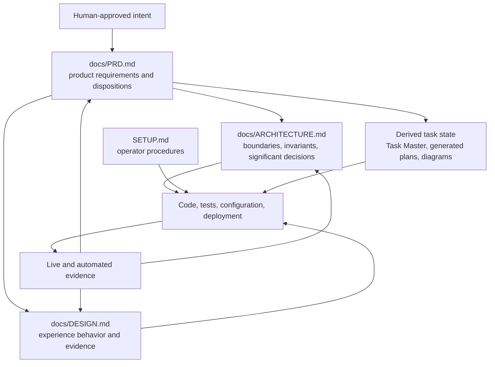

# 📖 Library Ops Documentation

> **One small documentation system, organized by reader intent.**
>
> This directory replaces the earlier fragmented collection of architecture notes, ADR folders, wireframes, research registers, runbooks, process documents, and duplicated PRDs.

---

## 🧭 Choose a reading path

| Reader | Start here | Then read |
| --- | --- | --- |
| **Evaluator / interviewer** | [Root README](../README.md) | [Design](DESIGN.md) → [PRD](PRD.md) |
| **Contributor** | [SETUP.md](../SETUP.md) | [Architecture](ARCHITECTURE.md) → relevant PRD requirements |
| **Product or engineering leader** | [PRD](PRD.md) | [Architecture](ARCHITECTURE.md) → [Design](DESIGN.md) |
| **Security / architecture reviewer** | [Architecture](ARCHITECTURE.md) | PRD quality attributes, risks, and decisions |
| **UX / accessibility reviewer** | [Design](DESIGN.md) | PRD personas, acceptance criteria, and roadmap |
| **Agent or automation maintainer** | `AGENTS.md` in the repository root | [Architecture control plane](ARCHITECTURE.md#12-autonomous-delivery-control-plane) → [SETUP operations](../SETUP.md#9-operate-the-autonomous-delivery-system) |

---

## 📚 Authoritative document set

| Document | Primary question | Authority |
| --- | --- | --- |
| **[../README.md](../README.md)** | What should an evaluator see, and what was actually delivered? | Evaluator-facing summary of current status and evidence. |
| **[../SETUP.md](../SETUP.md)** | How is the project installed, verified, operated, and deployed? | Contributor/operator procedure; checked-in scripts and configuration outrank copied commands. |
| **[README.md](README.md)** | Where does each kind of information belong? | Documentation governance and navigation. |
| **[ARCHITECTURE.md](ARCHITECTURE.md)** | How do the runtime system and autonomous delivery control plane work? | Current architecture, boundaries, invariants, significant decisions, risks, and evolution constraints. |
| **[DESIGN.md](DESIGN.md)** | How should the product behave and communicate across public and staff flows? | UX principles, information architecture, wireframes, content, accessibility, live-review findings, and evidence protocol. |
| **[PRD.md](PRD.md)** | Why does the product exist, what must it do, what shipped, and how is completion proven? | Canonical product requirements and as-built delivery record. |

---

## 🧱 Source-of-truth model



### Canonical

Human-reviewed product requirements, accepted architecture constraints, current design behavior, repository policy, and code/configuration that implements them.

### Derived

Task Master tasks, generated plans, diagrams, summaries, evaluation output, and context packs. Derived artifacts are useful execution memory, but they must be regenerated or reconciled when canonical intent changes.

### Operator-local

Credentials, OAuth state, caches, local databases, generated private packs, logs, and machine-specific tool state. These never become portable product truth.

> [!WARNING]
> No generated task, agent summary, old handoff, or stale screenshot may silently override the current PRD, architecture, design, code, tests, or live evidence.

---

## 🗂️ Consolidation map

The previous documentation hierarchy contained useful information but too many overlapping authorities. Its content is preserved by subject, not by file count.

| Former material | New home |
| --- | --- |
| Executive summary and evaluator guide | Root `README.md` |
| Setup, deployment, operations, environment, tooling | `SETUP.md` |
| System context, containers, components, runtime sequences | `ARCHITECTURE.md` |
| ADRs and architectural consequences | `ARCHITECTURE.md` decision register; material product decisions also appear in `PRD.md` |
| Threat model, RBAC, security controls, data integrity | `ARCHITECTURE.md` and PRD non-functional requirements |
| Design brief, Figma/Miro notes, wireframes, accessibility annotations | `DESIGN.md` |
| Assignment analysis, personas, glossary, SRS, acceptance criteria, priorities, roadmap, traceability | `PRD.md` |
| Research register and context-drift review | PRD derivation/evidence sections and architecture references |
| Test strategy, quality gates, release checklist | `SETUP.md`, `ARCHITECTURE.md`, and PRD definition of done |
| Demo script | Root `README.md` and `DESIGN.md` evaluation scenarios |
| Agent-system manual and SDLC process | `ARCHITECTURE.md`, with operational commands in `SETUP.md` |

Git history remains the audit trail for removed files. Do not keep obsolete copies in `docs/` merely to preserve history.

---

## ✍️ Documentation rules

1. **Write for one primary reader.** Link instead of copying whole sections across documents.
2. **State status explicitly.** Use shipped, authenticated, control-plane, deferred, superseded, or known limitation.
3. **Separate requirement from implementation.** The PRD explains outcomes and disposition; architecture explains structure; setup explains commands.
4. **Calibrate claims to evidence.** A configured tool is not necessarily initialized; a visible OAuth button is not necessarily a completed provider flow; a planned feature is not shipped.
5. **Use current primary sources.** Record time-sensitive framework, vendor, security, and standards decisions with official links.
6. **Keep diagrams purposeful.** Use Mermaid/C4 views only when they reduce ambiguity.
7. **Preserve significant decisions.** Material choices need context, alternatives, consequences, and reconsideration triggers.
8. **Prefer automation over prose.** Repeated formatting, policy, or validation requirements should become deterministic checks.
9. **Avoid secret-bearing evidence.** Redact credentials and private account data from screenshots, logs, and examples.
10. **Update docs in the same change as behavior.** A feature is not complete when its evaluator, operator, architecture, or requirement documentation is stale.

---

## 🧪 Documentation verification

Use the repository commands defined in `package.json` and scripts. The intended suite includes:

```bash
npm run docs:style
npm run docs:spell
npm run docs:links
npm run docs:inclusive
npm run verify:all
```

At minimum, verify:

- one H1 per file;
- balanced code fences and `<details>` elements;
- valid relative links and anchors;
- Mermaid blocks render on GitHub;
- no unresolved placeholders or private credentials;
- no duplicate canonical PRD;
- no link to a removed fragmented document;
- current live URLs match the evaluator route table;
- statuses are supported by code, tests, configuration, or live evidence.

---

## 🔄 Review cadence

| Trigger | Required review |
| --- | --- |
| Product behavior changes | PRD disposition, acceptance criteria, README status, and design flow |
| Domain or integration boundary changes | Architecture, security/trust boundaries, PRD impact, decision register |
| Setup/toolchain changes | SETUP commands, versions, CI parity, troubleshooting |
| UI or seeded-state changes | Live review, evidence routes, screenshot captures, accessibility states |
| Agent-control-plane changes | Architecture controls, setup verification, evaluations, risk boundaries |
| Major release or interview submission | Full links, claims, live routes, screenshots, quality gates, and known limitations |

**Last consolidated review:** 22 June 2026
